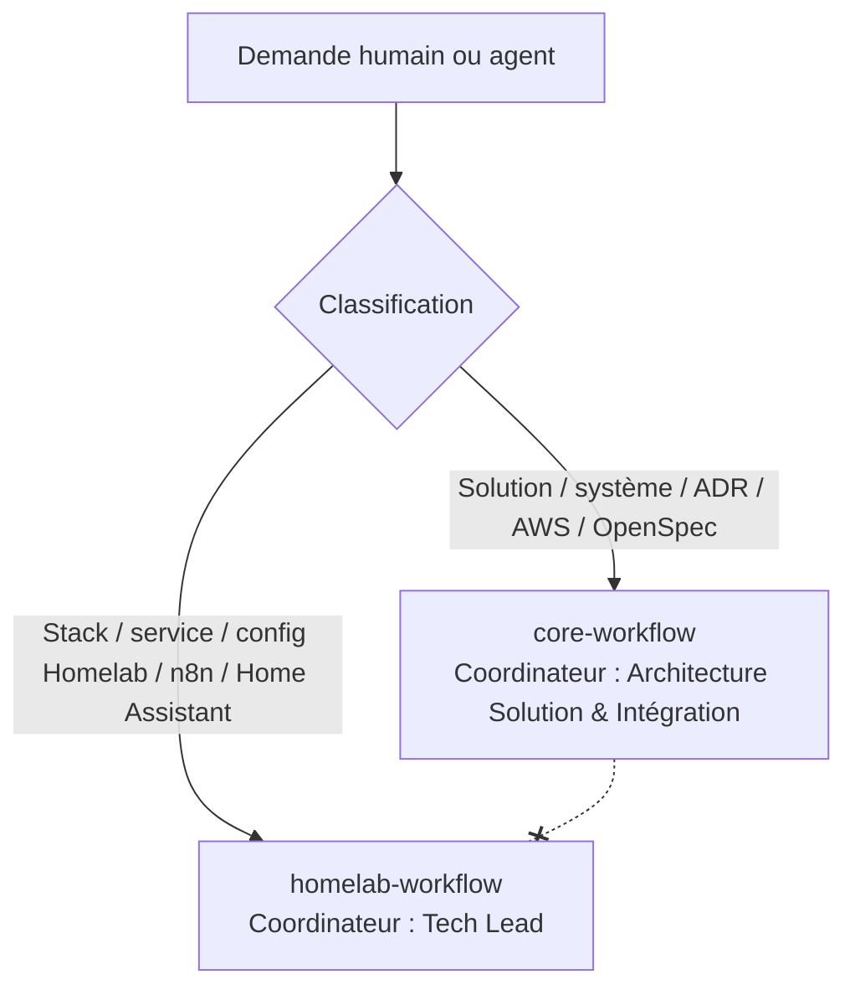

This is a monorepo of [Agent Plugins](https://agent-plugins.org) maintained by Sylvain G., compliant with the Agent Plugins Specification v1.0.0.

## Key Directories

- `/plugins`: Agent Plugin packages — each subdirectory is a self-contained plugin
- `/plugins/<name>/plugin.json`: Required manifest (v1.0.0 schema)
- `/plugins/<name>/skills/`: Portable Agent Skills (each skill is an immediate child directory with a `SKILL.md`)
- `/docs`: Architecture Workflow

## Code Standards

- Plugin manifests (`plugin.json`) must conform to the [Agent Plugins v1.0.0 schema](https://agent-plugins.org/schemas/1.0.0/plugin.schema.json). The schema is closed — only `$schema`, `name`, `version`, `description`, `author`, `homepage`, `repository`, `license`, `keywords`, and `extensions` are allowed at the top level.
- Plugin directory names must match the `name` field in their `plugin.json`.
- Plugin names use lowercase alphanumeric characters with hyphens and dots (no consecutive `--` or `..`).
- Skills are immediate child directories of `skills/` and must contain a `SKILL.md` with YAML front matter (`name` and `description` fields).
- MCP server configuration goes in a root-level `mcp.json` per plugin, never inside `plugin.json`.
- Client-specific extensions use reverse-domain namespaces (e.g., `com.vendor.client/`).

## Writing Standards

- Skill instructions in `SKILL.md` should be concise and actionable.
- Use imperative mood in skill descriptions ("Summarize the document" not "Summarizes the document").
- One concern per skill — prefer multiple small skills over one large one.

## Architecture Flow

Ce dépôt porte **deux workflows d'orchestration multi-agents (A2A) totalement
indépendants**. Ils ne se côtoient jamais : une demande relève de **l'un ou de l'autre**,
jamais des deux. Il n'existe **aucune passerelle, bascule ni chevauchement** entre eux, et
ils ne s'exécutent jamais conjointement sur une même issue ou un même livrable.

### Règle de routage (à appliquer en premier)

1. **La demande porte-t-elle sur le Homelab** — une stack Docker Swarm / Proxmox, un
   `docker-compose`, une config Terraform de stack, un flux n8n, une automatisation
   Home Assistant, des secrets Vault, des routes Traefik ?
   → Suivre **`homelab/common/conductor.md`** (coordinateur : **Tech Lead Homelab** ; source unique — stages sous `homelab/common/stages/`, protocoles sous `homelab/common/protocols/` ; stub historique `docs/homelab-workflow.md`).
   - Cas prioritaire absolu : dès que « n8n » apparaît, délégation immédiate à l'Expert N8n.

2. **La demande porte-t-elle sur l'architecture d'une solution / d'un système** —
   documentation d'architecture (DAS), ADR, diagrammes C4/Archimate/PlantUML/CALM,
   choix technologiques, intégration, cybersécurité, architecture AWS, cycle spec-driven
   (OpenSpec) ?
   → Suivre **`core/common/conductor.md`** (coordinateur : **Architecture Solution & Intégration**).

3. **En cas de doute sur la classification** : ne pas engager de workflow, ne rien
   supposer — demander à l'humain de trancher entre Homelab et architecture de solution,
   puis router vers le workflow retenu. Ne jamais combiner les deux.

### Invariants communs aux deux workflows

Ces invariants s'appliquent à chaque workflow **pris séparément** ; ils ne créent aucun
lien entre eux.

- **Coordination par l'issue** : chaque étape, décision et délégation est tracée en
  commentaire ; la piste d'audit vit sur l'issue Multica, jamais dans un fichier séparé.
- **Délégation A2A par mention valide** `[@Label](mention://agent/<uuid>)` avec mission
  claire (objectif, périmètre, critères d'acceptation). **Ne jamais deviner un UUID** :
  le résoudre via `multica agent list --output json`. Vérifier `trigger_outcomes` après
  chaque mention.
- **Le coordinateur coordonne, les spécialistes produisent** — le coordinateur ne produit
  pas les livrables (hors vérification / domaines sans agent dédié).
- **Validation humaine granulaire** : chaque choix est validé / rejeté séparément ; rien
  n'avance sur un élément non validé.
- **Chargement de contexte optimisé** : au démarrage, seulement les métadonnées légères
  (descriptions d'agents et de skills, index) ; contenu complet et secrets chargés à la
  demande uniquement.
- **Aucune action à impact sans validation humaine explicite** ; **aucun secret** dans les
  livrables, commentaires ou notifications.

### Vue d'ensemble



> Les deux branches sont **cloisonnées** : aucune transition de l'une vers l'autre
> (représentée par `-.-x`). Une demande suit une seule branche de bout en bout.

## Repository Structure

```
homelab-portfolio/
├── AGENTS.md                              # Standards du dépôt + règle de routage entre workflows
├── README.md
├── CONTRIBUTING.md
├── CODE_OF_CONDUCT.md
├── LICENCE                                # MIT
├── core/                                  # Workflow d'architecture de solution (A2A) + ressources partagées
│   ├── common/                            #   conductor.md + stages/<phase>/ + protocols/
│   │   ├── conductor.md                   #   Instructions du coordinateur (source unique du workflow)
│   │   ├── stages/                        #   Fiches de stage des 5 phases (front-matter conforme)
│   │   └── protocols/                     #   Protocoles transverses (stage-definition, gouvernance, reviewer…)
│   ├── rules/                             #   Mémoire de règles multi-couches (boucle d'apprentissage)
│   ├── scopes/                            #   Un fichier par scope (identité en données : depth, keywords…)
│   ├── sensors/                           #   Manifestes des verification gates & sensors (advisory)
│   ├── agents/                            #   Définitions d'agents du workflow (11 fichiers .md exportés)
│   └── common/ (ci-dessus)                #   (le workflow d'architecture vit sous core/common/)
├── homelab/                               # Workflow Homelab (A2A) — modèle conductor / stages / protocols
│   ├── common/                            #   conductor.md + stages/<phase>/ + protocols/ (source unique)
│   │   ├── conductor.md                   #   Instructions du Tech Lead Homelab (source unique du workflow)
│   │   ├── stages/                        #   26 fiches de stage sur 5 phases (front-matter conforme)
│   │   └── protocols/                     #   Protocoles transverses (stage-definition, gouvernance, reviewer…)
│   ├── rules/                             #   Mémoire de règles multi-couches (boucle d'apprentissage)
│   ├── scopes/                            #   Un fichier par scope (identité en données : depth, keywords…)
│   ├── sensors/                           #   Manifestes des verification gates & sensors (advisory)
│   └── agents/                            #   Définitions d'agents de l'équipe DevOps Homelab
├── decisions/                             # Registre des décisions structurantes (0001…0021)
├── docs/                                  # Stubs de redirection (core-workflow, homelab-workflow) + doc générale
└── plugins/                               # Packages de plugins d'agents (spec Agent Plugins v1.0.0) — portent les skills
    ├── architecture-assistant/            #   plugin.json + skills/ (OpenSpec, décision, gabarits, cybersécurité, AWS, Windows, supports de vente)
    ├── general-purpose-assistant/         #   plugin.json + skills/ (workflow de stack, notifications)
    ├── homelab-assistant/                 #   plugin.json + skills/ (docker-composer, traefik)
    ├── investment-assistant/              #   plugin.json + skills/ (analyse, data provider, liste de titres)
    └── medical-assistant/                 #   plugin.json + skills/ (dossiers médicaux)
```

> **Les skills sont portées par les plugins** (`plugins/<nom>/skills/<skill>/SKILL.md`),
> conformément à la spécification Agent Plugins v1.0.0 — c'est l'emplacement canonique.
> Les fichiers `SKILL.md` du dépôt sont une **source**. Sur Multica, une skill n'est
> utilisable qu'une fois **importée** dans le workspace (`multica skill import`) puis
> **assignée** à un agent (`multica agent skills add|set`) — un `SKILL.md` dans le dépôt
> n'est pas découvert automatiquement à l'exécution.
