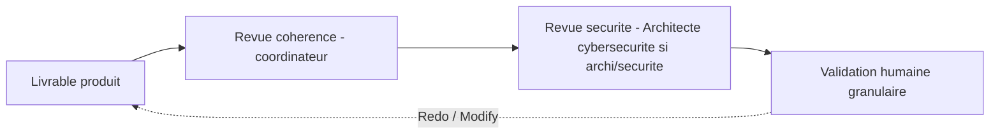

# Protocole — revue (reviewer)

Deux natures de revue coexistent dans le workflow, distinctes et non substituables.

## 1. Revue de cohérence (coordinateur — Architecture Solution & Intégration)

Portée : cohérence **documentation ↔ décisions structurantes**, absence de conflits entre décisions, complétude / structure / format des livrables.

- Déclenchée par le coordinateur à réception d'un livrable d'un agent spécialiste (temps 5-6 du [`stage-protocol.md`](stage-protocol.md)).
- Vérifie : correspondance documentation ↔ décisions, absence de décision structurante non tracée, absence d'artefact orphelin, respect des conventions (langue, diagrammes en code, aucun secret).
- Verdict : demande de correction à l'agent responsable, ou passage à la validation humaine.
- **Classe** `review_class: advisory` ou `granular` selon le stage. La revue de cohérence **ne remplace jamais** le contrôle sécurité ni la validation humaine.

## 2. Revue de sécurité (Architecte cybersécurité) — obligatoire, non substituable

Portée : analyse des risques (OWASP / STRIDE toujours actifs ; NIST / COBIT si documentation des risques ; PCI DSS / GDPR / Loi 25 / LPRPDE **sur demande explicite uniquement**).

- **Déclenchée systématiquement** dès qu'un stage produit ou modifie une architecture ou une **surface de sécurité** (instructions exécutables, frontières de délégation, contrôle de sécurité).
- Procédure : le coordinateur poste un commentaire mentionnant l'Architecte cybersécurité (UUID résolu via `multica agent list --output json`) avec le contexte et le résumé des modifications ; **attend l'analyse** ; intègre les recommandations **avant** la validation humaine.
- L'Architecte cybersécurité crée une **issue dédiée par aspect** analysé, y publie ses conclusions, puis notifie l'assigneur (le coordinateur) ou l'humain demandeur.
- **Plancher SG-3** : aucune revue de cohérence, aucun gate / sensor advisory ne peut porter, remplacer, conditionner ni court-circuiter la revue de sécurité. Un « vert » de gate ne dispense jamais de la revue de sécurité.

## Articulation des deux revues et du gate humain

- La revue de cohérence **prépare** la revue de sécurité et le gate humain ; elle ne les remplace pas.
- La revue de sécurité **précède toujours** la validation humaine sur toute modification d'architecture.
- La **validation humaine granulaire** reste l'unique gate décisionnel contraignant (invariant).

## Fin de revue

L'agent de revue notifie en retour l'assigneur / le demandeur par mention sur l'issue, avec un résumé clair des conclusions et recommandations. Une revue n'est jamais close sans cette notification.
