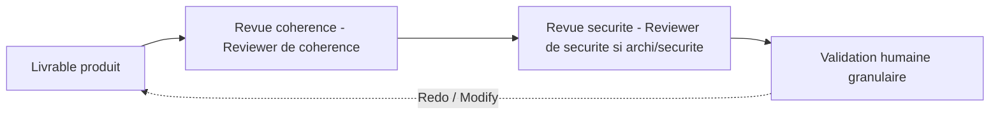

# Protocole — revue (reviewer)

Deux natures de revue coexistent dans le workflow, distinctes et non substituables.

> **Où se tient la revue : dans l'issue qui porte l'artefact revu — l'issue ADR quand il s'agit d'une ADR.** Une revue se tient **toujours sur l'issue qui porte l'artefact revu**, jamais sur une autre issue du flux. Sur impact structurant, l'artefact revu est l'**ADR** : les deux revues (cohérence puis sécurité) se tiennent donc **dans l'issue ADR dédiée** (l'issue parente de la décision créée au découpage — [`../stages/inception/deliverables-breakdown.md`](../stages/inception/deliverables-breakdown.md), Step 3.1), **et jamais dans l'issue d'origine** qui a déclenché le flux. La sollicitation se fait par mention A2A **sur l'issue ADR**, et les reviewers y postent leurs conclusions. Poster une revue d'ADR ailleurs que sur l'issue ADR est une **faute de flux** : la piste d'audit de la décision doit rester entière sur l'issue qui la porte. Hors impact structurant, la revue se tient sur l'issue qui porte le livrable concerné.

> **Qui peut solliciter une revue (source unique).** **Tout spécialiste ou architecte** peut solliciter une revue par mention A2A, pas uniquement le coordinateur — qui en reste le demandeur usuel au fil du stage. Les mentions « le coordinateur sollicite » des stages désignent le cas courant, elles ne restreignent pas ce droit. Reste au seul **coordinateur** ce qui relève de la coordination : passages de statut d'issue et fermeture de la boucle A2A. L'invariant de rôle est posé ci-dessous.

> **Séparation des rôles (non contournable).** L'**auteur d'un artefact n'en est jamais le relecteur**. Une revue (cohérence, sécurité ou autre) signée de l'auteur de l'artefact revu — pour une ADR, y compris via sa section `## Review` — est **nulle** : l'indépendance est perdue. Si une revue requise manque, elle est sollicitée auprès du reviewer dédié ; l'auteur ne la supplée jamais.

## 1. Revue de cohérence (Reviewer de cohérence)

Portée : cohérence **documentation ↔ décisions structurantes**, absence de conflits entre décisions, complétude / structure / format des livrables.

- **Portée par une fonction « review-only » distincte** : le **Reviewer de cohérence** (persona `consistency-reviewer-agent`), sollicité par mention A2A (par le coordinateur ou tout spécialiste/architecte — voir « Qui peut solliciter une revue ») à réception d'un livrable d'un agent spécialiste (temps 5-6 du [`stage-protocol.md`](stage-protocol.md)). Sur impact structurant, cette sollicitation et le post de la revue se font **sur l'issue ADR dédiée** (voir l'encadré d'ouverture), jamais sur l'issue d'origine.
- Vérifie : correspondance documentation ↔ décisions, absence de décision structurante non tracée, absence d'artefact orphelin, respect des conventions (langue, diagrammes en code, aucun secret).
- Verdict : demande de correction à l'agent responsable (via le coordinateur), ou passage à l'étape suivante (revue de sécurité si surface concernée, sinon validation humaine).
- **Classe** `review_class: advisory` ou `granular` selon le stage. La revue de cohérence **ne remplace jamais** le contrôle sécurité ni la validation humaine.

## 2. Revue de sécurité (Reviewer de sécurité) — obligatoire, non substituable

Portée : analyse des risques (OWASP / STRIDE toujours actifs ; NIST / COBIT si documentation des risques ; PCI DSS / GDPR / Loi 25 / LPRPDE **sur demande explicite uniquement**).

- **Portée par une fonction « review-only » distincte** : le **Reviewer de sécurité** (persona `security-reviewer-agent`).
- **Déclenchée systématiquement** dès qu'un stage produit ou modifie une architecture ou une **surface de sécurité** (instructions exécutables, frontières de délégation, contrôle de sécurité).
- Procédure : un demandeur (le coordinateur, ou tout spécialiste/architecte — voir « Qui peut solliciter une revue ») poste un commentaire mentionnant le **Reviewer de sécurité** (UUID résolu via `multica agent list --output json`) avec le contexte et le résumé des modifications ; **attend l'analyse** ; intègre les recommandations **avant** la validation humaine.
- Le Reviewer de sécurité **poste ses conclusions et recommandations directement dans la tâche qui porte l'artefact revu** — **l'issue ADR dédiée** sur impact structurant (voir l'encadré d'ouverture), l'issue du livrable sinon —, sans créer d'issue dédiée, puis notifie l'assigneur (le coordinateur) ou l'humain demandeur.
- **Plancher SG-3** : aucune revue de cohérence, aucun gate / sensor advisory ne peut porter, remplacer, conditionner ni court-circuiter la revue de sécurité. Un « vert » de gate ne dispense jamais de la revue de sécurité.

## Articulation des deux revues et du gate humain

```mermaid
flowchart LR
    L[Livrable produit] --> RC[Revue coherence - Reviewer de coherence]
    RC --> RS[Revue securite - Reviewer de securite si archi/securite]
    RS --> VH[Validation humaine granulaire]
    VH -.->|Redo / Modify| L
```

- La revue de cohérence **prépare** la revue de sécurité et le gate humain ; elle ne les remplace pas.
- La revue de sécurité **précède toujours** la validation humaine sur toute modification d'architecture.
- La **validation humaine granulaire** reste l'unique gate décisionnel contraignant (invariant).

## Fin de revue

Une revue n'est jamais close sans un **retour A2A par lien de mention actif** vers l'assigneur (le coordinateur) ou l'humain demandeur, avec un résumé clair des conclusions et recommandations. Les mécanismes de ce retour (passage de statut, lien actif posé par l'agent de revue lui-même, vérification `trigger_outcomes`, anti-wake parasite) sont définis **une seule fois** dans la « Checklist de sortie de stage » de [`stage-protocol.md`](stage-protocol.md) et la « Règle A2A » de [`governance-security.md`](governance-security.md) — non redéfinis ici.
