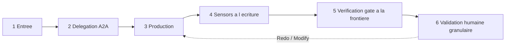

# Protocole — exécution générique d'un stage

Cycle standard qu'un stage suit, quel que soit sa phase. Il ne se substitue jamais aux instructions propres de la fiche de stage ; il en fixe l'ossature commune, adaptée au moteur A2A Multica (mentions UUID, statut d'issue, piste d'audit sur l'issue).

## Cycle en 6 temps

### 1. Entrée — pré-requis et contexte
- Vérifier que les `requires_stage` sont satisfaits et que les artefacts `consumes` (marqués `required: true`) existent. Sinon : **halt-and-ask** (ne jamais deviner).
- Charger, **à la demande**, uniquement le contexte nécessaire au stage (chargement optimisé — voir `conductor.md`).

### 2. Délégation A2A (si `mode: subagent | multi-agent`)
- Le coordinateur poste un commentaire sur l'issue avec une **mention valide** `[@Label](mention://agent/<uuid>)` et une **mission claire** : objectif, périmètre, critères d'acceptation.
- **Ne jamais deviner un UUID** : le résoudre via `multica agent list --output json` (champ `id`). Vérifier `trigger_outcomes` après chaque mention.
- Si `mode: inline`, le coordinateur (ou l'agent porteur) exécute directement.

### 3. Production
- La fonction `lead_agent` produit les artefacts `produces`, dans la langue de l'humain, sans secret, diagrammes en code à syntaxe validée.
- Chaque décision structurante est tracée dans le registre de décisions du projet.
- L'agent trace son avancement sur l'issue (piste d'audit au fil de l'eau).

### 4. Sensors à l'écriture
- À l'écriture d'un artefact, les `sensors` déclarés se déclenchent (`required-sections`, `upstream-coverage`, `diagram-validity`) et leur verdict est consigné en commentaire (`✅` / `⚠️` / `⛔ indisponible`). **Advisory** — n'autorise aucun raccourci, ne vaut pas validation (SG-1..6).

### 5. Verification gate à la frontière de phase
- À la sortie de la phase, le coordinateur exécute le gate de traçabilité ([`core/sensors/gates.md`](../../sensors/gates.md)) et poste le **« Rapport de vérification »** *avant* la validation humaine. Un écart est signalé, jamais bloquant ; `⛔ indisponible ≠ conforme`.

### 6. Validation humaine granulaire
- Selon `human_gate` : `none` (aucune — Initialization), `light` (approbation intention/périmètre — Ideation), `granular` (choix par choix — Inception / Construction), `explicit` (validation explicite + rollback si destructif — Operation).
- Boucle **Keep / Modify / Redo** par élément (voir `conductor.md`). Sur `Modify` / `Redo`, retour au temps 3 pour l'élément concerné uniquement.

## Contrôle sécurité — non contournable
Dès qu'un stage **produit ou modifie une architecture** (ou une surface de sécurité), le coordinateur sollicite l'**Architecte cybersécurité** **avant** la validation humaine et intègre ses recommandations. L'autonomie (Construction) ne court-circuite ni ne diffère jamais ce contrôle. Voir [`governance-security.md`](governance-security.md) et [`reviewer.md`](reviewer.md).

## Halt-and-ask
Le cycle s'arrête et interroge l'humain dès : échec / impossibilité d'un livrable ; écart ou contrôle de sécurité requis ; gate / sensor en écart ou `⛔ indisponible` ; décision structurante nouvelle non cadrée ; action à impact / destructive (jamais autonome).
