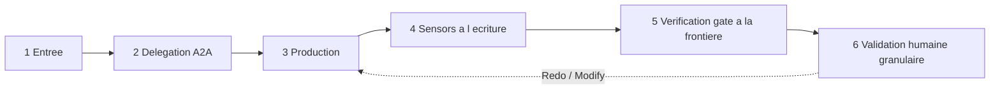

# Protocole — exécution générique d'un stage

Cycle standard qu'un stage suit, quel que soit sa phase. Il ne se substitue jamais aux instructions propres de la fiche de stage ; il en fixe l'ossature commune, adaptée au moteur A2A Multica (mentions UUID, statut d'issue, piste d'audit sur l'issue).

## Cycle en 6 temps

```mermaid
flowchart LR
    E[1 Entree] --> D[2 Delegation A2A]
    D --> P[3 Production]
    P --> S[4 Sensors a l ecriture]
    S --> G[5 Verification gate a la frontiere]
    G --> V[6 Validation humaine granulaire]
    V -.->|Redo / Modify| P
```

### 1. Entrée — pré-requis et contexte
- Vérifier que les `requires_stage` sont satisfaits et que les artefacts `consumes` (marqués `required: true`) existent. Sinon : **halt-and-ask** (ne jamais deviner).
- Charger, **à la demande**, uniquement le contexte nécessaire au stage (chargement optimisé — voir `conductor.md`).

### 2. Délégation A2A (si `mode: subagent | pipeline | mob`)
- Le coordinateur poste un commentaire sur l'issue avec une **mention valide** `[@Label](mention://agent/<uuid>)` et une **mission claire** : objectif, périmètre, critères d'acceptation. Il **nomme en texte clair** l'agent vers qui revenir en fin de tâche (lui-même, « reviens vers moi, Architecture Solution & Intégration ») **sans poser de lien de mention actif vers lui-même** (anti-wake parasite — voir [`governance-security.md`](governance-security.md), « Règle A2A »). La **pose du lien de retour actif revient à l'agent délégataire** (temps 3 + checklist de sortie).
- **Tag de méthodologie (contexte Multica uniquement)** : lorsque la mission relève d'une méthodologie activée **et que l'on opère sous Multica**, l'issue déléguée porte le label correspondant — en particulier, toute issue confiée à l'**OpenSpec Expert** est taguée **`OpenSpec`** (`multica issue label add <issue-id> <label-id>`, l'id du label résolu via `multica label list --output json` ; créer le label via `multica label create` s'il n'existe pas). Les labels d'issue étant **propres à Multica**, cette étape n'a aucun sens hors Multica et est alors sautée. Le tag est posé par le premier des deux qui agit — le coordinateur à la délégation **ou** l'OpenSpec Expert en première action (idempotent). Voir `deliverables-breakdown.md`, `conductor.md` et [`openspec-agent.md`](../../agents/openspec-agent.md).
- **Ne jamais deviner un UUID** : le résoudre via `multica agent list --output json` (champ `id`). Vérifier `trigger_outcomes` après chaque mention.
- La **topologie** dépend du `mode` (voir [`stage-definition.md`](stage-definition.md)) : `subagent` = hub-and-spoke (chaque support en rayon aveugle) ; `pipeline` = supports chaînés dans l'ordre déclaré ; `mob` = supports en parallèle contre le brouillon du lead, une ronde d'objection bornée. `pipeline` / `mob` exigent `support_agents` non vide.
- Si `mode: inline`, le coordinateur (ou l'agent porteur) exécute directement (supports = voix adoptées).
- Si `for_each` est déclaré, le cycle 3→6 s'exécute **une fois par instance** de l'artefact nommé.

### 3. Production
- La fonction `lead_agent` produit les artefacts `produces`, dans la langue de l'humain, sans secret, diagrammes en code à syntaxe validée.
- Chaque décision structurante est tracée dans le registre de décisions du projet.
- L'agent trace son avancement sur l'issue (piste d'audit au fil de l'eau).

> ⛔ **UN STAGE DÉLÉGUÉ N'EST JAMAIS TERMINÉ SANS LIEN DE RETOUR ACTIF.** Produire le livrable ne suffit pas : tant que le lien de mention actif vers l'assigneur n'est pas posé, le coordinateur n'est pas prévenu et la chaîne A2A reste rompue (c'est l'écart constaté sur ORIG-62 / ORIG-63 : le travail livré, mais le coordinateur jamais réveillé).

- **Retour de délégation (obligatoire, à la charge de l'agent délégataire)** : en fin de production, l'agent `lead_agent` passe l'issue en `in_review` puis poste un **commentaire de retour** clos par le lien de mention actif `[@<Nom de l'assigneur>](mention://agent/<uuid-assigneur>)` vers **l'agent qui l'a délégué** (le coordinateur), avec un résumé du livrable. L'UUID est **résolu à chaque fois** via `multica agent list --output json` (à partir du **nom** de l'assigneur donné en texte clair dans la mission), **jamais copié depuis la consigne de délégation ni codé en dur**. C'est **ce lien, posé par l'agent qui termine, qui enqueue le run de reprise du coordinateur** ; une mention en texte clair ou une simple réponse dans le fil **n'enqueue aucun run**. Réciproquement, **aucun agent ne se mentionne lui-même** avec un lien actif (anti-wake parasite — voir [`governance-security.md`](governance-security.md), « Règle A2A »).
- **Vérification `trigger_outcomes`** : après le post, l'agent vérifie les `trigger_outcomes` de son commentaire. Si la mention n'a pas déclenché le run attendu (`blocked` / `coalesced` / `deferred`), il le signale sur l'issue (halt-and-ask) plutôt que de considérer la tâche terminée.

### 4. Sensors à l'écriture
- À l'écriture d'un artefact, les `sensors` déclarés se déclenchent (`required-sections`, `upstream-coverage`, `diagram-validity`) et leur verdict est consigné en commentaire (`✅` / `⚠️` / `⛔ indisponible`). **Advisory** — n'autorise aucun raccourci, ne vaut pas validation (SG-1..6).

### 5. Verification gate à la frontière de phase
- À la sortie de la phase, le coordinateur exécute le gate de traçabilité ([`core/sensors/gates.md`](../../sensors/gates.md)) et poste le **« Rapport de vérification »** *avant* la validation humaine. Un écart est signalé, jamais bloquant ; `⛔ indisponible ≠ conforme`.

### 6. Validation humaine granulaire
- Selon `human_gate` : `none` (aucune — Initialization), `light` (approbation intention/périmètre — Ideation), `granular` (choix par choix — Inception / Construction), `explicit` (validation explicite + rollback si destructif — Operation).
- Boucle **Keep / Modify / Redo** par élément (voir `conductor.md`). Sur `Modify` / `Redo`, retour au temps 3 pour l'élément concerné uniquement.

## Contrôle sécurité — non contournable
Dès qu'un stage **produit ou modifie une architecture** (ou une surface de sécurité), le coordinateur sollicite le **Reviewer de sécurité** **avant** la validation humaine et intègre ses recommandations. L'autonomie (Construction) ne court-circuite ni ne diffère jamais ce contrôle. Voir [`governance-security.md`](governance-security.md) et [`reviewer.md`](reviewer.md).

## Checklist de sortie de stage (`mode: subagent | pipeline | mob`) — non contournable
Un stage délégué n'est considéré **terminé** QUE lorsque les trois cases sont cochées, **dans cet ordre** — c'est le **point de passage unique** que tout agent délégué franchit, quelle que soit sa fonction :

1. ☑ **Livrable produit et contrôlé** — artefacts `produces` écrits, décision structurante tracée, piste d'audit posée sur l'issue.
2. ☑ **Issue en `in_review` + lien de retour ACTIF posé** — le commentaire de retour se termine par `[@<Nom assigneur>](mention://agent/<uuid>)` vers le coordinateur, UUID résolu via `multica agent list --output json` (jamais copié / codé en dur), jamais une auto-mention. C'est ce lien qui enqueue le run de reprise du coordinateur.
3. ☑ **`trigger_outcomes` vérifié** — la mention a bien déclenché le run attendu ; sinon (`blocked` / `coalesced` / `deferred`) → **halt-and-ask** sur l'issue, ne pas conclure.

Tant que 2 ou 3 manque, la tâche est **incomplète** : ne jamais rendre la main comme si le stage était clos. Cette checklist est l'**unique endroit non contournable** de l'obligation de retour A2A ; les fiches d'agent ne la répètent pas, elles s'y réfèrent.

## Halt-and-ask
Le cycle s'arrête et interroge l'humain dès : échec / impossibilité d'un livrable ; écart ou contrôle de sécurité requis ; gate / sensor en écart ou `⛔ indisponible` ; décision structurante nouvelle non cadrée ; action à impact / destructive (jamais autonome).

**Mention humaine obligatoire (quel que soit l'agent)** : tout `halt-and-ask` est un **blocage**. L'agent qui le déclenche — coordinateur ou agent délégué, sans exception — **doit mentionner explicitement l'humain demandeur** sur l'issue (`[@Nom](mention://member/<user_id>)`, UUID résolu via `multica workspace member list --output json`), décrire le blocage et l'arbitrage attendu, et passer l'issue en `blocked`. Un commentaire sans mention humaine valide ne satisfait pas cette obligation. L'agent n'avance pas et ne devine pas tant que l'humain n'a pas tranché. Invariant non contournable — voir la clause « Mention humaine obligatoire en cas de blocage » de [`governance-security.md`](governance-security.md).
