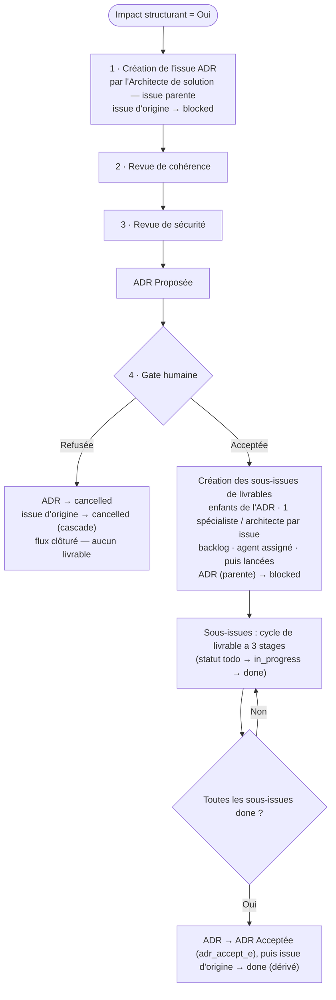

# Planification et découpage en livrables

## Objectif

Découper le travail en livrables et désigner l'agent responsable de chacun.

## Steps

### Step 1 — Déterminer phases, étapes et profondeur

### Step 2 — Découper et désigner l'agent responsable

Le coordinateur **identifie la nature de chaque travail** (architecture solution / logicielle, infrastructure, sécurité, données, AWS, etc.) et effectue **toutes les délégations adéquates** — une par spécialiste concerné —, y compris lorsque les travaux proviennent d'une passation amont (p. ex. descriptions de passation remontées par l'OpenSpec Expert après approbation d'une spécification). Un même lot de travaux peut relever de **plusieurs natures** et donc de **plusieurs délégations** parallèles.

- Documentation d'architecture / décisions structurantes / Patrons d'architecture / diagrammes → **Architecte de solution**.
- Analyse et cycle de vie des données (modélisation, gouvernance, classification, `10-cycle_vie_donnees.md`) → **Architecte de données** (délégué par l'Architecte de solution, qui valide le livrable — critère : sensor `data-lifecycle`).
- Choix AWS, diagrammes AWS, coûts → **Architecte AWS** (si AWS requis).
- Administration / infrastructure Windows → **Infrastructure Windows** (si concerné).
- Sécurité (surface de sécurité, menaces, conformité : OWASP, STRIDE, ISO 27001, NIST, etc.) → **Architecte Cybersécurité** (si une surface de sécurité est produite ou modifiée). Le livrable attendu couvre **l'analyse de sécurité ET la mise à jour de la documentation d'architecture de sécurité** (`documentation/architecture-securite/`), pas la seule analyse — même règle qu'à l'émergence en cours de production ([`../construction/detailed-deliverables.md`](../construction/detailed-deliverables.md), Step 1.1).
- Cycle spec-driven → **OpenSpec Expert** (uniquement si OpenSpec activé).

> **Pré-requis — verdict de méthodologie.** Toute condition « **si OpenSpec activé** » de ce stage (Steps 3.3 et 4, délégation à l'OpenSpec Expert) s'appuie sur le **verdict de méthodologie** analysé et tracé au cadrage ([`intake-framing`](intake-framing.md), Step 3 ; règle « Activation conditionnelle d'une méthodologie » de [`conductor.md`](../../conductor.md)). Le coordinateur **lit ce verdict** avant de découper ; s'il est **absent ou ambigu**, il ne devine pas et ne traite pas OpenSpec comme inactif par défaut : **halt-and-ask** (faire statuer l'humain, puis l'inscrire dans la description du projet). Le même principe vaut pour toute autre méthodologie déclarée.

### Step 3 — Flux impact structurant (ADR d'abord, livrables en sous-issues)

Dès que le **verdict d'impact structurant** établi au cadrage ([`intake-framing`](intake-framing.md), Step 5) vaut **`Oui`**, l'ordre est **inversé par rapport au reste du stage** : **rien n'est créé avant l'ADR**. L'**issue ADR est créée en premier** et devient l'**issue parente** de la décision ; les livrables n'existent qu'**après acceptation humaine**, en **sous-issues (enfants)** de cette ADR. S'il y a plusieurs décisions structurantes, appliquer ce flux **une fois par ADR**. En cas de doute sur le verdict, halt-and-ask.

#### Step 3.1 — Créer l'issue ADR (parente), déléguée à l'Architecte de solution

Le coordinateur crée l'**issue ADR**, déléguée à l'**Architecte de solution**, qui la conduit au stage [`design-and-decisions`](design-and-decisions.md) (production, revues cohérence puis sécurité, `ADR Proposée`, décision humaine). C'est un **garde-fou non contournable** (voir [`conductor.md`](../../conductor.md), « Garde-fous ») : un impact structurant ne peut jamais être traité sans son issue ADR.

> **L'issue d'origine est bloquée dès la création de l'issue ADR.** L'issue ADR étant une **sous-issue de l'issue d'origine** (celle que l'humain a ajoutée et qui a déclenché le flux), le coordinateur passe l'**issue d'origine en `blocked`** (`multica issue status <id-origine> blocked`) dès qu'il crée et lance l'issue ADR. L'issue d'origine **ne reprend jamais** tant que le flux ADR n'est pas terminé : son déblocage est **dérivé** (voir Step 3.2 pour le refus et Step 3.4 pour la clôture). C'est le garde-fou « Issue parente bloquée tant que ses sous-issues ne sont pas terminées » ([`conductor.md`](../../conductor.md), « Garde-fous »).

> **Tout le cycle de revue se déroule sur l'issue ADR**, jamais sur l'issue d'origine (conduite détaillée : [`design-and-decisions`](design-and-decisions.md), « Flux ADR » ; [`../../protocols/reviewer.md`](../../protocols/reviewer.md)).

#### Step 3.2 — Gate humaine : accepter ou refuser

- **ADR acceptée (Keep)** ⇒ le coordinateur crée les **sous-issues de livrable** (Step 3.3), puis les lance.
- **ADR refusée** ⇒ l'issue ADR passe à **`cancelled`** ; aucun livrable n'est créé, le flux se clôt. **L'issue d'origine qui a déclenché le flux est annulée en cascade** : le coordinateur la passe également à **`cancelled`** (`multica issue status <id-origine> cancelled`) — un refus d'ADR ne laisse jamais l'issue d'origine ouverte ou bloquée en suspens. Si l'humain reformule la décision, c'est une **nouvelle** issue d'origine (et une nouvelle issue ADR) qui est relancée.

#### Step 3.3 — Sous-issues de livrable, créées **seulement après acceptation** (enfants de l'ADR)

Pour chaque délégation, le coordinateur crée une **sous-issue** rattachée à l'ADR (`--parent <id-ADR>`), en **`backlog`** avec son **agent délégataire assigné** (`--assignee-id`, UUID résolu, jamais deviné), puis la lance (`multica issue status <id> todo`, qui démarre l'agent) avec mention A2A. **Une fois toutes les sous-issues de livrable créées et lancées, le coordinateur passe l'issue ADR (parente) en `blocked`** (`multica issue status <id-ADR> blocked`) : elle le reste tant que ses sous-issues ne sont pas toutes terminées (garde-fou « Issue parente bloquée », voir Step 3.4 pour le déblocage dérivé).

> **Directives complètes, dérivées de l'ADR acceptée.** L'agent délégataire démarre « à froid » : il **ne voit pas** le fil de l'ADR ni le contexte du coordinateur. Chaque sous-issue doit donc être **autosuffisante** et **reporter explicitement les décisions de l'ADR acceptée** qui conditionnent le livrable — sans quoi l'agent ne peut pas exécuter correctement. Le coordinateur **puise ces directives dans l'ADR tranchée** (`decisions/<NNNN>-<titre>.md`) et les inscrit dans la description de la sous-issue : voir [« Mission déléguée — contenu obligatoire »](#mission-déléguée--contenu-obligatoire) ci-dessous. En cas d'information manquante dans l'ADR pour cadrer un livrable, halt-and-ask plutôt que deviner.

Voir aussi la [règle « une sous-issue par agent »](#une-issue-par-spécialiste--architecte-hors-revues--règle-de-délégation) ci-dessous.

> **Chaque sous-issue de livrable suit le cycle de livrable à 3 stages.** Une fois lancée, toute sous-issue de livrable (post-acceptation ADR) parcourt le **cycle standard d'un livrable de spécialiste** — Stage 1 Production (expert de méthodologie optionnel puis spécialiste) → Stage 2 Review (revue de cohérence puis revue de sécurité, chacune transitant par le spécialiste) → Stage 3 Finalisation (compte rendu puis clôture de l'issue) — défini comme **source unique** dans [`../../protocols/stage-protocol.md`](../../protocols/stage-protocol.md), « Cycle de livrable d'un spécialiste ». Le `todo → in_progress → done` de l'issue n'est que le **reflet de statut** de ce cycle, pas un raccourci qui en dispenserait.

**Uniquement si OpenSpec activé** : ajouter de même une sous-issue dédiée au cycle spec-driven OpenSpec (création / modification / suppression de spécifications), déléguée à l'OpenSpec Expert.

#### Step 3.4 — Clôture de l'ADR quand tous les livrables sont terminés

L'issue ADR reste **`blocked` comme parente** tant que ses sous-issues tournent. Dès que **toutes** ses sous-issues sont `done`, le coordinateur passe l'**issue ADR à `ADR Acceptée`** (`multica issue status <id-ADR> adr_accept_e`) : clôture **dérivée** de l'état des enfants, **sans acte humain supplémentaire**. Le statut `ADR Acceptée` (`adr_accept_e`) relève de la catégorie `done` — il clôt l'issue ADR tout en marquant explicitement qu'il s'agit d'une ADR acceptée et menée à terme. L'issue ADR étant elle-même une sous-issue de l'**issue d'origine** (restée `blocked` depuis Step 3.1), sa clôture **débloque l'issue d'origine en cascade** : le coordinateur passe l'**issue d'origine à `done`** (`multica issue status <id-origine> done`) — le flux ne se poursuit sur l'issue d'origine qu'**après** la fin complète du flux ADR et de ses livrables, jamais avant.

### Step 4 — Sans décision structurante (`verdict Non`) : livrables directs en backlog

Pas d'ADR : le coordinateur crée directement les **issues de livrable** (une par spécialiste / architecte), en **`backlog`** avec agent assigné (`--assignee-id`, UUID résolu), **sans parent ADR**, puis les promeut selon le séquencement du stage. **Uniquement si OpenSpec activé**, ajouter de même l'issue du cycle spec-driven OpenSpec. Comme sur le flux ADR, **chaque issue de livrable suit le cycle de livrable à 3 stages** (Production → Review cohérence+sécurité → Finalisation — [`../../protocols/stage-protocol.md`](../../protocols/stage-protocol.md), « Cycle de livrable d'un spécialiste »).

> **Issue d'origine bloquée tant que ses livrables tournent.** Lorsque ces issues de livrable sont créées comme **sous-issues de l'issue d'origine** (`--parent <id-origine>`), le coordinateur passe l'**issue d'origine en `blocked`** une fois les livrables lancés et ne la débloque (`done`) que lorsque **tous** sont `done` — même garde-fou que sur le flux ADR (« Issue parente bloquée tant que ses sous-issues ne sont pas terminées », [`conductor.md`](../../conductor.md), « Garde-fous »). Déblocage **dérivé** de l'état des enfants, sans acte humain supplémentaire.

#### Une issue par spécialiste / architecte (hors revues) — règle de délégation

Chaque **délégation de livrable** donne lieu à **une issue dédiée par agent** (Architecte de solution, Architecte de données, Architecte AWS, Infrastructure Windows, OpenSpec Expert) — **jamais** une issue fourre-tout partagée. Chaque issue porte un périmètre, des critères d'acceptation et l'agent de retour (le coordinateur, en texte clair) propres à l'agent délégataire.

**Les revues ne sont pas des issues.** Les **revues** (Reviewer de cohérence, Reviewer de sécurité) sont des fonctions *review-only* **sollicitées en place par le coordinateur** sur l'issue qui porte l'artefact revu — l'**issue ADR dédiée** sur impact structurant (jamais l'issue d'origine), l'issue du livrable sinon (voir [`protocols/reviewer.md`](../../protocols/reviewer.md)) ; elles postent leurs conclusions dans cette issue, **sans issue dédiée**. La règle « une issue par agent » ne vaut donc **que** pour les délégations de production de livrable.

> **Parent d'une sous-issue de livrable = l'ADR (ou l'issue d'origine), jamais une autre sous-issue de livrable.** Toute sous-issue de livrable se rattache à l'**issue parente du découpage** : l'**issue ADR** sur impact structurant (`--parent <id-ADR>`), sinon l'**issue d'origine** (`--parent <id-origine>`). Une sous-issue de livrable n'est **jamais** parente d'une autre sous-issue de livrable — elles sont **sœurs**, au même niveau. En particulier, lorsque les travaux d'architecture proviennent de la **passation remontée par l'OpenSpec Expert** après approbation d'une spécification ([`../construction/consolidation-handoff.md`](../construction/consolidation-handoff.md), Steps 5-6), les sous-issues correspondantes se rattachent à l'**ADR / issue d'origine**, **jamais à l'issue OpenSpec** (qui est elle-même une sous-issue de livrable, terminale et `done`). La prendre pour parent crée une hiérarchie livrable-sous-livrable incorrecte et peut la rouvrir indûment via le garde-fou « issue parente bloquée » ([`conductor.md`](../../conductor.md), « Garde-fous »).

#### Mission déléguée — contenu obligatoire

Chaque mission déléguée inclut **obligatoirement** :

- Le **contexte de décision issu de l'ADR** (sur impact structurant) : la mission **reporte explicitement**, depuis l'ADR acceptée (`decisions/<NNNN>-<titre>.md`), les éléments qui cadrent le livrable — **option retenue et sa justification**, **contraintes et exigences** imposées (technologie, frontières de système, modèle de données, intégration, sécurité, infrastructure, patterns transverses), **périmètre précis** confié à cet agent et **ce qui en est explicitement exclu**, **critères d'acceptation**, **dépendances** vers d'autres livrables, et **référence à l'ADR parente** (lien / numéro). Objectif : l'agent délégataire, qui démarre sans le contexte du coordinateur, dispose de **toutes** les directives pour exécuter sans redemander ni deviner. (Hors impact structurant — Step 4 —, la mission reporte de même les décisions de cadrage pertinentes.)
- Le **nom de l'agent de retour en texte clair** (le coordinateur), **sans lien de mention actif vers lui-même** : la pose du lien de retour actif et le passage en `in_review` reviennent à l'agent délégataire en fin de tâche. L'obligation de retour A2A a **une seule source non contournable** — la « Checklist de sortie de stage » de [`stage-protocol.md`](../../protocols/stage-protocol.md) — et n'est pas redéfinie ici (voir aussi [`governance-security.md`](../../protocols/governance-security.md), « Règle A2A »).
- Le **tag de méthodologie** sur l'issue déléguée (**contexte Multica uniquement**) : toute issue confiée à l'**OpenSpec Expert** (cycle spec-driven, OpenSpec activé) est taguée **`OpenSpec`** — `multica issue label add <issue-id> <label-id>`, l'id du label résolu via `multica label list --output json` (créer le label `OpenSpec` via `multica label create` s'il n'existe pas). Ce tag rend visible, dès le découpage, quelles issues relèvent de la méthode OpenSpec. Les labels d'issue étant **propres à Multica**, l'étape est sautée hors Multica. L'**OpenSpec Expert pose aussi ce tag en première action** s'il traite une issue Multica (voir [`openspec-agent.md`](../../../agents/openspec-agent.md)) : le premier des deux qui agit suffit, l'autre est idempotent.

## Sensors

Outputs: impact structurant Oui ⇒ issue ADR parente d'abord (issue d'origine → `blocked`), ses sous-issues de livrable (backlog, agents assignés) créées et lancées après acceptation humaine puis l'ADR → `blocked` ; ADR refusée ⇒ ADR et issue d'origine → `cancelled` (cascade) ; ADR `ADR Acceptée` (`adr_accept_e`, catégorie `done`) quand toutes ses sous-issues sont `done`, puis issue d'origine → `done` (dérivé) ; impact structurant Non ⇒ issues de livrable directes en backlog (issue d'origine → `blocked` si elles en sont les enfants, jusqu'à leur achèvement).
Imports: none.

## Learn

Boucle d'apprentissage maison (voir [`core/rules/`](../../../rules/README.md)) : tracer sur l'issue les candidats-règles (motifs de découpage, affectation d'agents récurrente) ; les remonter au **gate humain granulaire** d'Inception ; persistance des apprentissages **confirmés** dans `core/rules/` via le cycle capture → confirmation humaine → contrôle de conflit.
