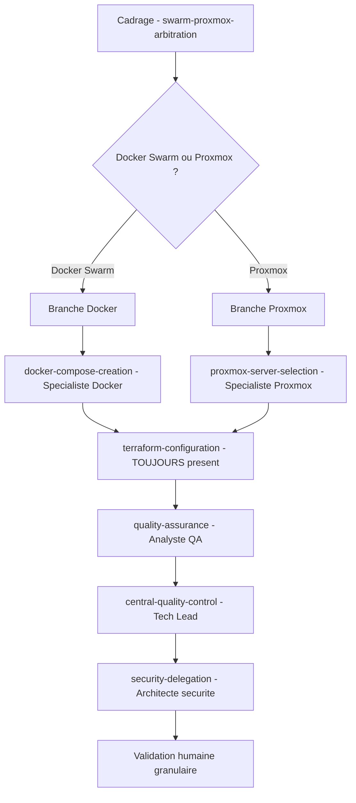
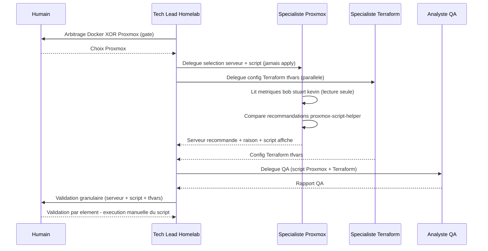

Branche Proxmox du scope `new-stack` — exclusivité Docker XOR Proxmox et stage de sélection serveur

---
auteurs: Stuart - Tech Lead Homelab (proposition), multica.gaston (demandeur)
accepté par : ""
accepté le : ""
supersedes: ""
superseded_by: ""

---

## Status

Proposed

> **En attente de la validation humaine granulaire** (gate — `homelab/common/stages/validation/human-granular-validation.md`). Tant que l'humain n'a pas arbitré chaque élément (Keep / Modify / Redo), aucune évolution ci-dessous n'est réputée acceptée. Les fiches de stage, protocoles et manifestes touchés par cette décision sont fournis **sur la même branche dédiée** pour revue conjointe, mais ne deviennent normatifs qu'au passage en `Accepted`.

## Contexte

Le workflow Homelab se veut **agnostique de l'outil** : il « s'applique aux stacks Docker Swarm
ou Proxmox, à leur configuration Terraform et aux domaines connexes »
([`conductor.md`](../homelab/common/conductor.md)). Dans les faits, le scope
[`new-stack`](../homelab/scopes/new-stack.md) ne sait produire que la branche **Docker** : le
stage [`docker-compose-creation`](../homelab/common/stages/production/docker-compose-creation.md)
produit un `docker-compose` optimisé Swarm, mais **aucun stage ne couvre la branche Proxmox**. Il
manque la logique de **sélection du serveur de déploiement**, l'agent spécialisé Proxmox et la
skill d'accès au cluster (traités dans les sous-issues jumelles HOM-239 et HOM-240 de la même
issue parent HOM-237).

Le stage d'arbitrage [`swarm-proxmox-arbitration`](../homelab/common/stages/cadrage/swarm-proxmox-arbitration.md)
(Cadrage) **pose** déjà la question « Docker Swarm ou Proxmox ? » et confirme l'existence d'une
alternative Proxmox (`https://community-scripts.org/`), mais ne **tire aucune conséquence** du
choix sur le parcours de Production : rien ne décrit ce qui se passe quand l'humain répond
« Proxmox ».

Demande de l'humain (multica.gaston, verbatim résumé — issue HOM-237 / HOM-238) :

- Pour une création de tâche Proxmox, **déterminer sur quel serveur** déployer parmi les
  **hostnames réels du cluster `bob` / `stuart` / `kevin`**, selon :
  - RAM moyenne utilisée sur le serveur ;
  - CPU moyen utilisé + load CPU ;
  - espace disque restant.
- **Comparer** aux recommandations de déploiement (valeurs standard LXC/VM du service),
  disponibles via `proxmox-script-helper`.
- Restituer à la gate humaine : **serveur recommandé**, **raison concise**, et **script de
  déploiement affiché**.

> **Note de nommage (reprise de HOM-237).** `bob` / `stuart` / `kevin` désignent **exclusivement
> des serveurs** (hostnames réels du cluster Proxmox), à utiliser tels quels dans les livrables.
> Ils ne doivent **pas** être confondus avec d'éventuels prénoms d'agents du workspace.

## Décision

Faire évoluer le scope `new-stack` (et `infra-terraform`) pour **couvrir pleinement la branche
Proxmox**, selon trois décisions structurantes :

### D1 — Exclusivité Docker XOR Proxmox

Au stage [`swarm-proxmox-arbitration`](../homelab/common/stages/cadrage/swarm-proxmox-arbitration.md)
(Cadrage), le choix de l'humain fixe **une et une seule** branche de déploiement pour la stack :

- **Docker Swarm** → le stage `docker-compose-creation` s'exécute ; `proxmox-server-selection`
  est **ignoré** (`SKIP`).
- **Proxmox** → le nouveau stage `proxmox-server-selection` s'exécute ; `docker-compose-creation`
  est **ignoré** (`SKIP`).

Les deux branches sont **mutuellement exclusives** : on ne produit **jamais** un `docker-compose`
**et** un script de déploiement Proxmox pour la même stack. L'arbitrage produit un artefact
`arbitrage_swarm_proxmox` dont la valeur (`docker` | `proxmox`) **conditionne** l'exécution des
deux stages de production.

### D2 — La configuration Terraform est TOUJOURS présente (invariant préservé)

Quelle que soit la branche retenue, le stage
[`terraform-configuration`](../homelab/common/stages/production/terraform-configuration.md) reste
**obligatoire et non abaissable** sur `new-stack` / `infra-terraform` : le livrable `.tfvars`
(`livrable_tfvars`) conditionne toujours la clôture (invariant SEC-1, gate `phase3-phase4`
bloquant, sensor `terraform-no-sni`). L'exclusivité D1 porte **uniquement** sur le couple
`docker-compose-creation` ⊕ `proxmox-server-selection` ; elle **n'affecte pas** Terraform.

### D3 — Nouveau stage `proxmox-server-selection` (Production)

Un nouveau stage [`proxmox-server-selection`](../homelab/common/stages/production/proxmox-server-selection.md)
est inséré en **phase Production**, conditionnel à la branche Proxmox, piloté par le rôle
générique **« Spécialiste Proxmox »** (agent `proxmox-specialist-agent`, créé en HOM-239), qui
s'appuie sur la skill `proxmox-cluster-access` (HOM-240). Il :

1. **lit** (lecture seule) les métriques des serveurs `bob` / `stuart` / `kevin` : RAM moyenne
   utilisée, CPU moyen + load, espace disque restant ;
2. **compare** aux recommandations de déploiement LXC/VM du service, issues de
   `proxmox-script-helper` ;
3. **produit** une **recommandation de serveur** (serveur recommandé + raison concise) et le
   **script de déploiement affiché**, présentés à l'humain à la gate granulaire ;
4. **ne déclenche jamais** le déploiement : l'exécution du script reste **manuelle, par
   l'humain**, après la validation humaine granulaire.

Le stage produit les artefacts `recommandation_serveur_proxmox` et `livrable_script_proxmox`,
passe par la vérification QA (Analyste QA), le contrôle qualité central (Tech Lead) et la
délégation sécurité (Architecte de sécurité Homelab) **au même titre** qu'un livrable compose,
puis par la validation humaine granulaire.

### Diagramme — parcours `new-stack` avec branche Docker XOR Proxmox

### Diagramme — délégation A2A de la branche Proxmox

## Conséquences

### Positives

- **POS-001** : le workflow tient enfin sa promesse d'être **agnostique de l'outil** — la branche
  Proxmox devient un parcours de première classe, à parité avec la branche Docker.
- **POS-002** : l'exclusivité Docker XOR Proxmox **supprime l'ambiguïté** sur « quel livrable de
  déploiement produire », en la tranchant une fois pour toutes au gate d'arbitrage (Cadrage).
- **POS-003** : la sélection de serveur fondée sur des **métriques réelles** (RAM / CPU+load /
  disque) comparées aux **recommandations standard** rend le placement **justifiable et
  auditable**, et non laissé au hasard.
- **POS-004** : la ligne de sécurité « lecture seule + script produit, jamais exécuté » est
  **cohérente avec les invariants existants** (« Terraform ne déploie JAMAIS », « aucune action à
  impact sans validation humaine explicite ») — la branche Proxmox n'ouvre **aucune** nouvelle
  surface d'exécution automatique.
- **POS-005** : l'invariant Terraform (`.tfvars` toujours présent) est **explicitement préservé**,
  ce qui évite une régression de clôture lorsque la branche Proxmox est retenue.

### Négatives

- **NEG-001** : trois nouveaux artefacts conditionnels (`arbitrage_swarm_proxmox` porteur d'une
  valeur de branche, `recommandation_serveur_proxmox`, `livrable_script_proxmox`) alourdissent la
  matrice stage × scope et le manifeste de gates ; le risque est une **divergence** entre vues
  (scope files, `scopes-and-axes.md`, `gates.md`) si une évolution n'est pas répercutée partout.
- **NEG-002** : le stage dépend d'un **agent et d'une skill pas encore créés** (HOM-239 /
  HOM-240) ; tant qu'ils n'existent pas, le stage est **inexécutable en pratique** (dépendance
  documentée, à lever par les sous-issues jumelles).
- **NEG-003** : la **surface de sécurité** d'un script bash de déploiement (droits, exposition,
  secrets, idempotence) diffère de celle d'un compose ; la revue QA + sécurité doit être
  **adaptée** à ce nouveau type de livrable (le présent ADR en pose le principe ; le détail des
  contrôles script relève de la skill HOM-240 et de l'agent HOM-239).
- **NEG-004** : introduire un rôle générique **« Spécialiste Proxmox »** dans le schéma de stage
  élargit la liste des fonctions reconnues ; toute fiche de stage le nommant restera **invalide
  tant que l'agent réel n'est pas enregistré** dans [`homelab/agents/`](../homelab/agents/README.md).

## Alternatives étudiées

### ALT-001 — Réutiliser le stage `docker-compose-creation` avec un paramètre « cible »

Faire porter au même stage la production du compose **ou** du script Proxmox selon un drapeau.

**Raison du rejet** : viole la séparation des responsabilités (le Spécialiste Docker n'est pas le
Spécialiste Proxmox), brouille la matrice stage × scope et la lecture du graphe
`consumes` / `produces`, et complique la revue (deux surfaces de sécurité très différentes dans un
seul stage). Un stage dédié reste plus lisible et plus auditable.

### ALT-002 — Placer la sélection serveur en Cadrage plutôt qu'en Production

Collecter métriques + recommandation dès l'arbitrage, avant la phase Production.

**Raison du rejet** : la sélection serveur **produit un livrable** (script de déploiement) qui
doit passer QA + sécurité + gate granulaire comme tout livrable de Production ; le placer en
Cadrage le soustrairait à ces contrôles. L'arbitrage (Cadrage) **choisit la branche** ; la
**production du livrable** (script + recommandation) appartient à la Production.

### ALT-003 — Autoriser Docker ET Proxmox simultanément pour une même stack

Produire les deux livrables et laisser l'humain choisir au déploiement.

**Raison du rejet** : contraire à la demande explicite (« si Proxmox, on ne fait pas Docker, et
inversement »), double le travail et les surfaces de sécurité, et crée une incohérence de
clôture (deux cibles de déploiement concurrentes pour une seule stack).

## Notes d'implémentation

- **IMP-001 — Nouveau stage.** Créer
  [`homelab/common/stages/production/proxmox-server-selection.md`](../homelab/common/stages/production/proxmox-server-selection.md)
  (front-matter conforme à [`stage-definition.md`](../homelab/common/protocols/stage-definition.md)) :
  `phase: production`, `execution: CONDITIONAL`, condition = branche Proxmox retenue,
  `lead_agent: Spécialiste Proxmox`, `mode: subagent`, `reviewer: Analyste QA`
  (`review_class: adversarial` — surface de sécurité = script), `human_gate: granular`,
  `produces: [recommandation_serveur_proxmox, livrable_script_proxmox]`,
  `consumes:` arbitrage Proxmox + paramètres requis + walking skeleton,
  `scopes: [new-stack, infra-terraform]`, `sensors: [plaintext-secret]`.
- **IMP-002 — Arbitrage.** Mettre à jour
  [`swarm-proxmox-arbitration.md`](../homelab/common/stages/cadrage/swarm-proxmox-arbitration.md)
  pour **formaliser l'exclusivité** (valeur de branche portée par `arbitrage_swarm_proxmox`) et le
  **routage vers le Spécialiste Proxmox** quand « Proxmox » est choisi.
- **IMP-003 — Rôle générique.** Ajouter **« Spécialiste Proxmox »** à la liste des fonctions
  reconnues du schéma de stage ([`stage-definition.md`](../homelab/common/protocols/stage-definition.md))
  et au conductor ; l'agent réel `proxmox-specialist-agent` est créé en **HOM-239** (table des
  UUID de [`homelab/agents/README.md`](../homelab/agents/README.md) complétée à ce moment-là).
- **IMP-004 — Matrice.** Dans
  [`scopes-and-axes.md`](../homelab/common/protocols/scopes-and-axes.md), ajouter la ligne
  `proxmox-server-selection` à la matrice stage × scope (✅ sur `new-stack` / `infra-terraform`
  **branche Proxmox** ; ❌ ailleurs) et préciser l'exclusivité avec `docker-compose-creation`.
- **IMP-005 — Scope.** Mettre à jour [`new-stack.md`](../homelab/scopes/new-stack.md) pour décrire
  la bascule Docker XOR Proxmox et rappeler que Terraform reste toujours présent.
- **IMP-006 — Gates.** Dans [`homelab/sensors/gates.md`](../homelab/sensors/gates.md), frontière
  `phase3-phase4` : ajouter `livrable_script_proxmox_present` comme artefact **conditionnel à la
  branche Proxmox** et **mutuellement exclusif** avec `livrable_compose_present` ; `livrable_tfvars_present`
  reste bloquant sur `new-stack` / `infra-terraform` dans les deux branches.
- **IMP-007 — Conductor.** Ajouter `proxmox-server-selection` à la table des stages de la Phase 3
  dans [`conductor.md`](../homelab/common/conductor.md) et nommer le rôle « Spécialiste Proxmox »
  dans l'équipe (en renvoyant à HOM-239 pour la création effective de l'agent).
- **IMP-008 — Garde-fous.** La branche Proxmox est pleinement soumise aux invariants non
  contournables (validation humaine granulaire, aucune action à impact sans validation explicite,
  aucun secret en clair, piste d'audit sur l'issue). Spécifiquement : la skill
  `proxmox-cluster-access` lit les métriques en **lecture seule** et **produit** le script sans
  jamais l'exécuter ; l'exécution est **manuelle, humaine, post-gate**.
- **IMP-009 — Diagrammes.** Les trois diagrammes Mermaid (parcours `new-stack` avec branche,
  séquence A2A Proxmox, routeur compact de l'arbitrage) ont été **validés en syntaxe** (parseur
  `mermaid@11`) avant écriture, conformément à la règle « diagrammes en code validés avant
  écriture ».
- **IMP-010 — Dépendances croisées.** Ce stage **délègue** à l'agent Proxmox (HOM-239), qui
  **utilise** la skill `proxmox-cluster-access` (HOM-240). Les trois sous-issues de HOM-237 sont
  solidaires ; cet ADR est la **pièce de workflow** qui les relie.

## Références

- **REF-001** : [Conductor Homelab — source unique du workflow](../homelab/common/conductor.md)
- **REF-002** : [Scope `new-stack`](../homelab/scopes/new-stack.md)
- **REF-003** : [Scope `infra-terraform`](../homelab/scopes/infra-terraform.md)
- **REF-004** : [Stage Arbitrage Swarm / Proxmox](../homelab/common/stages/cadrage/swarm-proxmox-arbitration.md)
- **REF-005** : [Stage Sélection serveur Proxmox (nouveau)](../homelab/common/stages/production/proxmox-server-selection.md)
- **REF-006** : [Stage Création docker-compose](../homelab/common/stages/production/docker-compose-creation.md)
- **REF-007** : [Stage Configuration Terraform](../homelab/common/stages/production/terraform-configuration.md)
- **REF-008** : [Protocole scopes & axes (matrice stage × scope)](../homelab/common/protocols/scopes-and-axes.md)
- **REF-009** : [Protocole définition d'un stage](../homelab/common/protocols/stage-definition.md)
- **REF-010** : [Manifeste des verification gates](../homelab/sensors/gates.md)
- **REF-011** : Issue parent HOM-237 (compléter le workflow Homelab pour Proxmox) et sous-issues HOM-239 (agent `proxmox-specialist-agent`), HOM-240 (skill `proxmox-cluster-access`)
