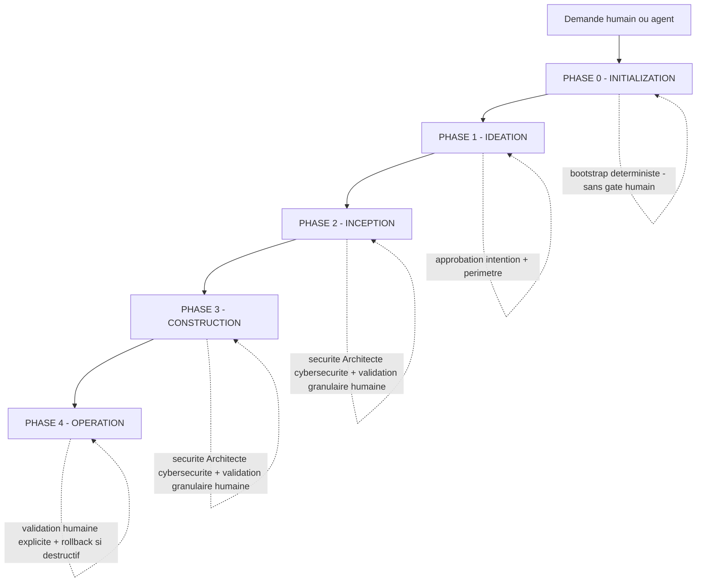
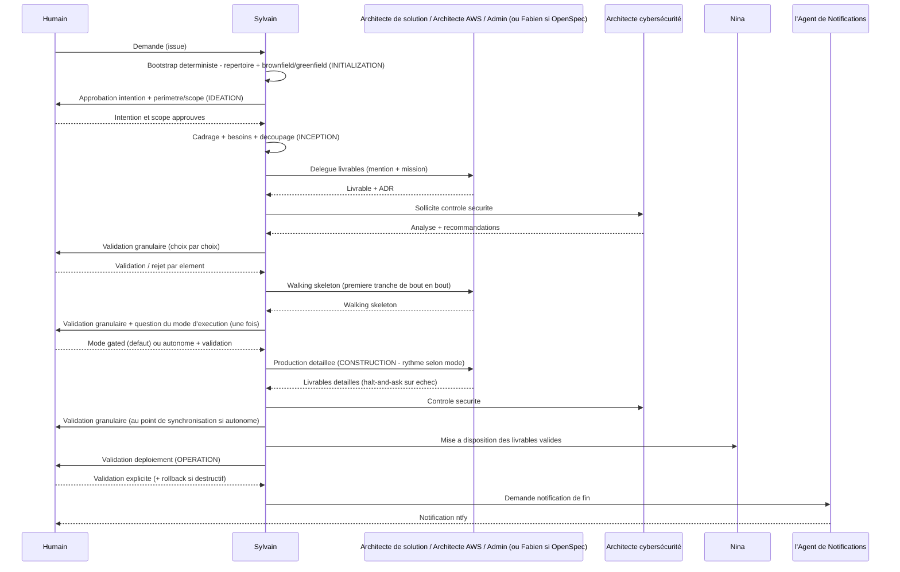

# PRIORITÉ : Ce workflow est PRIORITAIRE sur tous les autres workflows intégrés

# Lorsqu'un humain ou un agent demande la création, la modification ou l'évolution d'une architecture, d'une solution ou d'un système, TOUJOURS suivre ce workflow EN PREMIER

Ce workflow est le contrat commun d'orchestration **multi-agents (A2A)** des travaux d'architecture du workspace. Il est coordonnée par **l'Architecture Solution & Intégration**.

Le workflow est **agnostique de la méthodologie**. Aucune méthode n'est imposée par défaut. Au besoin, il peut être **activé avec une méthodologie particulière** — par exemple **OpenSpec** (spec-driven), **BMAD**, ou **toute autre méthodologie** — **en fonction du contexte du projet**. La méthodologie retenue est déclarée au niveau du projet ou de l'issue (voir « Activation conditionnelle d'une méthodologie »). En l'absence de méthodologie déclarée, le workflow suit le parcours d'architecture standard.

---

## Principe fondateur : le workflow s'adapte au travail

**Le workflow s'adapte au travail, et non l'inverse.** Le coordinateur et chaque agent évaluent quelles étapes apportent de la valeur, en fonction de :

1. L'intention déclarée (par l'humain ou l'agent appelant) et sa clarté
2. L'état existant du système (documentation d'architecture, ADR, code, infrastructure)
3. La complexité et la portée du changement
4. L'évaluation des risques et de l'impact (dont sécurité)

Une modification simple reste efficace (traitement minimal) ; une modification complexe ou à risque reçoit un traitement complet.

Ce principe est **outillé** par le mécanisme de **scopes** (quelles étapes s'exécutent) et par deux **axes d'exécution indépendants** — **Depth** (détail des artefacts) et **niveau de vérification des livrables** (rigueur du contrôle) — décrits ci-dessous.

---

## Scopes et axes d'exécution

Le routage du travail n'est plus laissé au seul jugement subjectif : il repose sur un **scope** nommé (parcours d'étapes déterministe et auditable) et sur deux **axes indépendants** qui règlent, séparément, le détail des artefacts et la rigueur de leur vérification.

> Adaptation d'AI-DLC 2.0 (`awslabs/aidlc-workflows/core/scopes`) au contexte du workspace : architecture de solution, AWS, infrastructure Windows, livrables majoritairement documentaires. Décision structurante tracée dans [ADR-0003](../decisions/0003-scopes-et-axes-depth-verification.md).

### Table des scopes

| Scope | Intention type | Traitement |
| --- | --- | --- |
| `standard` *(défaut)* | Évolution ou conception d'architecture « normale » | Parcours d'architecture standard complet |
| `feature` | Ajout / évolution fonctionnelle d'une solution | Inception ciblée + Construction, sécurité systématique |
| `infra` | Infra / plateforme (AWS, réseau, Windows, migration) | Accent Architecte AWS / Admin Infrastructure Windows, rollback obligatoire |
| `security-patch` | Correction / durcissement de sécurité | **Architecte cybersécurité pilote**, périmètre resserré, traçabilité renforcée |
| `mvp` | Produit minimum viable — première version fonctionnelle à faire évoluer | Parcours ciblé sur le cœur de valeur, Depth standard, dette technique tracée |
| `poc` | Preuve de concept / exploration jetable | Allégé, Depth minimale, pas d'exigence de complétude documentaire |
| `express` | Petit changement clair et à faible risque | Chemin court : cadrage + décision + validation, étapes lourdes ignorées |
| `enterprise` | Chantier structurant, fort impact / conformité | Parcours complet + Depth comprehensive + normes conditionnelles activables |

Le scope par **défaut**, en l'absence de mot-clé détecté, est **`standard`** (parcours d'architecture actuel — aucune régression, compatibilité ascendante).

**Invariants non négociables, quel que soit le scope** — aucun scope ne peut les désactiver, y compris `poc` et `express` :

- Validation humaine granulaire (chaque choix validé / rejeté séparément).
- ADR sur chaque décision structurante.
- Piste d'audit sur l'issue.
- Contrôle sécurité minimal toujours actif (OWASP / STRIDE).

### Matrice stage × scope

Adossée à la structure à **5 phases** du workflow (Initialization / Ideation / Inception / Construction / Operation — voir « Vue d'ensemble des phases »). Légende : ✅ activé · ➖ allégé / optionnel · ❌ ignoré · 🔒 renforcé · *cond.* conditionnel.

| Étape | `standard` | `feature` | `infra` | `security-patch` | `mvp` | `poc` | `express` | `enterprise` |
| --- | --- | --- | --- | --- | --- | --- | --- | --- |
| 0.x Initialization (bootstrap) | ✅ | ✅ | ✅ | ✅ | ✅ | ✅ | ✅ | ✅ |
| 1.x Ideation (intention + scope) | ✅ | ✅ | ✅ | ✅ | ✅ | ➖ | ➖ | ✅ |
| 2.1 Cadrage | ✅ | ✅ | ✅ | ✅ | ✅ | ✅ | ✅ | ✅ |
| 2.2 Contexte existant | ➖ | ✅ | ✅ | ✅ | ➖ | ❌ | ➖ | ✅ |
| 2.3 Analyse besoins | ✅ | ✅ | ✅ | ✅ 🔒 [^sp13] | ✅ | ➖ | ➖ [^ex] | ✅ 🔒 [^ent13] |
| 2.4 Découpage livrables | ✅ | ✅ | ✅ | ➖ | ✅ | ➖ | ➖ | ✅ |
| 2.5 Conception + ADR | ✅ | ✅ | ✅ | ✅ 🔒 | ✅ | ➖ | ➖ | ✅ 🔒 |
| Contrôle sécurité (Architecte cybersécurité) | ✅ | ✅ | ✅ | 🔒 pilote | ✅ | ➖ | ➖ | ✅ 🔒 |
| 3.1 Livrables détaillés | ✅ | ✅ | ✅ | ✅ | ✅ | ➖ | ➖ | ✅ |
| 3.2 Sécurité + cohérence | ✅ | ✅ | ✅ | 🔒 | ✅ | ➖ | ➖ [^ex] | ✅ 🔒 |
| 3.3 Consolidation + mise à disposition | ✅ | ✅ | ✅ | ✅ | ✅ | ➖ | ✅ | ✅ |
| 4.x Operation / déploiement | *cond.* | *cond.* | ✅ | *cond.* | *cond.* | ❌ | *cond.* [^ex] | ✅ |
| Validation humaine granulaire | ✅ | ✅ | ✅ | ✅ | ✅ | ✅ | ✅ | ✅ |

[^sp13]: `security-patch` — l'étape `2.3` couvre a minima l'**analyse d'impact du correctif** : surface affectée, effets de bord, non-régression de sécurité. Exigence, pas option (un correctif sans analyse d'impact peut rouvrir ou déplacer la vulnérabilité).
[^ex]: `express` — l'allègement est réservé aux changements **sans impact runtime / production**. **Dès qu'un `express` implique un déploiement ou une action à impact** (`4.x` ≠ ❌), l'étape `3.2 Sécurité + cohérence` repasse à **✅** (non ➖) et la vérification à **`standard`** minimum.
[^ent13]: `enterprise` — l'étape `2.3` inclut deux pré-requis obligatoires : (a) une **classification des données traitées** (publiques / internes / sensibles / réglementées), et (b) un **point de contrôle « applicabilité des normes »** (voir « Renforcements sécurité par scope »).

#### Renforcements sécurité par scope

Ces clauses, issues du contrôle sécurité (Architecte cybersécurité), sont **contraignantes** — elles ferment les vecteurs d'abaissement de la posture de sécurité par le routage lui-même :

- **`security-patch` — analyse d'impact obligatoire** : l'étape `2.3` couvre l'impact du correctif (surface affectée, effets de bord, non-régression), même en traitement resserré. *(voir [^sp13])*
- **`enterprise` — applicabilité des normes tracée** : point de contrôle obligatoire où l'Architecte cybersécurité et l'humain **statuent explicitement** sur l'applicabilité de chaque norme candidate (PCI DSS / GDPR / Loi 25 / LPRPDE). La décision — **y compris « aucune norme spécifique requise »** — est **tracée en ADR** (sinon la conformité repose sur un oubli possible).
- **`enterprise` — classification des données** : pré-requis en `2.3` ; c'est elle qui conditionne l'activation des normes et le niveau `renforcé`. *(voir [^ent13])*
- **`express` — pas d'allègement sur action à impact** : réservé au sans-impact runtime/production ; sur déploiement ou action à impact, `3.2` = ✅ et vérification ≥ `standard`. *(voir [^ex])*
- **`poc` — non promouvable directement** : un PoC est **jetable par construction**. Il ne peut **jamais** être promu tel quel ; toute reprise en `feature` / `mvp` / `enterprise` **re-déclenche le contrôle sécurité complet du scope cible**.

**Affectation des agents par scope** (déclencheurs A2A) :

- `feature`, `standard`, `mvp`, `enterprise` → Architecte de solution (+ Architecte AWS si cloud) ; Architecte cybersécurité systématique.
- `infra` → Architecte AWS et/ou Admin Infrastructure Windows au premier plan ; plan de rollback validé avant toute action destructive.
- `security-patch` → **Architecte cybersécurité pilote l'analyse** ; Architecte de solution en appui documentaire.
- `poc`, `express` → Architecte de solution seul ; contrôle sécurité allégé mais toujours présent.
- La mise à disposition des livrables validés est confiée au **Gestionnaire de document**.
- OpenSpec (Fabien) reste **conditionnel** à tous les scopes, jamais imposé.

### Auto-détection du scope

Le scope est **auto-détecté** par mots-clés dans l'intention exprimée en langage libre (français / anglais), puis **confirmé explicitement avant démarrage** — jamais de démarrage silencieux sur un scope simplement déduit.

| Scope | Mots-clés FR | Mots-clés EN |
| --- | --- | --- |
| `standard` *(défaut)* | *(aucun mot-clé — scope retenu par défaut si aucun autre ne correspond)* | *(no keyword — default fallback)* |
| `feature` | fonctionnalité, évolution, ajouter, nouvelle capacité | feature, capability, add |
| `infra` | infrastructure, réseau, AWS, VM, migration, Windows, Intune, golden image | infra, network, deploy, migration, platform |
| `security-patch` | sécurité, faille, vulnérabilité, correctif, durcissement, CVE | security, vulnerability, patch, hardening, CVE |
| `mvp` | mvp, produit minimum viable, première version, version initiale, socle | mvp, minimum viable product, first version, initial release |
| `poc` | poc, preuve de concept, prototype, explorer, maquette | poc, proof of concept, prototype, spike |
| `express` | rapide, petit, mineur, trivial, urgent | express, quick, small, minor |
| `enterprise` | conformité, PCI, GDPR, Loi 25, audit, critique, entreprise | enterprise, compliance, audit, critical |

**Règle de désambiguïsation** — en cas de plusieurs correspondances, l'ordre de priorité est :

`security-patch` > `enterprise` > `infra` > `feature` > `mvp` > `poc` > `express` > `standard`

La sécurité et la conformité priment ; à défaut de tout mot-clé, le scope retenu est `standard`. En cas d'ambiguïté résiduelle ou de conflit fort, le coordinateur **propose le scope détecté et demande confirmation** plutôt que de trancher seul.

### Axe 1 — Depth (détail des artefacts)

Règle le niveau de détail des artefacts produits, **indépendamment** du scope et de l'axe de vérification :

- `minimal` : intention documentée, décision essentielle, pas de vues exhaustives.
- `standard` : besoins fonctionnels / non fonctionnels, ADR, diagrammes principaux.
- `comprehensive` : traçabilité complète, alternatives détaillées, vues multiples, registre de dette technique.

### Axe 2 — Niveau de vérification des livrables

Règle la rigueur du contrôle des livrables, **indépendamment** de Depth. Cet axe remplace, pour un workspace produisant majoritairement de la documentation d'architecture, l'axe « test strategy » d'AI-DLC :

- `advisory` : contrôle de cohérence par jugement d'agent.
- `standard` : cohérence documentation ↔ ADR + contrôle sécurité OWASP / STRIDE + validation humaine.
- `renforcé` : + traçabilité exigence ↔ ADR ↔ livrable, syntaxe des diagrammes validée, normes conditionnelles si demandées. *(Préfigure les Verification gates et Sensors introduits ultérieurement.)*
- **Cas code / IaC** : dès qu'un livrable comporte du code ou de l'IaC (ex. OpenSpec activé), cet axe **inclut une stratégie de tests** — le niveau `renforcé` exige alors des tests. L'axe reste ainsi compatible avec le sens AI-DLC quand du code existe, sans l'imposer à la documentation pure.

### Valeurs par défaut des axes, par scope

Les valeurs ci-dessous sont les **défauts** ; elles sont overridables (voir « Points d'override »).

| Scope | Depth par défaut | Vérification par défaut |
| --- | --- | --- |
| `standard` | standard | standard |
| `feature` | standard | standard |
| `infra` | standard | renforcé |
| `security-patch` | standard | renforcé |
| `mvp` | standard | standard |
| `poc` | minimal | advisory |
| `express` | minimal | standard |
| `enterprise` | comprehensive | renforcé |

### Points d'override

Les deux axes peuvent être ajustés à trois moments, du plus tôt au plus tard :

1. **À l'invocation** : l'humain ou l'agent appelant fixe `depth=` et `verification=` dans la demande.
2. **À la confirmation de scope** : lors de la confirmation du scope auto-détecté, le coordinateur propose les défauts et l'humain peut les ajuster.
3. **À un gate** : à une frontière de phase, l'humain peut **relever** le niveau (jamais l'abaisser sous les invariants).

**Garde-fou sécurité** : tout niveau lié à la sécurité **ne peut jamais être abaissé** par un override. Le plancher couvre trois leviers, pas seulement l'axe de vérification :

1. **Axe de vérification** : le contrôle sécurité minimal (OWASP / STRIDE) et, pour les scopes `security-patch` et `enterprise`, le niveau de vérification `renforcé` constituent un plancher ; un override ne peut que les maintenir ou les renforcer.
2. **Axe Depth** : sur `security-patch` et `enterprise`, la Depth **ne peut pas descendre sous `standard`** (préserve la traçabilité exigence ↔ ADR ↔ livrable, qui est un contrôle d'intégrité).
3. **Re-scoping** : tout changement de scope qui **abaisse le niveau de contrôle** d'un travail déjà détecté comme sécuritaire (mots-clés `security-patch`, ou scope courant `security-patch` / `enterprise`) **exige une validation humaine explicite tracée** sur l'issue. La reclassification en `express` / `poc` pour esquiver les contrôles est un contournement (STRIDE : Elevation of Privilege / Tampering sur la décision de routage) et n'est jamais silencieuse.

**Auto-détection = plancher, jamais plafond** : lorsqu'un scope est proposé par détection, la confirmation humaine peut le **maintenir ou monter** vers un scope à contrôle plus strict (ex. `security-patch` → `enterprise`) ; elle ne peut **descendre** vers un scope à contrôle allégé qu'avec la validation tracée du re-scoping (point 3).

---

## Règles & boucle d'apprentissage

Le workspace **capitalise les corrections humaines en règles persistantes** pour qu'un agent ne répète pas la même erreur d'un projet à l'autre. Le mécanisme combine une **mémoire de règles multi-couches** (fichiers Markdown versionnés) et une **boucle d'apprentissage** déclenchée aux points de validation humaine.

> Adaptation d'AI-DLC 2.0 (`awslabs/aidlc-workflows/core/memory`) au contexte du workspace (gouvernance A2A, livrables majoritairement documentaires, piste d'audit sur l'issue). Décision structurante tracée dans [ADR-0004](../decisions/0004-boucle-apprentissage-et-regles-persistantes.md). Les règles vivent dans [`core/rules/`](../core/rules/README.md).

### Système de règles en couches

Quatre couches, de la plus forte à la plus faible **précédence** :

| Couche | Fichier | Portée | Chargement |
| --- | --- | --- | --- |
| `workspace` | `core/rules/workspace.md` | Invariants et conventions valables partout | Au démarrage (toujours actif) |
| `project` | `core/rules/projects/<projet>.md` | Spécifique à un projet | Au démarrage, uniquement le projet courant |
| `phase` | `core/rules/phases/<phase>.md` (`inception` / `construction` / `operation`) | Par phase du workflow | À la demande, quand la phase est déclenchée |
| `scope` | `core/rules/scopes/<scope>.md` (les 8 scopes de la section précédente) | Par scope | À la demande, quand le scope est confirmé |

**Précédence** : `workspace` > `project` > `phase` > `scope`. Une règle d'une couche **ne peut pas contredire** une règle d'une couche supérieure sans arbitrage humain (voir « Contrôle de conflit à l'admission »).

Chaque règle porte un identifiant stable `RULE-<COUCHE>-NNN`, sa portée, l'issue d'origine et sa date d'ajout.

### Chargement des règles (paresseux)

Conformément au chargement optimisé pour le contexte : au démarrage, ne charger que les couches **toujours actives** — `workspace` et le `project` courant — ainsi que l'**index (titres) des règles** des autres couches. Les règles `phase` et `scope` ne sont chargées **en intégralité qu'à la demande**, lorsque la phase ou le scope concerné est effectivement déclenché. Documenter sur l'issue les règles chargées à la demande.

### La boucle d'apprentissage

La boucle capitalise les corrections humaines **sans jamais modifier l'exécution en cours** :

1. **Journal d'observations** *(pendant l'étape)* — chaque correction / rejet ❌ / reformulation 💬 humaine sur un choix est consignée en commentaire sur l'issue (piste d'audit existante) comme **candidat-règle** potentiel.
2. **Remontée des candidats** *(au point de validation humaine)* — le coordinateur formule les candidats détectés en règles courtes (« à l'avenir, faire X plutôt que Y »), en proposant pour chacun une **couche** et une **portée**. La détection est systématique (déclencheur **C1**) mais ne fait qu'alimenter la proposition.
3. **Confirmation humaine** — l'humain garde ✅ / rejette ❌ / reformule 💬 **chaque candidat séparément**. **Aucune règle n'est écrite sans validation humaine explicite** (garde-fou).
4. **Contrôle de conflit à l'admission** — avant écriture, chaque règle confirmée passe le contrôle ci-dessous.
5. **Écriture sur disque** — la règle admise est ajoutée au fichier de sa couche dans `core/rules/`, avec identifiant, portée, issue d'origine et date.
6. **Application au prochain workflow** — une règle nouvellement écrite **ne s'applique jamais en cours de route** ; elle est chargée au démarrage du **prochain** workflow.

**Portée par défaut** d'une règle apprise, en l'absence de précision : `project`. La promotion `project → workspace` est une décision structurante explicite (tracée en ADR si structurante) et **soumise dans tous les cas au contrôle sécurité systématique de l'Architecte cybersécurité** — qu'elle « touche la sécurité » ou non, au même titre qu'une écriture native en couche `workspace` (voir « Contrôle de conflit à l'admission », SEC-4). La qualification « touche la sécurité » ne conditionne jamais le déclenchement de ce contrôle.

### Contrôle de conflit à l'admission

Une règle apprise **ne peut pas contredire — ni éroder — une règle de niveau supérieur ou un garde-fou sans arbitrage humain**. Avant écriture :

1. **Précédence des couches** — `workspace` > `project` > `phase` > `scope`. Un candidat qui contredit une règle d'une couche supérieure n'est pas écrit tel quel : le coordinateur **remonte le conflit à l'humain** (et à l'Architecte cybersécurité si la règle touche la sécurité) ; l'arbitrage humain décide (rejet, reformulation, ou modification explicite de la règle supérieure via son canal propre — ADR si structurant). **Le coordinateur ne tranche jamais seul un conflit.**
2. **Invariants non contournables** — aucune règle apprise, à aucune couche, ne peut affaiblir les invariants non négociables (validation humaine granulaire, ADR sur décision structurante, piste d'audit sur l'issue, contrôle sécurité minimal OWASP / STRIDE) ni les garde-fous sécurité des scopes (plancher de vérification, Depth non abaissable sur `security-patch` / `enterprise`, re-scoping tracé). Un candidat qui les contredit est **rejeté d'office**.
3. **SEC-1 — Contrôle d'érosion sémantique** — le contrôle ne se limite pas à la contradiction littérale : un candidat qui **restreint la portée, ajoute une exception, ou conditionne l'application** d'un invariant non contournable ou d'un garde-fou de scope est traité comme un affaiblissement et **rejeté d'office**, même s'il n'entre pas en contradiction directe. L'idempotence n'exonère jamais de ce contrôle.
4. **SEC-2 — Contrôle sécurité systématique, à périmètre fondé sur le risque** — le contrôle sécurité de l'Architecte cybersécurité, avant écriture, s'applique à **toute** règle de couche `workspace`, **et** à toute règle de couche `project`, `phase` ou `scope` dès lors qu'elle vise ou modifie le comportement d'un scope à garde-fous (`security-patch`, `enterprise`), d'une phase de vérification, ou d'un contrôle de sécurité existant. Le critère de déclenchement est le **risque**, pas seulement la couche.
5. **SEC-3 — Pas d'exploitation d'un candidat dans le run courant** — un candidat-règle capturé pendant une étape **n'a aucune valeur normative tant qu'il n'est pas confirmé, contrôlé et écrit**. Il ne peut être ni appliqué, ni invoqué comme justification d'un autre choix dans le run courant. Seules les règles déjà écrites au démarrage du workflow font autorité ; l'application reste différée au **prochain** workflow, sans exception.
6. **SEC-5 — Intégrité du canal d'écriture** — aucune règle n'est ajoutée, modifiée ou supprimée dans `core/rules/` en dehors de la boucle d'apprentissage (capture → confirmation humaine → contrôle de conflit à l'admission). Toute modification de `core/rules/` est versionnée, revue en PR et porte l'`origine` (issue) et la date ; une entrée sans provenance traçable est invalide et retirée.
7. **Idempotence** — un candidat déjà couvert par une règle existante n'est pas ré-écrit (évite la dérive de `core/rules/`) — sans jamais court-circuiter SEC-1.

> **SEC-4 — Contrôle sécurité systématique sur promotion vers `workspace`** : toute promotion d'une règle de `project` (ou couche inférieure) vers `workspace` est soumise au contrôle sécurité systématique de l'Architecte cybersécurité, qu'elle « touche la sécurité » ou non, au même titre qu'une écriture native en couche `workspace` (voir « Portée par défaut »).

### Articulation avec l'audit et OpenSpec

- **Piste d'audit** : la *capture* (candidats, décision humaine, conflit éventuel) vit **sur l'issue** ; seule la **règle acceptée** est écrite dans `core/rules/`. Pas de fichier `audit.md`.
- **OpenSpec (conditionnel)** : lorsqu'OpenSpec est activé, les règles apprises pertinentes pour l'Inception peuvent enrichir la formulation des propositions (Fabien), sans jamais imposer OpenSpec.

---

## Verification gates & Sensors

Le workspace ajoute deux mécanismes de **fiabilisation déterministe** qui soulagent l'humain des vérifications mécaniques, **sans jamais se substituer à la validation humaine granulaire** : les **verification gates** (contrôle automatique de traçabilité aux frontières de phases) et les **sensors** (checks déterministes déclenchés à l'écriture d'un artefact). Les deux sont **advisory** : ils produisent une trace d'audit factuelle mais **ne bloquent jamais** le gate humain (voir « Caractère advisory »).

> Adaptation d'AI-DLC 2.0 (`awslabs/aidlc-workflows/core` — mécanismes *verification gates* et *sensors*) au contexte du workspace : gouvernance A2A, livrables majoritairement documentaires, piste d'audit sur l'issue. Décision structurante tracée dans [ADR-0005](../decisions/0005-verification-gates-et-sensors.md). Les définitions déterministes vivent dans [`core/sensors/`](../core/sensors/README.md). Ce mécanisme **matérialise** le niveau de vérification `renforcé` de l'[ADR-0003](../decisions/0003-scopes-et-axes-depth-verification.md) et s'appuie sur la piste d'audit de l'[ADR-0004](../decisions/0004-boucle-apprentissage-et-regles-persistantes.md).

### Distinction : gate automatique ≠ gate humain

| | **Verification gate (automatique)** | **Validation humaine granulaire (gate humain)** |
| --- | --- | --- |
| Nature | Contrôle **déterministe** de traçabilité | Jugement **humain** choix par choix |
| Objet | Présence / cohérence / liaison des artefacts | Pertinence, justesse, arbitrage des décisions |
| Effet | **Advisory** : produit un rapport, ne bloque pas | **Contraignant** : rien n'avance sans ✅ |
| Position | À l'entrée du gate humain, en amont | Le gate décisionnel lui-même |

Le verification gate **prépare** le gate humain : il factualise l'état de traçabilité pour que l'humain valide le *contenu*, pas la *plomberie*. Il ne remplace, n'abaisse ni ne court-circuite jamais la validation humaine (invariant non négociable).

### Verification gates — contrôle de traçabilité aux frontières de phases

À **chaque transition de phase**, avant le point de validation humaine, le coordinateur exécute un **contrôle automatique de traçabilité** distinct de la validation humaine. Trois contrôles déterministes :

1. **Présence des artefacts requis** — les artefacts attendus à la sortie de la phase existent (voir table ci-dessous).
2. **Liaison exigence ↔ ADR ↔ livrable** — chaque exigence retenue est reliée à un ADR ou à un livrable ; chaque décision structurante est tracée en ADR.
3. **Absence d'artefact orphelin** — aucun ADR / livrable / diagramme n'est déconnecté (sans exigence amont ni référence).

**Frontières de phases et artefacts requis** (alignées sur l'ossature à **5 phases** — voir « Vue d'ensemble des phases » et [ADR-0006](../decisions/0006-passage-5-phases-et-mode-autonomie-construction.md) ; ancrage initial [ADR-0003](../decisions/0003-scopes-et-axes-depth-verification.md), IMP-003) :

| Frontière | Artefacts requis en sortie | Contrôles du gate |
| --- | --- | --- |
| **Entrée → Initialization** | Répertoire projet confirmé, brownfield / greenfield détecté, piste d'audit ouverte | Présence (répertoire, contexte détecté) — déterministe, sans gate humain |
| **Initialization → Ideation** | Contexte détecté consigné, règles toujours actives chargées | Présence (contexte, index des règles) |
| **Ideation → Inception** | Intention capturée (entrée brute), scope + axes confirmés, maquettes si UI (sinon N/A) | Présence (intention, scope) + approbation périmètre tracée |
| **Inception → Construction** | Besoins tracés, ADR de conception, diagramme(s) principal(aux), scope + axes confirmés | Présence + liaison exigence ↔ ADR + absence d'orphelin + `diagram-validity` sur les diagrammes produits |
| **Construction → Operation** | Livrables détaillés, ADR à jour, cohérence documentation ↔ ADR, mode d'exécution consigné | Présence + liaison + absence d'orphelin + `required-sections` sur ADR/DAS |
| **Operation → Fin** | Plan / configuration validé, rollback si action destructive | Présence (plan, rollback conditionnel) |

**En cas d'échec** (advisory) : le coordinateur **ne bloque pas** mais **signale l'écart** dans le rapport de gate sur l'issue et **propose de revenir corriger** avant de présenter le contenu à l'humain. L'humain reste seul décideur : il peut demander la correction, ou valider en connaissance de cause en actant l'écart sur l'issue.

### Sensors — checks déterministes à l'écriture d'un artefact

Un **sensor** est un check **déterministe** (pas de jugement d'agent) déclenché **à l'écriture d'un artefact** d'un type donné. Trois sensors sont définis, dont **deux prioritaires** (`required-sections`, `upstream-coverage`) et un troisième pour les diagrammes générés en code (`diagram-validity`).

#### Sensor 1 — `required-sections` (sections requises) — *prioritaire*

- **Périmètre de déclenchement** : écriture d'un **ADR** (`decisions/NNNN-*.md`) ou d'un document d'architecture (DAS).
- **Contrôle** : les rubriques obligatoires du gabarit sont présentes et non vides.
  - **ADR** : `Status`, `Contexte`, `Décision`, `Conséquences` (Positives / Négatives), `Alternatives étudiées`, `Références` — en-tête méta (`auteurs`, `accepté par`, `accepté le`). *(Rubriques dérivées des ADR existants 0001–0004.)*
  - **DAS** : titre, contexte / objectif, vues (fonctionnelle / technique), décisions liées (ADR), risques.
- **Sortie** : liste des rubriques manquantes / vides (advisory).

#### Sensor 2 — `upstream-coverage` (couverture amont) — *prioritaire*

- **Périmètre de déclenchement** : écriture d'un **ADR**, d'une **DAS** ou d'un **livrable** détaillé.
- **Contrôle** : le livrable **référence explicitement sa demande amont** — issue d'origine (`ALI-NNN` / `HOM-NNN`) et, le cas échéant, l'**ADR parent** ou la décision de cadrage dont il découle. Pour un ADR : présence d'au moins une entrée `Références` reliant à l'issue et/ou aux ADR liés.
- **Sortie** : signalement si aucune référence amont détectée (artefact potentiellement orphelin — recoupe le contrôle 3 du gate).

#### Sensor 3 — `diagram-validity` (validité de diagramme)

- **Périmètre de déclenchement** : écriture d'un diagramme **généré en code** (bloc Mermaid / PlantUML dans un `.md`, fichier `.puml`, Structurizr DSL).
- **Contrôle** : la **syntaxe** du diagramme est valide (parse sans erreur). Cohérent avec l'obligation « générer les diagrammes en code et en valider la syntaxe avant écriture ».
- **Sortie** : erreur de parsing localisée (advisory) ; l'écriture reste possible mais l'écart est tracé.

### Caractère advisory (garde-fou de gouvernance)

Les gates automatiques et les sensors sont **advisory par décision** :

- Ils **ne bloquent jamais** la validation humaine granulaire ni ne se substituent à elle — celle-ci reste l'unique gate décisionnel contraignant (invariant non négociable).
- Ils **ne peuvent pas abaisser** un contrôle de sécurité : un sensor advisory ne remplace pas le contrôle sécurité systématique de l'Architecte cybersécurité, qui reste obligatoire aux mêmes points qu'aujourd'hui (§2.5, §3.2).
- Un signal advisory **en échec n'autorise aucun raccourci** : il informe, il ne décide pas. Inversement, un signal **au vert ne vaut pas validation** — il ne dispense jamais du contrôle sécurité ni de la validation humaine.
- **Passage à bloquant** : rendre un sensor bloquant est une **décision structurante explicite**, tracée en ADR et soumise au contrôle sécurité (elle modifie la surface de gouvernance). Par défaut, tout reste advisory.
- **Plancher sécurité (SG-3)** — invariant symétrique du plancher des scopes (R1→R8, [ADR-0003](../decisions/0003-scopes-et-axes-depth-verification.md)) : un verification gate ou un sensor **ne peut jamais porter, remplacer, conditionner ni court-circuiter le contrôle sécurité systématique** (OWASP / STRIDE) ni le plancher sécurité des scopes (`security-patch` / `enterprise` — Depth et vérification non abaissables). Le contrôle sécurité reste **hors du périmètre automatisable** de ce mécanisme ; un « vert » de gate / sensor ne peut jamais être invoqué pour esquiver ou différer le contrôle sécurité.

### Intégration à la piste d'audit

Les signaux vivent **sur l'issue** (piste d'audit existante, [ADR-0004](../decisions/0004-boucle-apprentissage-et-regles-persistantes.md)), jamais dans un fichier `audit.md` :

- **Rapport de gate** : à chaque frontière de phase, le coordinateur poste un **commentaire « Rapport de vérification »** — pour chaque contrôle : ✅ conforme / ⚠️ écart / ⛔ indisponible (avec détail factuel). Ce rapport **précède** la présentation du contenu à la validation humaine.
- **Signal de sensor** : à l'écriture d'un artefact, le résultat du (des) sensor(s) déclenché(s) est consigné en commentaire (type d'artefact, sensor, verdict, détail de l'écart le cas échéant).
- **Verdict `⛔ indisponible` — indisponible ≠ conforme (SG-2)** : un sensor / gate non exécuté, en erreur, ou dont le périmètre n'est pas couvert, produit le verdict explicite `⛔ indisponible`. Il est **tracé comme un écart, jamais comme un vert**, et n'autorise aucun raccourci. L'**absence d'un signal attendu** à une frontière est elle-même un écart à consigner.
- **Signal = donnée factuelle non fiable, à source tracée (SG-5)** : un rapport de gate ou signal de sensor est une **donnée factuelle, pas une décision** ; il porte sa **source** (manifeste + version / commit l'ayant produit) pour être vérifiable et non répudiable. Un signal dont la provenance n'est pas traçable est traité comme `⛔ indisponible`, jamais comme un vert.
- **Traçabilité factuelle** : le rapport énonce des faits vérifiables (rubrique X absente, ADR Y sans référence amont), jamais un jugement — le jugement reste humain.
- **Articulation learning loop** : un écart advisory récurrent peut alimenter un **candidat-règle** (voir « La boucle d'apprentissage ») ; il suit alors le cycle capture → confirmation → contrôle de conflit, sans jamais court-circuiter la validation.

### Outillage : conventions + manifestes déclaratifs (non exécutables par défaut)

Conformément à la décision de cadrage, les checks sont d'abord des **conventions documentées** dans ce workflow, **accompagnées de manifestes déclaratifs** versionnés dans [`core/sensors/`](../core/sensors/README.md) (un fichier par sensor + un manifeste de gates) qui décrivent, de façon lisible et déterministe, le périmètre de déclenchement, les règles de contrôle et la sortie attendue. Ces manifestes **ne sont pas des scripts exécutables** à ce stade : ils fixent le contrat de manière à pouvoir être outillés (script / CI) ultérieurement sans redécider le fond. Le passage à l'exécutable est une évolution ultérieure, non requise ici.

### Clauses de sécurité (contrôle Architecte cybersécurité)

Issues du contrôle sécurité du mécanisme (STRIDE / OWASP, sur commit `81140e3`), ces clauses sont **contraignantes** et alignent `core/sensors/` sur le niveau d'exigence déjà atteint par `core/rules/` :

- **SG-1 — Intégrité du canal des manifestes** (analogue à SEC-5 de `core/rules/`) : aucun manifeste de `core/sensors/` (gate ou sensor) n'est ajouté / modifié / supprimé **hors PR revue**. Toute modification est versionnée et porte `origine` (issue) + date ; un manifeste sans provenance traçable est **invalide**. **Affaiblir un check** (retrait d'une règle, ajout d'une exception, réduction du périmètre de déclenchement) est une modification de la surface de gouvernance **soumise au contrôle sécurité systématique**.
- **SG-6 — Anti-érosion sémantique des manifestes** (analogue à SEC-1) : un manifeste modifié pour **restreindre le périmètre de déclenchement, ajouter une exception ou conditionner un check** est traité comme un affaiblissement soumis au contrôle sécurité, **même sans contradiction littérale**.
- **SG-4 — Pré-requis sécurité de l'exécution différée** (à respecter avant tout passage en CI, ancrés dès [ADR-0005](../decisions/0005-verification-gates-et-sensors.md)) : (a) **parsing statique uniquement** — aucun rendu, aucun accès réseau, aucune exécution de code ou directive embarquée dans un artefact contrôlé (`!include` distant, `getResource`, scripts) ; (b) tout contenu d'artefact traité comme **donnée non fiable** ; (c) exécution en environnement **sans secret ni privilège** (moindre privilège, pas d'accès en écriture au repo, pas de token) ; (d) `triggers` en glob **bornés au repo**, sans remontée de chemin ; (e) échec d'un check → verdict `⛔ indisponible` (SG-2), jamais `✅`.

*(Compléments dans les manifestes : verdict `⛔ indisponible` = SG-2, source tracée du signal = SG-5, plancher « jamais de gate/sensor sur un contrôle de sécurité » = SG-3 — voir « Caractère advisory » et « Intégration à la piste d'audit ».)*

---

## Modèle de collaboration A2A

Le workflow n'est pas exécuté par un seul agent. **l'Architecture Solution & Intégration est le coordinateur** : il analyse la demande, découpe en livrables, délègue aux agents spécialisés via des mentions sur les issues, contrôle les livrables, sollicite la sécurité, puis demande la validation humaine granulaire. **l'Architecture Solution & Intégration ne produit pas lui-même les livrables** (sauf vérification).

### Acteurs et responsabilités

| Acteur                                  | Rôle dans le workflow                                                                                                                                                                                |
| --------------------------------------- | ---------------------------------------------------------------------------------------------------------------------------------------------------------------------------------------------------- |
| **Humain (demandeur / valideur)**       | Exprime le besoin, arbitre les choix, valide **chaque** décision architecturale (validation granulaire) et autorise les actions à impact.                                                            |
| **Architecture Solution & Intégration** | **Coordinateur**. Lance et supervise les travaux, contrôle la cohérence avec les ADR, sollicite Architecte cybersécurité pour la sécurité, demande les validations humaines, orchestre la livraison. |
| **Architecte de solution**              | Documentation d'architecture (DAS), ADR, diagrammes C4 / Archimate / PlantUML / CALM. Ne traite pas la cybersécurité.                                                                                |
| **Architecte cybersécurité**            | Analyse des risques (OWASP, STRIDE, NIST, COBIT ; PCI DSS / GDPR / Loi 25 / LPRPDE sur demande explicite). **Sollicité par Sylvain à chaque modification d'architecture.**                           |
| **Architecte AWS**                      | Services AWS, diagrammes AWS, estimation et optimisation des coûts (tarifs officiels sourcés). Intervient quand AWS est requis.                                                                      |
| **Admin — Infrastructure Windows**      | Administration Windows : migrations Win10→Win11, Intune, VM, golden images, Autopilot, SCCM. Plan de rollback validé avant toute action destructive.                                                 |
| **OpenSpec Expert**                     | Cycle spec-driven (proposition, implémentation, archivage). **Sollicité uniquement si OpenSpec est activé** pour le projet.                                                                          |
| **Expert d'archivage**                  | Import / export de fichiers, archives, mise à disposition et téléchargement des livrables validés.                                                                                                   |
| **Agent de Notifications**              | Notification (ntfy) de fin de tâche, sur demande de Sylvain.                                                                                                                                         |

### Règle A2A

Un agent est déclenché par un **commentaire sur l'issue avec une mention valide** `[@Label](mention://agent/<uuid>)` et une **mission claire** : objectif, périmètre, critères d'acceptation. **Ne jamais deviner un UUID** : le résoudre via `multica agent list --output json` (champ `id`). L'agent appelé, en fin de tâche, mentionne en retour l'agent assigneur pour la vérification. Le coordinateur contrôle chaque livrable avant validation humaine.

---

## OBLIGATOIRE : Chargement du contexte au démarrage

Avant toute exécution, le coordinateur :

> Cette section détaille les opérations de la phase **Initialization** (§0.x, bootstrap déterministe sans gate humain) et du chargement paresseux des règles ; elle s'applique en amont de l'Ideation.

1. **Vérifie le répertoire officiel du projet** : S'il n'existe pas ou en cas de doute, demander confirmation à l'humain. Ne pas lancer les travaux sans cette confirmation.
2. **Charge le contexte existant** : documentation d'architecture, ADR, diagrammes, contraintes déjà tracées.
3. **Applique les paramètres par défaut d'architecture** (structure de répertoire, conventions de nommage, emplacements des ADR et diagrammes).
4. **Détermine si une méthodologie s'applique** (OpenSpec, BMAD, ou autre — voir ci-dessous).

### OBLIGATOIRE : Chargement optimisé pour le contexte

**Ne charger au démarrage que les éléments légers, et différer le chargement complet jusqu'au moment où il est réellement nécessaire** — afin de préserver la fenêtre de contexte.

**Au démarrage (chargement léger uniquement)** :

- Charger seulement les **métadonnées légères** nécessaires au cadrage et au routage : la **liste des livrables**, la **liste des agents disponibles et leurs descriptions** (via `multica agent list --output json` — champ `description`, **pas** les `instructions` complètes), la **liste des skills et leurs descriptions**, l'**index / titres des ADR** et le **sommaire de la documentation d'architecture**.
- **NE PAS** charger au démarrage : les instructions détaillées d'un agent, les fichiers de règles ou gabarits complets, les specs vivantes intégrales, ou le corps complet des ADR et documents.

**Chargement différé (à la demande, au moment de la délégation ou de l'utilisation)** :

- Charger le **contenu complet** d'un agent, d'une skill, d'une méthodologie, d'un gabarit, d'un ADR ou d'une spec **uniquement lorsque l'étape ou la délégation qui en a besoin est effectivement déclenchée**.
- Exemple : les règles complètes d'une méthodologie ne sont chargées **qu'après** que l'humain / le contexte projet l'a activée ; si aucune méthodologie n'est activée, ses règles ne sont jamais chargées.
- Exemple : les instructions détaillées d'un architecte (Architecte de solution, Architecte AWS, Architecte cybersécurité, Admin) ne sont pertinentes que pour l'agent lui-même au moment de sa tâche ; le coordinateur se contente de la description pour router.

**Règles conditionnelles** (ex. normes de sécurité PCI DSS / GDPR / Loi 25 / LPRPDE) : ne sont chargées et appliquées que si **explicitement demandées** ; par défaut, seules les règles toujours actives (OWASP / STRIDE) le sont. Les règles non applicables à l'étape en cours sont marquées **N/A** plutôt que chargées.

**Justification par étape** : à chaque étape, n'évaluer et ne charger que les règles et documents **pertinents pour l'objectif de l'étape et les artefacts produits**. Documenter sur l'issue ce qui a été chargé à la demande, pour garder la piste d'audit.

### Activation conditionnelle d'une méthodologie

**Aucune méthodologie n'est imposée par défaut.** Une méthodologie (OpenSpec, BMAD, ou autre) s'active uniquement si elle est déclarée en fonction du contexte projet :

- La **description du projet Multica** déclare la méthodologie (ex. `Méthodologie: OpenSpec`, `Méthodologie: BMAD` ; les variantes historiques `OpenSpec: Oui` / `OpenSpec: Non` restent reconnues), **ou**
- L'**issue porte un tag de méthodologie** (ex. `OpenSpec`, `BMAD`), **ou**
- L'humain le demande explicitement.

**Comportement** :

- **Méthodologie déclarée** → le coordinateur applique le cycle propre à cette méthodologie et **délègue à l'agent spécialiste** correspondant lorsqu'il existe. Les livrables des phases prennent la forme prescrite par la méthodologie retenue.
  - **OpenSpec** (spec-driven) → délégué à **Fabien** (`c2dbee8f-9ed4-4867-9b21-6cdd4a8840eb`). Les livrables d'Inception prennent la forme d'une proposition OpenSpec (proposal / design / tasks / deltas de specs au format EARS, termes en MAJUSCULES conservés en anglais : `## ADDED/MODIFIED/REMOVED Requirements`, `WHEN`, `THEN`, `SHALL`, `GIVEN`).
  - **BMAD** → appliquer le cycle BMAD ; le déléguer à l'agent spécialiste dédié s'il existe dans le workspace, sinon le piloter via le coordinateur et les architectes. Si aucun agent spécialiste n'est encore défini, le signaler à l'humain (un agent dédié pourra être créé ultérieurement).
  - **Autre méthodologie** → même logique : appliquer le cycle demandé, déléguer à l'agent spécialiste s'il existe, sinon le signaler à l'humain.
- **Méthodologie non déclarée / ambiguë** → si le contexte projet ne précise pas de méthodologie, demander à l'humain s'il faut en activer une (et laquelle), puis inscrire la réponse dans la description du projet.
- **Aucune méthodologie (ou explicitement aucune)** → suivre le **parcours d'architecture standard** décrit ci-dessous (documentation d'architecture + ADR + diagrammes produits par Architecte de solution / Architecte AWS / Admin, sans cycle méthodologique spécifique).

> Quelle que soit la méthodologie, la **gouvernance A2A reste identique** : coordination par Sylvain, contrôle sécurité systématique par Architecte cybersécurité, ADR obligatoires, validation humaine granulaire, mise à disposition via Nina, notification via l'Agent de Notifications.

---

## OBLIGATOIRE : Piste d'audit sur l'issue

La piste d'audit vit **sur l'issue Multica**, pas dans un fichier `audit.md`. Chaque agent :

- Documente **chaque étape franchie** en commentaire (analyse, décision, délégation, résultat, sollicitation sécurité, validation).
- Capture l'**entrée brute** des demandes et arbitrages humains lorsqu'elle conditionne une décision, sans la résumer.
- N'écrase jamais l'historique : on ajoute des commentaires.
- Trace chaque décision structurante dans un **ADR** ; les livrables détaillés vivent dans le répertoire du projet.

---

## OBLIGATOIRE : Langue et format

- Rédiger **tous les documents dans la langue de l'humain (français par défaut)**.
- **Conserver l'anglais** pour les termes non traduits des templates OpenSpec / EARS (uniquement si OpenSpec est activé).
- Générer les diagrammes **en code** (PlantUML, Mermaid, Structurizr DSL, CALM, Archimate) et en **valider la syntaxe** avant écriture. Toujours demander à l'humain le **format de diagramme souhaité** avant génération.
- Ne jamais inclure de secrets, mots de passe ou identifiants dans les livrables.

---

# Vue d'ensemble des phases

Le workflow s'aligne sur les **cinq phases d'AI-DLC 2.0** (`Initialization → Ideation → Inception → Construction → Operation`), réinterprétées pour la gouvernance d'architecture A2A du workspace. Décision structurante tracée dans [ADR-0006](../decisions/0006-passage-5-phases-et-mode-autonomie-construction.md).

Deux phases sont **ajoutées en amont** de l'ancienne structure à trois phases : **Initialization** (bootstrap déterministe) et **Ideation** (cadrage amont léger). Les trois phases historiques sont **conservées à l'identique** dans leur périmètre — seule la numérotation change (voir « Tableau de correspondance » ci-dessous). Aucune référence existante n'est cassée (compatibilité ascendante, [ADR-0002](../decisions/0002-strategie-compatibilite-et-terminologie.md)).

- **INITIALIZATION** — Préparer le terrain → bootstrap déterministe (répertoire projet, détection brownfield / greenfield, initialisation de la piste d'audit et de l'état). **Sans gate humain.**
- **IDEATION** — Cadrer l'intention → capture d'intention, faisabilité / contraintes, définition de périmètre (scope), maquettes si UI, **approbation** avant d'engager la conception.
- **INCEPTION** — Déterminer QUOI et POURQUOI → besoins, décisions d'architecture (ADR), conception cible validée.
- **CONSTRUCTION** — Déterminer COMMENT → produire les livrables détaillés (documentation, diagrammes, IaC ou implémentation), vérifier, faire valider. **Mode d'autonomie** posé une fois après le « walking skeleton » (voir § dédié).
- **OPERATION** — DÉPLOYER et EXPLOITER → déploiement / administration sous validation humaine explicite.

## Tableau de correspondance des phases (alias)

Conformément à [ADR-0002](../decisions/0002-strategie-compatibilite-et-terminologie.md), les libellés historiques du workspace sont conservés comme **alias** pour ne pas invalider la documentation et les références des travaux en cours.

| Phase AI-DLC (nouvelle nomenclature) | N° | Libellé / alias historique | Correspondance | Gate humain |
| --- | --- | --- | --- | --- |
| **Initialization** | 0 | *(nouveau — n'existait pas)* | Ajoutée en amont | Non (bootstrap déterministe) |
| **Ideation** | 1 | *(nouveau — cadrage amont)* | Ajoutée en amont | Approbation intention + périmètre |
| **Inception** | 2 | Inception (ex-Phase 1) | Périmètre **inchangé** | Validation granulaire humaine |
| **Construction** | 3 | Construction (ex-Phase 2) | Périmètre **inchangé** (+ mode autonomie) | Validation granulaire humaine |
| **Operation** | 4 | Operations / Operation (ex-Phase 3) | Périmètre **inchangé** | Validation humaine explicite |

> **Lecture des références existantes** : une issue ou un projet qui parle de « Phase 1 / Inception », « Phase 2 / Construction » ou « Phase 3 / Operation » reste valide — ces phases conservent leur nom et leur contenu ; seul leur numéro d'ordre est décalé par l'ajout des deux phases amont. Les couches de règles `phase` (`core/rules/phases/{inception,construction,operation}.md`) restent nommées par le nom de phase, pas par le numéro, donc inchangées.

---

# PHASE 0 — INITIALIZATION

**Objectif** : préparer le terrain de façon déterministe avant tout cadrage.
**Focus** : DANS QUEL CONTEXTE on travaille.
**Livrable de sortie** : contexte projet confirmé, nature du travail (brownfield / greenfield) détectée, piste d'audit initialisée. **Aucun gate humain** — étape mécanique et reproductible ; l'humain n'est sollicité qu'en cas de doute bloquant (répertoire projet introuvable).

**Étapes** :

- Vérification du répertoire projet (CONDITIONNEL — sollicite l'humain uniquement en cas de doute)
- Détection brownfield / greenfield
- Initialisation de l'état et de la piste d'audit

## 0.1 — Vérification du répertoire projet (déterministe)

1. Vérifier l'existence du **répertoire officiel du projet** et des emplacements conventionnels (`decisions/`, documentation d'architecture, `core/rules/`, `core/sensors/`).
2. **Seul cas de sollicitation humaine à cette phase** : répertoire introuvable ou ambigu → demander confirmation et **ne pas lancer les travaux** sans elle (reprend l'invariant « Chargement du contexte au démarrage », point 1). Ce n'est pas un gate de validation : c'est une garde déterministe.

## 0.2 — Détection brownfield / greenfield (déterministe)

- **Brownfield** : documentation d'architecture, ADR, diagrammes ou infrastructure **préexistants** détectés → la phase Inception activera le chargement du contexte existant (§2.2) et le contrôle d'orphelins des verification gates s'appuie sur l'existant.
- **Greenfield** : aucun existant pertinent → chargement du contexte existant marqué **N/A**, conception partant d'une page blanche.
- Le résultat (brownfield / greenfield) est **consigné sur l'issue** ; il n'appelle pas de validation humaine, c'est un fait détecté.

## 0.3 — Initialisation de l'état et de la piste d'audit (déterministe)

1. Ouvrir la **piste d'audit sur l'issue** (invariant, [ADR-0004](../decisions/0004-boucle-apprentissage-et-regles-persistantes.md)) : consigner le contexte détecté (répertoire, brownfield / greenfield).
2. Charger les **règles toujours actives** (`core/rules/workspace.md` + `project` courant) et l'**index** des autres couches (chargement paresseux, voir « Règles & boucle d'apprentissage »).
3. Appliquer le **chargement optimisé pour le contexte** (métadonnées légères uniquement — voir section dédiée).

> **Caractère déterministe (sans gate humain)** : Initialization ne produit aucune décision d'architecture ; elle n'a donc pas de gate de validation granulaire. Elle reste néanmoins **sous les invariants** (piste d'audit, aucun secret consigné) et son verification gate d'entrée est purement documentaire (voir « Verification gates »).

---

# PHASE 1 — IDEATION

**Objectif** : cadrer l'intention et le périmètre **avant** d'engager la conception détaillée.
**Focus** : EST-CE PERTINENT et JUSQU'OÙ.
**Livrable de sortie** : intention capturée, faisabilité / contraintes évaluées, **scope confirmé** et axes (Depth / vérification) proposés, **approbation humaine** de l'intention et du périmètre.

**Étapes** :

- Capture d'intention
- Faisabilité et contraintes
- Définition de périmètre (scope) et maquettes si UI
- Approbation de l'intention et du périmètre

## 1.1 — Capture d'intention

Consigner la **demande brute** (entrée non résumée) sur l'issue, conformément à la piste d'audit. Reformuler l'intention en une phrase vérifiable (« ce travail vise à… »).

## 1.2 — Faisabilité et contraintes

Évaluer, de façon **légère**, la faisabilité et les contraintes fortes (techniques, sécurité, coût, délais) susceptibles de rendre le travail non pertinent ou de le réorienter. Objectif : éviter d'engager l'Inception sur une base non viable, pas produire une étude détaillée (celle-ci relève de l'Inception).

## 1.3 — Définition de périmètre (scope) et maquettes

1. **Auto-détecter le scope** depuis l'intention (voir « Auto-détection du scope ») et le **proposer à confirmation** avec ses axes par défaut (Depth / niveau de vérification). Jamais de démarrage silencieux sur un scope simplement déduit.
2. **Maquettes / wireframes — CONDITIONNEL (UI uniquement)** : si le travail comporte une interface utilisateur, produire ou référencer des maquettes légères. **Marqué N/A** pour les travaux d'architecture / infrastructure sans UI (cas majoritaire du workspace).

## 1.4 — Approbation de l'intention et du périmètre (gate humain léger)

**Point de validation humaine** — l'humain approuve (ou ajuste) : l'**intention** reformulée, le **scope** proposé et ses **axes** (Depth / vérification). C'est un gate **léger** : il valide *qu'on part dans la bonne direction*, pas encore les décisions d'architecture (celles-ci sont validées en Inception, granulairement). Rien n'engage l'Inception tant que l'intention et le périmètre ne sont pas approuvés.

> **Réutilisation des agents existants** : l'Ideation ne crée pas de nouveaux rôles. La capture et la reformulation sont portées par le **coordinateur (Architecture Solution & Intégration)** ; les maquettes UI éventuelles relèvent de l'**Architecte de solution**. Aucune production détaillée ni ADR à ce stade.

---

# PHASE 2 — INCEPTION

**Objectif** : planification, collecte des besoins, décisions architecturales.
**Focus** : QUOI et POURQUOI.
**Entrée** : intention et périmètre (scope) approuvés en Ideation ; contexte projet initialisé en Initialization.
**Livrable de sortie** : conception cible et décisions (ADR) **validées par l'humain** de façon granulaire, après contrôle sécurité par Architecte cybersécurité.

**Étapes** :

- Réception et cadrage de la demande (TOUJOURS)
- Chargement du contexte existant (CONDITIONNEL — brownfield détecté en Initialization)
- Analyse des besoins (TOUJOURS — profondeur adaptative)
- Planification et découpage en livrables (TOUJOURS)
- Conception d'architecture et ADR (TOUJOURS)

## 2.1 — Réception et cadrage (TOUJOURS)

1. Passer l'issue en `in_progress`.
2. Reprendre la demande initiale (entrée brute) et l'intention approuvée en Ideation ; confirmer le répertoire du projet (détecté en Initialization) et l'activation éventuelle d'OpenSpec.
3. Clarifier le besoin d'affaires : objectifs, exigences fonctionnelles et non fonctionnelles, contraintes. **Ne poser que les questions qui changent réellement la conception.** Ne jamais deviner une information manquante.

## 2.2 — Chargement du contexte existant (CONDITIONNEL)

**Exécuter SI** : Initialization a détecté un contexte **brownfield** (système / documentation existants) et le contexte est insuffisant.
**Ignorer SI** : greenfield (détecté en Initialization), ou contexte déjà suffisant.

Charger la documentation d'architecture, les ADR et diagrammes pertinents ; en produire une synthèse sur l'issue.

## 2.3 — Analyse des besoins (TOUJOURS — profondeur adaptative)

- **Minimale** : demande simple et claire — documenter l'analyse d'intention.
- **Standard** : recueillir besoins fonctionnels et non fonctionnels (performance, sécurité, scalabilité, portabilité, maintenabilité).
- **Complète** : haut risque — besoins détaillés avec traçabilité.

Documenter les besoins retenus sur l'issue.

## 2.4 — Planification et découpage en livrables (TOUJOURS)

1. Déterminer les phases et étapes à exécuter et leur profondeur.
2. **Découper le travail en livrables** et désigner l'agent responsable de chacun :
   - Documentation d'architecture / ADR / diagrammes → **Architecte de solution**.
   - Choix AWS, diagrammes AWS, coûts → **Architecte AWS** (si AWS requis).
   - Administration / infrastructure Windows → **Admin Infrastructure Windows** (si concerné).
   - Cycle spec-driven → **Fabien** (uniquement si OpenSpec activé).
3. Créer les issues nécessaires et déclencher chaque agent par mention avec mission claire.
4. Produire la visualisation du workflow retenu (diagramme validé) sur l'issue.

## 2.5 — Conception d'architecture, ADR et contrôle sécurité (TOUJOURS)

1. Les agents désignés produisent leurs livrables de conception (vues fonctionnelle/technique, choix, alternatives, risques) et **tracent chaque décision structurante dans un ADR**.
2. **Contrôle sécurité obligatoire (Architecte cybersécurité)** : à **chaque modification d'architecture** par un agent, Sylvain lit le résumé des modifications, poste un commentaire mentionnant **Architecte cybersécurité** (`694a1a6f-9659-48ea-b45f-43ae6dc01706`) avec le contexte, **attend son analyse** et intègre ses recommandations avant toute validation. Préciser explicitement toute norme spécifique à appliquer (PCI DSS, GDPR, Loi 25, LPRPDE) — sinon seules OWASP/STRIDE (+ NIST/COBIT si documentation des risques) sont actives.
3. **Contrôle de cohérence ADR** : vérifier la correspondance documentation ↔ ADR, l'absence de conflits entre ADR ; signaler les écarts et demander les corrections aux agents responsables.
4. **Validation granulaire humaine** (point de synchronisation) : présenter à l'humain **chaque choix / recommandation séparément** (choix, justification, alternative), demander une validation ✅ / rejet ❌ / 💬 par élément. Ne pas avancer sur un élément non validé ; sur rejet, proposer une alternative et relancer la validation de cet élément uniquement.
5. **Analyse de dette technique (Architecte de solution)** : pour chaque décision ou spécification produite, l'Architecte de solution évalue le potentiel de réduction de la dette technique et consigne ses **recommandations justifiées/prouvées** dans l'ADR ou la spécification. Si un document de dette technique est fourni sans décision ni demande de modification d'architecture, il produit à la place un **registre de dette technique en annexe** de la documentation (aucun ADR). Ces éléments entrent dans le contrôle de cohérence et la validation granulaire humaine.

> Si OpenSpec est activé, cette phase se matérialise par une **proposition OpenSpec** créée par Fabien, qui notifie Sylvain à la mise en revue (`in_review`) ; Sylvain analyse puis fait approuver l'humain. À spécification approuvée, Fabien crée les tâches de mise à jour des documents d'architecture (backlog, assignées à Sylvain, priorité qu'il détermine).

---

# 🟢 PHASE 3 — CONSTRUCTION

**Objectif** : conception détaillée et production des livrables.
**Focus** : COMMENT le construire.
**Entrée** : conception cible et ADR validés.

**Étapes** :

- Walking skeleton et choix du mode d'exécution (mode d'autonomie — voir § dédié)
- Production des livrables détaillés (par livrable / agent)
- Contrôle sécurité et cohérence
- Consolidation, validation humaine et mise à disposition

## 3.1 — Production des livrables détaillés

Chaque agent exécute son livrable (documentation détaillée, diagrammes définitifs, estimation de coûts AWS, configuration/administration infra, ou — si OpenSpec activé — implémentation des tâches via Fabien avec tests). Chaque agent, en fin de travail, mentionne Sylvain pour vérification. Documenter sur l'issue.

Le **rythme de validation** de cette production (gated à chaque livrable vs autonome jusqu'au prochain point de synchronisation) est fixé par le **mode d'exécution** choisi une fois après le walking skeleton (voir « Mode d'autonomie en Construction »).

## 3.2 — Contrôle sécurité et cohérence (TOUJOURS)

1. **Solliciter Architecte cybersécurité** pour tout livrable modifiant l'architecture (mêmes règles qu'en 2.5).
2. Vérifier structure, complétude, qualité, format des livrables, et cohérence avec les ADR.
3. Demander les corrections aux agents responsables le cas échéant.

## 3.3 — Consolidation, validation humaine et mise à disposition (TOUJOURS)

1. **Validation granulaire humaine** de chaque livrable / choix restant à approuver.
2. **Mise à disposition** : confier à **Nina** (`8f54de1e-9725-4c0a-9dc7-9bb32f160acb`) le téléversement, la visualisation, le téléchargement et l'archivage des documents validés dans le répertoire du projet ; fournir à l'humain un récapitulatif accessible.
3. Si OpenSpec activé : Fabien archive le changement (fusion des deltas dans les specs vivantes) et passe l'issue à Done après approbation.

## Mode d'autonomie en Construction

AI-DLC pose, en Construction, une **question d'autonomie posée une seule fois** après le premier jalon fonctionnel (« walking skeleton »), avec **halt-and-ask systématique sur échec**. Le workspace adopte ce mécanisme **adapté à sa gouvernance A2A**, où l'humain valide déjà granulairement et où la production est déléguée aux agents spécialisés. Décision structurante tracée dans [ADR-0006](../decisions/0006-passage-5-phases-et-mode-autonomie-construction.md).

### Walking skeleton — le premier jalon qui débloque la question

Le **walking skeleton** est le plus petit livrable **de bout en bout** qui prouve que l'ossature de la solution tient : dans notre contexte majoritairement documentaire, c'est la **première tranche cohérente** validée par l'humain — par exemple la première vue d'architecture + son ADR de conception, ou le premier module IaC / spec OpenSpec de bout en bout. Il **passe obligatoirement par la validation granulaire humaine et le contrôle sécurité** (aucune autonomie avant lui).

### La question, posée une seule fois

**Après validation du walking skeleton**, le coordinateur pose à l'humain **une seule question**, pour le **reste de la Construction** : le rythme de validation des livrables suivants doit-il être

- **Gated à chaque étape** *(défaut)* — chaque livrable est présenté à la validation granulaire humaine avant de poursuivre (comportement historique du workflow, inchangé) ; **ou**
- **Autonome jusqu'au prochain point de synchronisation** — les agents spécialisés enchaînent les livrables **du même lot déjà cadré** sans re-valider chaque étape, le coordinateur regroupant la validation granulaire en **un point de synchronisation** (fin de lot). L'humain valide alors les livrables **en bloc, mais toujours choix par choix** (la granularité n'est jamais abandonnée, seul le *moment* est regroupé).

La réponse est **consignée sur l'issue** et vaut pour le lot de Construction en cours ; elle ne se **présume jamais** (pas de réponse ⇒ mode gated par défaut). Un nouveau lot ou un changement de périmètre **re-pose la question**.

### Halt-and-ask systématique sur échec

Quel que soit le mode choisi, l'exécution **s'arrête et interroge l'humain** (halt-and-ask) dès qu'un des événements suivants survient — **le mode autonome n'y déroge jamais** :

1. **Échec d'un livrable** ou impossibilité de le produire tel que cadré.
2. **Écart de sécurité** signalé par l'Architecte cybersécurité, ou besoin d'un contrôle sécurité non encore fait sur une modification d'architecture.
3. **Verification gate ou sensor en écart / `⛔ indisponible`** sur un artéfact du lot (le signal advisory ne bloque pas, mais en mode autonome il **redevient un point d'arrêt** — l'autonomie ne sert pas à passer outre un écart).
4. **Décision structurante nouvelle** non couverte par le cadrage validé (elle exige un ADR et une validation granulaire).
5. **Action à impact / destructive** (déploiement, migration) — jamais autonome (relève d'Operation, validation humaine explicite obligatoire).

### Garde-fous (invariants non contournables)

Le mode autonome **regroupe le moment de la validation, il ne la supprime pas**. Il reste borné par les invariants non négociables :

- **Validation humaine granulaire préservée** : chaque choix reste validé / rejeté séparément, au point de synchronisation. L'autonomie ne fusionne jamais des choix en une approbation globale « tout ou rien ».
- **Contrôle sécurité systématique préservé** : toute modification d'architecture passe par l'Architecte cybersécurité avant validation, y compris en mode autonome. L'autonomie ne court-circuite ni ne diffère le contrôle sécurité.
- **Piste d'audit maintenue** : chaque livrable produit en autonomie est tracé sur l'issue au fil de l'eau, pas seulement au point de synchronisation.
- **Aucune action à impact en autonomie** : le mode autonome ne s'applique qu'à la **production de livrables** en Construction, jamais au déploiement (Operation).
- **Réversibilité** : à tout point de synchronisation, l'humain peut **repasser en mode gated** pour le reste de la Construction.

> **Cohérence avec les scopes** : sur `security-patch` et `enterprise`, le mode autonome reste proposable mais le halt-and-ask sécurité (§2) et le plancher de vérification `renforcé` s'appliquent pleinement ; sur `poc` / `express`, l'autonomie est le cas courant vu le faible risque, mais bascule en halt-and-ask dès qu'une action à impact apparaît (voir note `[^ex]`).

---

# 🟡 PHASE 4 — OPERATION

**Objectif** : déployer et exploiter.
**Focus** : COMMENT DÉPLOYER et LANCER.

**Étapes** :

- Déploiement / administration sous validation humaine
- Notification de fin
- Maintenance et support (extension future)

## 4.1 — Déploiement / administration sous validation humaine

1. Soumettre la configuration / le plan complet à l'humain pour **validation explicite**.
2. Pour les actions d'infrastructure destructives ou de migration (Admin Windows), un **plan de rollback détaillé** doit être publié et **validé par l'humain avant exécution**.
3. **Aucune action à impact (déploiement, migration, orchestration) sans validation humaine explicite.**

## 4.2 — Notification de fin

Une fois la tâche réalisée et passée en revue, Sylvain demande à **l'Agent de Notifications** (`9b5a4076-7b9c-4db6-9d03-06ba49ae0f0f`) d'envoyer une notification (ntfy) : message court (« L'issue a été réalisée »), identifiant de l'issue et lien si possible.

## 4.3 — Maintenance et support (extension future)

Emplacement réservé : planification de déploiement, surveillance/observabilité, réponse aux incidents, préparation à la production.

---

# Fin de chantier

- Ne clôturer aucune issue comme « terminée » avant la **validation humaine**.
- Informer l'humain sur l'issue lorsque l'ensemble du travail est achevé, avec le récapitulatif des livrables et leur emplacement.

---

# Principes clés et garde-fous

- **Exécution adaptative** : n'exécuter que les étapes qui apportent de la valeur.
- **Cinq phases AI-DLC** : `Initialization → Ideation → Inception → Construction → Operation`. Initialization (bootstrap déterministe, sans gate humain) et Ideation (cadrage amont léger) précèdent les trois phases historiques, conservées à l'identique (voir « Tableau de correspondance »). Compatibilité ascendante : aucune référence existante n'est cassée.
- **Mode d'autonomie en Construction** : après le walking skeleton, la question du rythme de validation (gated à chaque étape vs autonome jusqu'au point de synchronisation) est posée **une seule fois**, avec **halt-and-ask systématique sur échec** ; l'autonomie regroupe le *moment* de la validation, jamais sa granularité, et ne court-circuite jamais le contrôle sécurité ni les actions à impact.
- **Méthode agnostique** : OpenSpec est conditionnel (déclaré au niveau du projet ou de l'issue) ; sinon, parcours d'architecture standard.
- **Chargement optimisé pour le contexte** : au démarrage, ne charger que les métadonnées légères (descriptions d'agents/skills, index des ADR, sommaire de la documentation) ; différer le chargement complet (instructions d'agent, règles de méthodologie, gabarits, specs, corps des ADR) jusqu'au moment où l'étape ou la délégation en a besoin.
- **Sylvain coordonne, les spécialistes produisent** : la production des livrables revient aux agents spécialisés.
- **Sécurité systématique** : toute modification d'architecture passe par Architecte cybersécurité avant validation humaine ; normes spécifiques appliquées uniquement si explicitement demandées.
- **Validation humaine granulaire** : chaque choix est validé/rejeté séparément ; rien n'avance sur un élément non validé.
- **ADR obligatoires** : chaque décision structurante est tracée, révisée, sans conflit ; aucune décision acceptée sans validation humaine.
- **Capitalisation des corrections (learning loop)** : les corrections humaines validées deviennent des règles persistantes multi-couches (`core/rules/`) ; l'écriture est subordonnée à une validation humaine explicite et à un contrôle de conflit à l'admission ; une règle apprise s'applique au **prochain** workflow, jamais en cours de route.
- **Fiabilisation déterministe (verification gates & sensors)** : contrôle automatique de traçabilité aux frontières de phases + checks déterministes (`required-sections`, `upstream-coverage`, `diagram-validity`) à l'écriture des artefacts (`core/sensors/`) ; **advisory** — trace d'audit factuelle sur l'issue, ne bloque ni ne remplace jamais le contrôle sécurité ni la validation humaine granulaire.
- **Jamais de supposition** : information requise manquante → demander à l'humain et attendre.
- **Coordination par l'issue** : chaque étape, décision et délégation documentée en commentaire ; délégations A2A par mention valide (UUID résolu, jamais deviné) avec mission claire.
- **Validation de contenu** : diagrammes en code, syntaxe validée ; format de diagramme confirmé par l'humain avant génération.
- **Séparation des responsabilités** : fichiers/exports via Nina ; notifications via l'Agent de Notifications ; Docker Compose hors périmètre (Stuart).
- **Aucun secret** dans les livrables ; **aucune action à impact** sans validation humaine explicite ; **rollback validé** avant action destructive.

---

# Points de synchronisation A2A (résumé)

