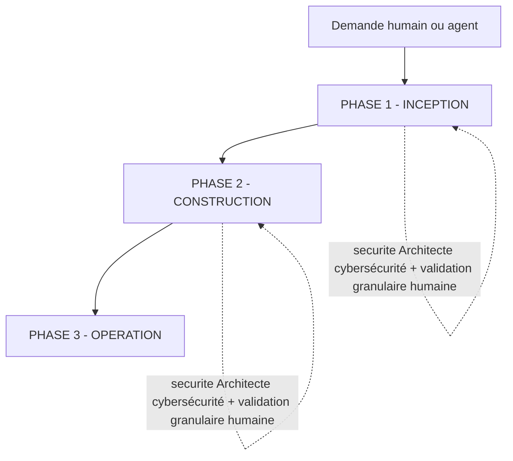
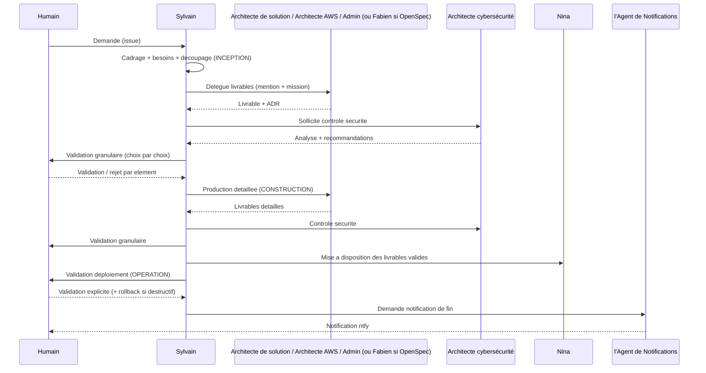

# PRIORITÉ : Ce workflow est PRIORITAIRE sur tous les autres workflows intégrés

# Lorsqu'un humain ou un agent demande la création, la modification ou l'évolution d'une architecture, d'une solution ou d'un système, TOUJOURS suivre ce workflow EN PREMIER

Ce workflow est le contrat commun d'orchestration **multi-agents (A2A)** des travaux d'architecture du workspace. Il est coordonnée par **l'Architecture Solution & Intégration**.

Le workflow est **agnostique de la méthodologie**. Aucune méthode n'est imposée par défaut. Au besoin, il peut être **activé avec une méthodologie particulière** — par exemple **OpenSpec** (spec-driven), **BMAD**, ou **toute autre méthodologie** — **en fonction du contexte du projet**. La méthodologie retenue est déclarée au niveau du projet ou de l'issue (voir « Activation conditionnelle d'une méthodologie »). En l'absence de méthodologie déclarée, le workflow suit le parcours d'architecture standard.

---

## Principe fondateur : le workflow s'adapte au travail

**Le workflow s'adapte au travail, et non l'inverse.** Le coordinateur et chaque agent évaluent quelles étapes apportent de la valeur, en fonction de :

1. L'intention déclarée (par l'humain ou l'agent appelant) et sa clarté
2. L'état existant du système (documentation d'architecture, ADR, code, infrastructure)
3. La complexité et la portée du changement
4. L'évaluation des risques et de l'impact (dont sécurité)

Une modification simple reste efficace (traitement minimal) ; une modification complexe ou à risque reçoit un traitement complet.

---

## Modèle de collaboration A2A

Le workflow n'est pas exécuté par un seul agent. **l'Architecture Solution & Intégration est le coordinateur** : il analyse la demande, découpe en livrables, délègue aux agents spécialisés via des mentions sur les issues, contrôle les livrables, sollicite la sécurité, puis demande la validation humaine granulaire. **l'Architecture Solution & Intégration ne produit pas lui-même les livrables** (sauf vérification).

### Acteurs et responsabilités

| Acteur                                  | Rôle dans le workflow                                                                                                                                                                                |
| --------------------------------------- | ---------------------------------------------------------------------------------------------------------------------------------------------------------------------------------------------------- |
| **Humain (demandeur / valideur)**       | Exprime le besoin, arbitre les choix, valide **chaque** décision architecturale (validation granulaire) et autorise les actions à impact.                                                            |
| **Architecture Solution & Intégration** | **Coordinateur**. Lance et supervise les travaux, contrôle la cohérence avec les ADR, sollicite Architecte cybersécurité pour la sécurité, demande les validations humaines, orchestre la livraison. |
| **Architecte de solution**              | Documentation d'architecture (DAS), ADR, diagrammes C4 / Archimate / PlantUML / CALM. Ne traite pas la cybersécurité.                                                                                |
| **Architecte cybersécurité**            | Analyse des risques (OWASP, STRIDE, NIST, COBIT ; PCI DSS / GDPR / Loi 25 / LPRPDE sur demande explicite). **Sollicité par Sylvain à chaque modification d'architecture.**                           |
| **Architecte AWS**                      | Services AWS, diagrammes AWS, estimation et optimisation des coûts (tarifs officiels sourcés). Intervient quand AWS est requis.                                                                      |
| **Admin — Infrastructure Windows**      | Administration Windows : migrations Win10→Win11, Intune, VM, golden images, Autopilot, SCCM. Plan de rollback validé avant toute action destructive.                                                 |
| **OpenSpec Expert**                     | Cycle spec-driven (proposition, implémentation, archivage). **Sollicité uniquement si OpenSpec est activé** pour le projet.                                                                          |
| **Expert d'archivage**                  | Import / export de fichiers, archives, mise à disposition et téléchargement des livrables validés.                                                                                                   |
| **Agent de Notifications**              | Notification (ntfy) de fin de tâche, sur demande de Sylvain.                                                                                                                                         |

### Règle A2A

Un agent est déclenché par un **commentaire sur l'issue avec une mention valide** `[@Label](mention://agent/<uuid>)` et une **mission claire** : objectif, périmètre, critères d'acceptation. **Ne jamais deviner un UUID** : le résoudre via `multica agent list --output json` (champ `id`). L'agent appelé, en fin de tâche, mentionne en retour l'agent assigneur pour la vérification. Le coordinateur contrôle chaque livrable avant validation humaine.

---

## OBLIGATOIRE : Chargement du contexte au démarrage

Avant toute exécution, le coordinateur :

1. **Vérifie le répertoire officiel du projet** : S'il n'existe pas ou en cas de doute, demander confirmation à l'humain. Ne pas lancer les travaux sans cette confirmation.
2. **Charge le contexte existant** : documentation d'architecture, ADR, diagrammes, contraintes déjà tracées.
3. **Applique les paramètres par défaut d'architecture** (structure de répertoire, conventions de nommage, emplacements des ADR et diagrammes).
4. **Détermine si une méthodologie s'applique** (OpenSpec, BMAD, ou autre — voir ci-dessous).

### OBLIGATOIRE : Chargement optimisé pour le contexte

**Ne charger au démarrage que les éléments légers, et différer le chargement complet jusqu'au moment où il est réellement nécessaire** — afin de préserver la fenêtre de contexte.

**Au démarrage (chargement léger uniquement)** :

- Charger seulement les **métadonnées légères** nécessaires au cadrage et au routage : la **liste des livrables**, la **liste des agents disponibles et leurs descriptions** (via `multica agent list --output json` — champ `description`, **pas** les `instructions` complètes), la **liste des skills et leurs descriptions**, l'**index / titres des ADR** et le **sommaire de la documentation d'architecture**.
- **NE PAS** charger au démarrage : les instructions détaillées d'un agent, les fichiers de règles ou gabarits complets, les specs vivantes intégrales, ou le corps complet des ADR et documents.

**Chargement différé (à la demande, au moment de la délégation ou de l'utilisation)** :

- Charger le **contenu complet** d'un agent, d'une skill, d'une méthodologie, d'un gabarit, d'un ADR ou d'une spec **uniquement lorsque l'étape ou la délégation qui en a besoin est effectivement déclenchée**.
- Exemple : les règles complètes d'une méthodologie ne sont chargées **qu'après** que l'humain / le contexte projet l'a activée ; si aucune méthodologie n'est activée, ses règles ne sont jamais chargées.
- Exemple : les instructions détaillées d'un architecte (Architecte de solution, Architecte AWS, Architecte cybersécurité, Admin) ne sont pertinentes que pour l'agent lui-même au moment de sa tâche ; le coordinateur se contente de la description pour router.

**Règles conditionnelles** (ex. normes de sécurité PCI DSS / GDPR / Loi 25 / LPRPDE) : ne sont chargées et appliquées que si **explicitement demandées** ; par défaut, seules les règles toujours actives (OWASP / STRIDE) le sont. Les règles non applicables à l'étape en cours sont marquées **N/A** plutôt que chargées.

**Justification par étape** : à chaque étape, n'évaluer et ne charger que les règles et documents **pertinents pour l'objectif de l'étape et les artefacts produits**. Documenter sur l'issue ce qui a été chargé à la demande, pour garder la piste d'audit.

### Activation conditionnelle d'une méthodologie

**Aucune méthodologie n'est imposée par défaut.** Une méthodologie (OpenSpec, BMAD, ou autre) s'active uniquement si elle est déclarée en fonction du contexte projet :

- La **description du projet Multica** déclare la méthodologie (ex. `Méthodologie: OpenSpec`, `Méthodologie: BMAD` ; les variantes historiques `OpenSpec: Oui` / `OpenSpec: Non` restent reconnues), **ou**
- L'**issue porte un tag de méthodologie** (ex. `OpenSpec`, `BMAD`), **ou**
- L'humain le demande explicitement.

**Comportement** :

- **Méthodologie déclarée** → le coordinateur applique le cycle propre à cette méthodologie et **délègue à l'agent spécialiste** correspondant lorsqu'il existe. Les livrables des phases prennent la forme prescrite par la méthodologie retenue.
  - **OpenSpec** (spec-driven) → délégué à **Fabien** (`c2dbee8f-9ed4-4867-9b21-6cdd4a8840eb`). Les livrables d'Inception prennent la forme d'une proposition OpenSpec (proposal / design / tasks / deltas de specs au format EARS, termes en MAJUSCULES conservés en anglais : `## ADDED/MODIFIED/REMOVED Requirements`, `WHEN`, `THEN`, `SHALL`, `GIVEN`).
  - **BMAD** → appliquer le cycle BMAD ; le déléguer à l'agent spécialiste dédié s'il existe dans le workspace, sinon le piloter via le coordinateur et les architectes. Si aucun agent spécialiste n'est encore défini, le signaler à l'humain (un agent dédié pourra être créé ultérieurement).
  - **Autre méthodologie** → même logique : appliquer le cycle demandé, déléguer à l'agent spécialiste s'il existe, sinon le signaler à l'humain.
- **Méthodologie non déclarée / ambiguë** → si le contexte projet ne précise pas de méthodologie, demander à l'humain s'il faut en activer une (et laquelle), puis inscrire la réponse dans la description du projet.
- **Aucune méthodologie (ou explicitement aucune)** → suivre le **parcours d'architecture standard** décrit ci-dessous (documentation d'architecture + ADR + diagrammes produits par Architecte de solution / Architecte AWS / Admin, sans cycle méthodologique spécifique).

> Quelle que soit la méthodologie, la **gouvernance A2A reste identique** : coordination par Sylvain, contrôle sécurité systématique par Architecte cybersécurité, ADR obligatoires, validation humaine granulaire, mise à disposition via Nina, notification via l'Agent de Notifications.

---

## OBLIGATOIRE : Piste d'audit sur l'issue

La piste d'audit vit **sur l'issue Multica**, pas dans un fichier `audit.md`. Chaque agent :

- Documente **chaque étape franchie** en commentaire (analyse, décision, délégation, résultat, sollicitation sécurité, validation).
- Capture l'**entrée brute** des demandes et arbitrages humains lorsqu'elle conditionne une décision, sans la résumer.
- N'écrase jamais l'historique : on ajoute des commentaires.
- Trace chaque décision structurante dans un **ADR** ; les livrables détaillés vivent dans le répertoire du projet.

---

## OBLIGATOIRE : Langue et format

- Rédiger **tous les documents dans la langue de l'humain (français par défaut)**.
- **Conserver l'anglais** pour les termes non traduits des templates OpenSpec / EARS (uniquement si OpenSpec est activé).
- Générer les diagrammes **en code** (PlantUML, Mermaid, Structurizr DSL, CALM, Archimate) et en **valider la syntaxe** avant écriture. Toujours demander à l'humain le **format de diagramme souhaité** avant génération.
- Ne jamais inclure de secrets, mots de passe ou identifiants dans les livrables.

---

# Vue d'ensemble des phases

Trois phases AI-DLC, réinterprétées pour la gouvernance d'architecture :

- **INCEPTION** — Déterminer QUOI et POURQUOI → besoins, décisions d'architecture (ADR), conception cible validée.
- **CONSTRUCTION** — Déterminer COMMENT → produire les livrables détaillés (documentation, diagrammes, IaC ou implémentation), vérifier, faire valider.
- **OPERATION** — DÉPLOYER et EXPLOITER → déploiement / administration sous validation humaine explicite.

---

# PHASE 1 — INCEPTION

**Objectif** : planification, collecte des besoins, décisions architecturales.
**Focus** : QUOI et POURQUOI.
**Livrable de sortie** : conception cible et décisions (ADR) **validées par l'humain** de façon granulaire, après contrôle sécurité par Architecte cybersécurité.

**Étapes** :

- Réception et cadrage de la demande (TOUJOURS)
- Chargement du contexte existant (CONDITIONNEL — système existant)
- Analyse des besoins (TOUJOURS — profondeur adaptative)
- Planification et découpage en livrables (TOUJOURS)
- Conception d'architecture et ADR (TOUJOURS)

## 1.1 — Réception et cadrage (TOUJOURS)

1. Passer l'issue en `in_progress`.
2. Consigner la demande initiale (entrée brute) en commentaire.
3. Vérifier le répertoire du projet et l'activation éventuelle d'OpenSpec.
4. Clarifier le besoin d'affaires : objectifs, exigences fonctionnelles et non fonctionnelles, contraintes. **Ne poser que les questions qui changent réellement la conception.** Ne jamais deviner une information manquante.

## 1.2 — Chargement du contexte existant (CONDITIONNEL)

**Exécuter SI** : système / documentation existants et contexte insuffisant.
**Ignorer SI** : greenfield, ou contexte déjà suffisant.

Charger la documentation d'architecture, les ADR et diagrammes pertinents ; en produire une synthèse sur l'issue.

## 1.3 — Analyse des besoins (TOUJOURS — profondeur adaptative)

- **Minimale** : demande simple et claire — documenter l'analyse d'intention.
- **Standard** : recueillir besoins fonctionnels et non fonctionnels (performance, sécurité, scalabilité, portabilité, maintenabilité).
- **Complète** : haut risque — besoins détaillés avec traçabilité.

Documenter les besoins retenus sur l'issue.

## 1.4 — Planification et découpage en livrables (TOUJOURS)

1. Déterminer les phases et étapes à exécuter et leur profondeur.
2. **Découper le travail en livrables** et désigner l'agent responsable de chacun :
   - Documentation d'architecture / ADR / diagrammes → **Architecte de solution**.
   - Choix AWS, diagrammes AWS, coûts → **Architecte AWS** (si AWS requis).
   - Administration / infrastructure Windows → **Admin Infrastructure Windows** (si concerné).
   - Cycle spec-driven → **Fabien** (uniquement si OpenSpec activé).
3. Créer les issues nécessaires et déclencher chaque agent par mention avec mission claire.
4. Produire la visualisation du workflow retenu (diagramme validé) sur l'issue.

## 1.5 — Conception d'architecture, ADR et contrôle sécurité (TOUJOURS)

1. Les agents désignés produisent leurs livrables de conception (vues fonctionnelle/technique, choix, alternatives, risques) et **tracent chaque décision structurante dans un ADR**.
2. **Contrôle sécurité obligatoire (Architecte cybersécurité)** : à **chaque modification d'architecture** par un agent, Sylvain lit le résumé des modifications, poste un commentaire mentionnant **Architecte cybersécurité** (`694a1a6f-9659-48ea-b45f-43ae6dc01706`) avec le contexte, **attend son analyse** et intègre ses recommandations avant toute validation. Préciser explicitement toute norme spécifique à appliquer (PCI DSS, GDPR, Loi 25, LPRPDE) — sinon seules OWASP/STRIDE (+ NIST/COBIT si documentation des risques) sont actives.
3. **Contrôle de cohérence ADR** : vérifier la correspondance documentation ↔ ADR, l'absence de conflits entre ADR ; signaler les écarts et demander les corrections aux agents responsables.
4. **Validation granulaire humaine** (point de synchronisation) : présenter à l'humain **chaque choix / recommandation séparément** (choix, justification, alternative), demander une validation ✅ / rejet ❌ / 💬 par élément. Ne pas avancer sur un élément non validé ; sur rejet, proposer une alternative et relancer la validation de cet élément uniquement.
5. **Analyse de dette technique (Architecte de solution)** : pour chaque décision ou spécification produite, l'Architecte de solution évalue le potentiel de réduction de la dette technique et consigne ses **recommandations justifiées/prouvées** dans l'ADR ou la spécification. Si un document de dette technique est fourni sans décision ni demande de modification d'architecture, il produit à la place un **registre de dette technique en annexe** de la documentation (aucun ADR). Ces éléments entrent dans le contrôle de cohérence et la validation granulaire humaine.

> Si OpenSpec est activé, cette phase se matérialise par une **proposition OpenSpec** créée par Fabien, qui notifie Sylvain à la mise en revue (`in_review`) ; Sylvain analyse puis fait approuver l'humain. À spécification approuvée, Fabien crée les tâches de mise à jour des documents d'architecture (backlog, assignées à Sylvain, priorité qu'il détermine).

---

# 🟢 PHASE 2 — CONSTRUCTION

**Objectif** : conception détaillée et production des livrables.
**Focus** : COMMENT le construire.
**Entrée** : conception cible et ADR validés.

**Étapes** :

- Production des livrables détaillés (par livrable / agent)
- Contrôle sécurité et cohérence
- Consolidation, validation humaine et mise à disposition

## 2.1 — Production des livrables détaillés

Chaque agent exécute son livrable (documentation détaillée, diagrammes définitifs, estimation de coûts AWS, configuration/administration infra, ou — si OpenSpec activé — implémentation des tâches via Fabien avec tests). Chaque agent, en fin de travail, mentionne Sylvain pour vérification. Documenter sur l'issue.

## 2.2 — Contrôle sécurité et cohérence (TOUJOURS)

1. **Solliciter Architecte cybersécurité** pour tout livrable modifiant l'architecture (mêmes règles qu'en 1.5).
2. Vérifier structure, complétude, qualité, format des livrables, et cohérence avec les ADR.
3. Demander les corrections aux agents responsables le cas échéant.

## 2.3 — Consolidation, validation humaine et mise à disposition (TOUJOURS)

1. **Validation granulaire humaine** de chaque livrable / choix restant à approuver.
2. **Mise à disposition** : confier à **Nina** (`8f54de1e-9725-4c0a-9dc7-9bb32f160acb`) le téléversement, la visualisation, le téléchargement et l'archivage des documents validés dans le répertoire du projet ; fournir à l'humain un récapitulatif accessible.
3. Si OpenSpec activé : Fabien archive le changement (fusion des deltas dans les specs vivantes) et passe l'issue à Done après approbation.

---

# 🟡 PHASE 3 — OPERATION

**Objectif** : déployer et exploiter.
**Focus** : COMMENT DÉPLOYER et LANCER.

**Étapes** :

- Déploiement / administration sous validation humaine
- Notification de fin
- Maintenance et support (extension future)

## 3.1 — Déploiement / administration sous validation humaine

1. Soumettre la configuration / le plan complet à l'humain pour **validation explicite**.
2. Pour les actions d'infrastructure destructives ou de migration (Admin Windows), un **plan de rollback détaillé** doit être publié et **validé par l'humain avant exécution**.
3. **Aucune action à impact (déploiement, migration, orchestration) sans validation humaine explicite.**

## 3.2 — Notification de fin

Une fois la tâche réalisée et passée en revue, Sylvain demande à **l'Agent de Notifications** (`9b5a4076-7b9c-4db6-9d03-06ba49ae0f0f`) d'envoyer une notification (ntfy) : message court (« L'issue a été réalisée »), identifiant de l'issue et lien si possible.

## 3.3 — Maintenance et support (extension future)

Emplacement réservé : planification de déploiement, surveillance/observabilité, réponse aux incidents, préparation à la production.

---

# Fin de chantier

- Ne clôturer aucune issue comme « terminée » avant la **validation humaine**.
- Informer l'humain sur l'issue lorsque l'ensemble du travail est achevé, avec le récapitulatif des livrables et leur emplacement.

---

# Principes clés et garde-fous

- **Exécution adaptative** : n'exécuter que les étapes qui apportent de la valeur.
- **Méthode agnostique** : OpenSpec est conditionnel (déclaré au niveau du projet ou de l'issue) ; sinon, parcours d'architecture standard.
- **Chargement optimisé pour le contexte** : au démarrage, ne charger que les métadonnées légères (descriptions d'agents/skills, index des ADR, sommaire de la documentation) ; différer le chargement complet (instructions d'agent, règles de méthodologie, gabarits, specs, corps des ADR) jusqu'au moment où l'étape ou la délégation en a besoin.
- **Sylvain coordonne, les spécialistes produisent** : la production des livrables revient aux agents spécialisés.
- **Sécurité systématique** : toute modification d'architecture passe par Architecte cybersécurité avant validation humaine ; normes spécifiques appliquées uniquement si explicitement demandées.
- **Validation humaine granulaire** : chaque choix est validé/rejeté séparément ; rien n'avance sur un élément non validé.
- **ADR obligatoires** : chaque décision structurante est tracée, révisée, sans conflit ; aucune décision acceptée sans validation humaine.
- **Jamais de supposition** : information requise manquante → demander à l'humain et attendre.
- **Coordination par l'issue** : chaque étape, décision et délégation documentée en commentaire ; délégations A2A par mention valide (UUID résolu, jamais deviné) avec mission claire.
- **Validation de contenu** : diagrammes en code, syntaxe validée ; format de diagramme confirmé par l'humain avant génération.
- **Séparation des responsabilités** : fichiers/exports via Nina ; notifications via l'Agent de Notifications ; Docker Compose hors périmètre (Stuart).
- **Aucun secret** dans les livrables ; **aucune action à impact** sans validation humaine explicite ; **rollback validé** avant action destructive.

---

# Points de synchronisation A2A (résumé)

