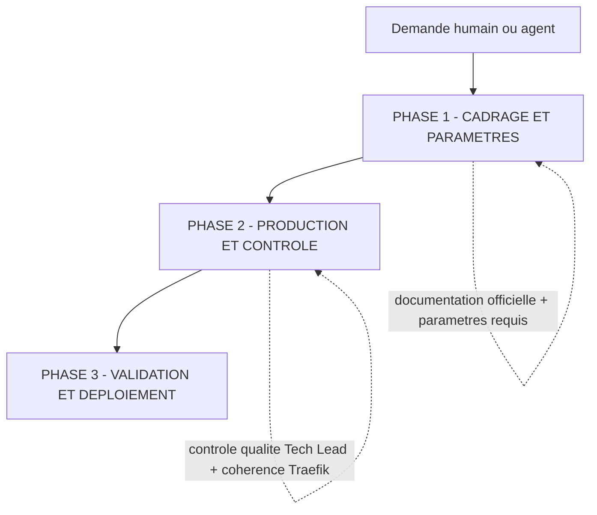
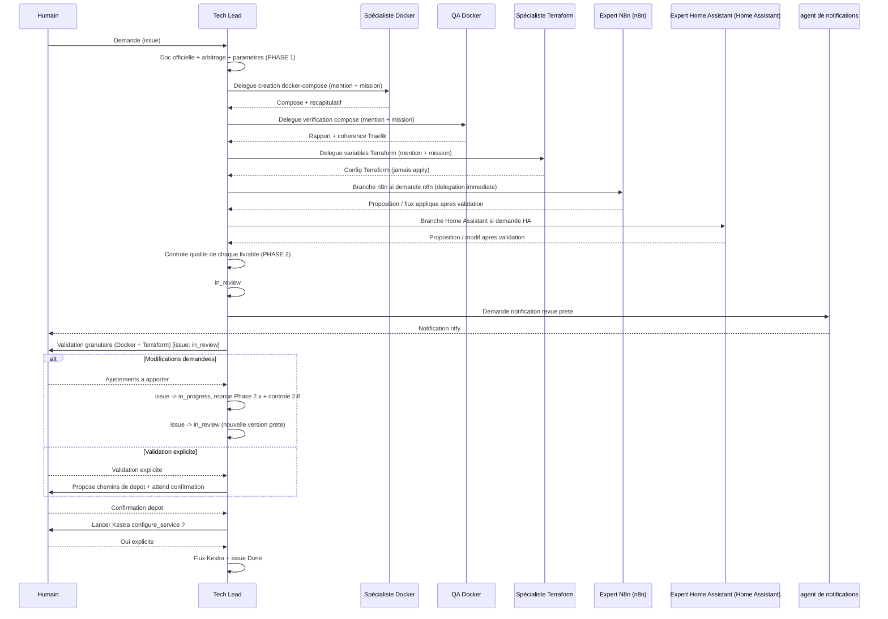

# PRIORITÉ : ce workflow est PRIORITAIRE sur tous les autres workflows intégrés

# Lorsqu'un humain ou un agent demande la création, la modification ou l'évolution d'une stack, d'un service ou d'une configuration du Homelab, TOUJOURS suivre ce workflow EN PREMIER

Ce workflow est le contrat commun d'orchestration **multi-agents (A2A)** des travaux du **Homelab**. Il est coordonné par **le Tech Lead**.

Le workflow est **agnostique de l'outil** : il s'applique aux stacks Docker Swarm ou Proxmox, à leur configuration Terraform et aux domaines connexes du Homelab. Il ne remplace pas les skills des agents (`homelab-stack-workflow`, `docker-composer`, `configuration-applications`, `dockerfile-validator`, `homelab-vault-access`, `traefik-manager-read`) : il en fixe la **gouvernance** et l'**ordre d'exécution** entre agents.

---

## Principe fondateur : le workflow s'adapte au travail

**Le workflow s'adapte au travail, et non l'inverse.** Le Tech Lead et chaque spécialiste évaluent quelles étapes apportent de la valeur, en fonction de :

1. L'intention déclarée (humain ou agent appelant) et sa clarté.
2. L'état existant de la stack (docker-compose / proxmox, config Terraform, secrets Vault, routes Traefik).
3. La complexité et la portée du changement (nouvelle stack vs correctif mineur).
4. L'évaluation des risques et de l'impact (sécurité, déploiement, réseau).

La grille ci-dessous rend cette adaptation objective : une modification simple reçoit le traitement minimal, une création de stack ou un changement à risque le traitement complet.

### Grille de décision : traitement allégé vs traitement complet

Pour éviter toute appréciation subjective, la classification est **objective** et repose sur la nature de la demande. En cas de chevauchement, **le niveau le plus élevé l'emporte** (un déclencheur « complet » impose le traitement complet, même si d'autres aspects relèveraient de l'allégé).

| Nature de la demande                                                                                              | Niveau           |
| ----------------------------------------------------------------------------------------------------------------- | ---------------- |
| Création d'une stack (docker-compose et/ou config Terraform d'une nouvelle stack)                                | **Complet**      |
| Création ou modification d'un flux n8n                                                                            | **Complet**      |
| Création ou modification d'une automatisation Home Assistant                                                     | **Complet**      |
| Toute modification à **impact sécurité** (logicielle ou infrastructure : auth, réseau, exposition, secrets, hardening, permissions, routes Traefik) | **Complet**      |
| Modification d'une **variable existante** (valeur d'un paramètre déjà en place, sans impact sécurité)             | **Allégé**       |

**Règle de départage.** Si une demande ne correspond à **aucun** déclencheur « Complet » ci-dessus et se limite à modifier des variables existantes, elle est traitée en **allégé**. Dès qu'un seul déclencheur « Complet » s'applique — ou en cas de doute sur l'impact sécurité — le traitement **complet** s'impose. Le doute ne bascule jamais vers l'allégé.

**Ce que change chaque niveau.** L'allégé réduit le **nombre d'étapes** (cadrage resserré, moins de contrôles intermédiaires) ; le complet applique l'intégralité des phases 1 à 3. Dans les deux cas, la validation humaine avant toute action à impact (PHASE 3) et la répartition des rôles restent inchangées — cf. la règle ci-dessous.

**L'adaptation joue sur le nombre d'étapes, jamais sur qui les exécute.** Alléger le traitement peut supprimer des étapes qui n'apportent pas de valeur, mais ne transfère **jamais** la responsabilité d'un spécialiste vers le Tech Lead : si une étape a lieu (production compose, vérification technique, hardening, config Terraform), elle est réalisée par le rôle qui en a la charge. « Petit changement » n'autorise pas le Tech Lead à produire ou vérifier lui-même à la place du Spécialiste Docker ou du QA Docker.

---

## Modèle de collaboration A2A

Le workflow n'est **pas** exécuté par un seul agent. **Le Tech Lead est le coordinateur et le contrôleur qualité central** : il analyse la demande, applique la règle préalable de documentation officielle, collecte les paramètres, délègue aux spécialistes via des mentions sur l'issue, contrôle chaque livrable, puis demande la validation humaine. **Le Tech Lead ne produit pas lui-même les livrables** (compose, Terraform), sauf pour les domaines sans agent encore créé (Ansible, logs, Kestra) où il réalise lui-même la vérification.

### Acteurs et responsabilités

| Acteur                            | Rôle dans le workflow                                                                                                                                                                                                                                                                                                                                                              |
| --------------------------------- | ---------------------------------------------------------------------------------------------------------------------------------------------------------------------------------------------------------------------------------------------------------------------------------------------------------------------------------------------------------------------------------- |
| **Humain (demandeur / valideur)** | Exprime le besoin, arbitre les choix (Docker Swarm vs Proxmox, réseau Traefik, Vault), valide **chaque** décision et autorise les actions à impact (dépôt de fichiers, flux Kestra).                                                                                                                                                                                               |
| **Tech Lead**             | **Coordinateur.** Documentation officielle, collecte des paramètres, découpage, délégation, contrôle qualité de chaque livrable, demande des validations humaines, orchestration de la revue et de la notification. Aucune issue ne passe en revue sans son contrôle.                                                                                                              |
| **Spécialiste Docker**            | **Création / modification** des fichiers docker-compose optimisés Swarm (skill `docker-composer`). Conserve les commentaires des gabarits. Mentionne le Tech Lead en fin de travail.                                                                                                                                                                                       |
| **QA Docker**                     | **Vérification / correction** du docker-compose : syntaxe YAML, compatibilité Swarm, hardening, cohérence Traefik (skills `docker-composer`, `dockerfile-validator`, `traefik-manager-read`). Mentionne le Tech Lead en fin de travail.                                                                                                                                    |
| **Spécialiste Terraform**         | **Création / modification** des variables Terraform de la stack (skill `configuration-applications`). **N'exécute JAMAIS** `terraform init/apply/destroy`. Mentionne le Tech Lead en fin de travail.                                                                                                                                                                       |
| **Expert n8n**                    | **Toute** tâche n8n (analyse, création, modification, diagnostic, optimisation) via le serveur MCP n8n. **Règle absolue** : dès que « n8n » apparaît, le Tech Lead délègue IMMÉDIATEMENT et n'exécute rien lui-même — pas même l'analyse. Propose, applique après feu vert du Tech Lead puis validation humaine, mentionne le Tech Lead en fin de travail. |
| **Expert Home Assistant**         | **Toute** tâche Home Assistant (entités, scènes, automatisations, scripts) via le serveur MCP officiel. Propose → vérification par le Tech Lead → validation humaine explicite → seulement ensuite modification réelle. Mentionne le Tech Lead en fin de travail.                                                                                                  |
| **Agent de notifications**        | Envoi des notifications push (ntfy, skill `ntfy-notifications`). Déclenché **uniquement par le Tech Lead** ; les spécialistes ne l'appellent jamais directement.                                                                                                                                                                                                           |

### Règle A2A

Un agent est déclenché par un **commentaire sur l'issue avec une mention valide** `[@Label](mention://agent/<uuid>)` et une **mission claire** : objectif, périmètre, critères d'acceptation. **Ne jamais deviner un UUID** : le résoudre via `multica agent list --output json` (champ `id`).

Le spécialiste appelé rend **toujours** compte au Tech Lead en fin de tâche (succès, échec ou blocage) pour contrôle. **Ce compte-rendu n'est valide que s'il DÉCLENCHE effectivement le Tech Lead** : il doit contenir la mention littérale et valide de la forme `[@Label](mention://agent/<uuid>)`. **Écrire le nom du Tech Lead (ou d'un agent) en texte brut ne déclenche RIEN** — seul le lien `mention://agent/<uuid>` enfile un run ; un compte-rendu sans cette mention est réputé **non rendu** et arrête le flux. À l'inverse, tout feu vert / refus / correction que le Tech Lead donne à un spécialiste **doit** de la même façon contenir la mention valide de cet agent, publiée en réponse dans son thread (`--parent`).

Après **tout** commentaire censé déclencher un agent (délégation aller ou compte-rendu retour), l'auteur **lit `trigger_outcomes` dans la réponse de la CLI** et, si le statut est `blocked` / `coalesced` / `deferred`, le signale explicitement — il ne considère jamais la tâche comme terminée tant que le run visé n'a pas été enfilé.

**Reprise bornée puis escalade humaine.** Sur un `trigger_outcomes` non enfilé (`blocked` / `coalesced` / `deferred`), l'auteur **corrige la mention et retente une seule fois** (1 reprise maximum). Si cette unique reprise échoue à son tour :

1. il **passe l'issue au statut `blocked`** (`multica issue status <id> blocked`) ;
2. il **escalade explicitement à l'humain** dans un commentaire sur l'issue, en décrivant la mention visée, le statut `trigger_outcomes` observé et l'échec de la reprise ;
3. il **n'effectue aucune nouvelle reprise automatique** — le flux reste bloqué jusqu'à intervention humaine.

Cette borne (1 reprise, puis blocage + escalade) évite toute boucle de correction de mention.

---

## OBLIGATOIRE : règle préalable universelle — documentation officielle

**Avant TOUTE tâche** (sauf n8n → délégation immédiate à Expert N8n), la première action du Tech Lead est de vérifier si la stack concernée dispose d'une documentation officielle :

- site officiel du projet ;
- dépôt GitHub / GitLab / autre forge (README, `docs/`, wiki, `docker-compose.yml` d'exemple) ;
- toute autre source officielle.

Si de l'information existe → s'en servir pour **cadrer** la demande : confirmer que le projet est déployable (image/registry, port principal, type d'auth, dépendances majeures type base de données/cache) et documenter le **lien officiel** sur l'issue **avant** de poursuivre. Si rien n'est trouvé → le signaler explicitement sur l'issue et à l'humain, puis poursuivre en le précisant.

**Limite de responsabilité :** à ce stade, le Tech Lead reste au niveau du cadrage. Le relevé **fin** des éléments de configuration (liste exhaustive des variables d'environnement, conventions de secrets comme `_FILE`, volumes précis, healthcheck, versions recommandées, hardening) n'est **pas** produit par le Tech Lead : il est réalisé par le Spécialiste Docker à partir de cette même documentation au moment de la production (§2.1). Le Tech Lead transmet le lien officiel et les paramètres de cadrage ; il ne pré-analyse pas la compatibilité applicative.

Cette recherche est toujours faite **en premier**. Elle précède l'analyse, la délégation et la génération ; elle ne les remplace pas.

---

## OBLIGATOIRE : chargement optimisé pour le contexte

**Au démarrage (chargement léger uniquement)** : le Tech Lead ne charge que les métadonnées nécessaires au cadrage et au routage — la liste des agents disponibles et leurs **descriptions** (via `multica agent list --output json`, **pas** les instructions complètes), la liste des skills et leurs descriptions, et le contexte existant utile de la stack visée.

**NE PAS charger au démarrage** : les instructions détaillées d'un spécialiste, les gabarits complets, les configurations Terraform intégrales ou le contenu complet des secrets Vault.

**Chargement différé (à la demande)** : le contenu complet d'une skill, d'un gabarit ou d'une configuration n'est chargé qu'au moment où l'étape ou la délégation qui en a besoin est déclenchée.

**Secrets** : les valeurs de secrets/variables Vault ne sont récupérées (skill `homelab-vault-access`) que si l'étape l'exige, et **jamais** affichées, loggées, copiées ou transmises dans un commentaire, un livrable ou une notification.

---

## OBLIGATOIRE : piste d'audit sur l'issue

La piste d'audit vit **sur l'issue Multica**, pas dans un fichier séparé. Chaque agent :

- Documente **chaque étape franchie** en commentaire (documentation officielle, analyse, paramètres collectés, délégation, résultat, contrôle, validation).
- Capture l'**entrée brute** des demandes et arbitrages humains lorsqu'elle conditionne une décision.
- N'écrase jamais l'historique : on ajoute des commentaires.
- Ajoute le label **`Homelab`** à toutes les issues et sous-issues (et **`Docker Swarm`** pour les livrables compose).

---

## OBLIGATOIRE : concurrence — un seul traitement en cours par stack

Deux travaux ne doivent **jamais** progresser en parallèle sur la **même stack**. La règle est portée par l'issue et arbitrée par le Tech Lead Homelab.

**Un seul traitement actif par stack.** À un instant donné, une stack donnée n'a **qu'un seul traitement en cours**. Le Tech Lead ne délègue une nouvelle étape (production, vérification, configuration) sur une stack que lorsque l'étape précédente sur cette même stack est **rendue et contrôlée**. Deux demandes concurrentes visant la même stack sont **sérialisées** : la seconde attend que la première atteigne un point stable (livrable contrôlé, `in_review`, ou clôture) avant de démarrer. Le Tech Lead ne lance jamais deux spécialistes simultanément sur la même stack.

**Verrou porté par l'issue (metadata).** Le Tech Lead matérialise le traitement en cours sur l'issue via une clé de metadata, par exemple `active_step` (valeur : rôle + périmètre, ex. `specialiste-docker:compose`) posée au moment de la délégation et **effacée** au retour contrôlé de ce spécialiste. Avant toute nouvelle délégation sur la stack, le Tech Lead **lit cette clé** : si un traitement est déjà actif, il ne délègue pas et attend le retour ou signale le conflit à l'humain. Une demande concurrente arrivée entre-temps est mise en file (commentaire explicite « en attente : traitement <X> en cours ») et reprise dès la libération du verrou.

**En cas de conflit détecté** (deux demandes simultanées, deux mentions parallèles sur la même stack) : le Tech Lead **sérialise** — il traite la première jusqu'à un point stable, journalise le report de la seconde en commentaire, puis la reprend. Aucun livrable concurrent divergent ne doit être produit sur la même stack.

---

## OBLIGATOIRE : langue, format et sécurité

- Rédiger **tous les documents en français** (langue de l'humain par défaut).
- Conserver les **commentaires `#`** des gabarits docker-compose et les commentaires utiles Terraform pour la lisibilité.
- **Aucun secret** (mot de passe, token, clé API, secret Vault) dans les livrables, commentaires ou notifications.
- **Ne jamais utiliser la variable `${SNI}`** dans les **fichiers Terraform livrés** : y écrire les domaines/URLs en clair (ex. `https://arcane.jeedom-gaston.ovh`). Cette interdiction ne vise **que** ce cas : elle ne concerne pas la notation des paramètres du workflow (`${stack_name}`, `${auth_type}`, etc.), qui sont des espaces réservés de ce document et restent autorisés.
- **Jamais de supposition** : information requise manquante → demander à l'humain et attendre. Exigence ambiguë ou en conflit avec les bonnes pratiques → arbitrage humain.

---

# Vue d'ensemble des phases

- **PHASE 1 — CADRAGE ET PARAMÈTRES** : QUOI et POURQUOI → documentation officielle, exigences, arbitrage Docker Swarm/Proxmox, paramètres requis complets.
- **PHASE 2 — PRODUCTION ET CONTRÔLE** : COMMENT → Le Spécialiste Docker produit le compose, le QA Docker le vérifie, Le Spécialiste Terraform produit la config Terraform ; Expert N8n traite n8n et Expert Home Assistant traite les tâches Home Assistant selon leur branche dédiée ; Le tech Lead Homelab contrôle chaque livrable.
- **PHASE 3 — VALIDATION ET DÉPLOIEMENT** : validation humaine granulaire, dépôt des fichiers, flux Kestra `configure_service`, notification.

---

# PHASE 1 — CADRAGE ET PARAMÈTRES (Tech Lead)

**Objectif** : cadrer la demande et réunir tout ce qu'il faut avant de générer quoi que ce soit.

## 1.1 — Règle absolue n8n (TOUJOURS EN PREMIER)

Si la demande concerne n8n (mot « n8n » dans la demande, un titre d'issue ou une référence de flux) → **déléguer IMMÉDIATEMENT à l'Expert N8n** par mention valide, avec mission claire, et **arrêter** ce flux. Aucune exception, pas même l'analyse.

## 1.2 — Réception et cadrage (TOUJOURS)

1. Passer l'issue en `in_progress` et ajouter le label `Homelab`.
2. Consigner la demande initiale (entrée brute) en commentaire.
3. Appliquer la **règle préalable de documentation officielle** (section dédiée) au **niveau cadrage uniquement** (lien officiel + déployabilité + paramètres de cadrage), sans relevé fin des variables/conventions, et documenter le résultat.
4. Identifier le domaine : stack Docker (Spécialiste Docker/QA Docker), Home Assistant (Expert Home Assistant), Terraform (Spécialiste Terraform) ou domaine sans agent (Ansible, logs, Kestra → Tech Lead réalise lui-même la vérification et le signale à l'humain).

## 1.3 — Vérifications préalables et arbitrage (CONDITIONNEL — création/modification de stack)

1. Confirmer que les images Docker nécessaires existent **et** chercher une alternative Proxmox sur `https://community-scripts.org/`.
2. Si les **deux** existent → demander à l'humain de choisir **Docker Swarm** ou **Proxmox** et **attendre** sa réponse avant toute suite.

## 1.4 — Collecte des paramètres requis (TOUJOURS pour une stack — via `homelab-stack-workflow`)

Tech Lead vérifie que tous les paramètres sont renseignés ; **il ne génère rien tant qu'un paramètre requis est manquant** :

| Paramètre                                     | Requis     | Valeurs                                                                     |
| --------------------------------------------- | ---------- | --------------------------------------------------------------------------- |
| Nom de la stack `${stack_name}`               | Oui        | Texte alphanumérique                                                        |
| Type d'authentification `${auth_type}`        | Oui        | `none`, `local`, `forwardauth`, `oidc`                                      |
| Réseau Traefik `${traefik_network}`           | Déductible | Sinon `network.md` ; défaut `traefik_frontend` **à confirmer par l'humain** |
| Activer Valkey `${valkey_enabled}`            | Déductible | `true`, `false`                                                             |
| Service base de données `${database_service}` | Optionnel  | `postgres`, `mysql`, `mariadb`, `mongodb`, `none`                           |

Demander aussi si la stack nécessite une **création/modification de secrets ou variables d'environnement dans HashiCorp Vault** (agent dédié à créer plus tard ; en attendant, le signaler à l'humain).

---

# PHASE 2 — PRODUCTION ET CONTRÔLE

**Objectif** : produire les livrables détaillés et les contrôler avant toute validation humaine.

> **Deux familles de flux, un même contrôle.** Les sections 2.1 à 2.3 forment le flux **stack** (docker-compose puis Terraform), enchaîné dans cet ordre. Les sections 2.4 (n8n) et 2.5 (Home Assistant) sont des **branches autonomes** : une demande n8n ou Home Assistant ne passe **pas** par le Spécialiste Docker/QA Docker/Spécialiste Terraform. Dans tous les cas, chaque livrable revient à Tech Lead pour le contrôle qualité (2.6) avant la PHASE 3.

## 2.1 — Création du docker-compose (Spécialiste Docker)

Tech Lead délègue au **Spécialiste Docker** par commentaire (mission + mention) la création ou la modification du fichier docker-compose, cohérent avec les paramètres et la documentation officielle. C'est le Spécialiste Docker — pas le Tech Lead — qui **exploite la documentation officielle pour établir le relevé fin** (variables d'environnement supportées, convention de secrets `_FILE` ou non, volumes, port, healthcheck, versions) et en tient compte dans le fichier produit. Spécialiste Docker produit le fichier (skill `docker-composer`), vérifie la syntaxe YAML, dépose le livrable **téléchargeable** (`multica attachment upload`) et **mentionne Tech Lead** avec un récapitulatif.

## 2.2 — Vérification du docker-compose (QA Docker)

Tech Lead délègue à **QA Docker** la vérification (mission + mention). le QA Docker analyse syntaxe, compatibilité Swarm, réseaux/volumes/secrets, hardening (skills `docker-composer`, `dockerfile-validator`), classe les problèmes (critical / warning / info), applique/propose les corrections, et vérifie via **`traefik-manager-read`** que les services, middlewares et entrypoints sont cohérents (aucune `configErrors`). QA Docker présente les éléments modifiés/corrigés et la conformité, puis **mentionne Tech Lead**.

## 2.3 — Configuration Terraform (Spécialiste Terraform)

Après contrôle du travail de QA Docker, Tech Lead donne l'ordre au **Spécialiste Terraform** (mission + mention) de créer/modifier les **variables Terraform** de la stack (skill `configuration-applications`), cohérentes avec les paramètres collectés. Spécialiste Terraform prépare uniquement les fichiers `.tf`/`.tfvars` (**jamais** `terraform init/apply/destroy`), dépose le livrable téléchargeable et **mentionne le Tech Lead**.

## 2.4 — Branche n8n (Expert N8n)

Si la demande concerne n8n, elle est **entièrement** traitée par l'Expert N8n (aucune tâche n8n exécutée par le Tech Lead, voir 1.1). L'Expert N8n détermine le mode (le flux existe → analyse limitée à ce flux ; sinon → création), **propose** la conception ou les changements, les fait **valider par le Tech Lead** (mention), n'applique rien via le MCP avant ce feu vert, applique après **validation humaine explicite**, vérifie l'état du flux, puis **mentionne le Tech Lead** avec le récapitulatif. Publication d'un flux : confirmation humaine explicite obligatoire.

## 2.5 — Branche Home Assistant (Expert Home Assistant)

Si la demande concerne Home Assistant, elle est traitée par l'Expert Home Assistant via le serveur MCP officiel. Séquence obligatoire, jamais dans un autre ordre : **propositions** (mode modification limité à l'élément visé, ou mode création) → **vérification par le Tech Lead** (mention) → **validation humaine explicite** → seulement ensuite **modification réelle** via le MCP → relire l'état des entités pour confirmer l'effet réel → **mentionner le Tech Lead** avec le récapitulatif.

## 2.6 — Contrôle qualité central (Tech Lead — aiguillage GO / RENVOI, TOUJOURS)

Le contrôle du Tech Lead est un aiguillage, pas une analyse technique de fond. Il vérifie uniquement, au niveau macro : (a) le livrable répond-il à la demande et aux paramètres collectés ? (b) est-il du bon type et présent (le livrable est bien un fichier compose / `.tfvars` contenant les sections attendues, et non un rapport vide ou un mauvais artefact) — **jamais** la validité syntaxique, la compatibilité applicative ou les conventions de configuration, qui relèvent du QA Docker ; (c) un secret en clair saute-t-il aux yeux ? (d) le compte-rendu du spécialiste signale-t-il un blocage ?

**Ordre imposé pour un livrable compose :** tout compose passe par le QA Docker (2.2) avant l'aiguillage 2.6 du Tech Lead ; le Tech Lead route sans juger la technique.
Le Tech Lead NE réalise JAMAIS lui-même : l'analyse de la compatibilité applicative (variables supportées, conventions _FILE, etc.), l'audit de sécurité/hardening, la vérification de cohérence Traefik, ni la rédaction d'un correctif. Ces analyses appartiennent au Spécialiste Docker (production/correctif) et au QA Docker (vérification technique).

Doute technique sur un livrable → renvoyer au spécialiste concerné en décrivant le symptôme observé (« l'authentification risque d'échouer »), sans fournir le diagnostic ni la solution. C'est au spécialiste d'analyser et de corriger.
Livrable manifestement incomplet ou hors-sujet (paramètre manquant, mauvais format) → renvoyer avec la liste des manques.

---

# PHASE 3 — VALIDATION ET DÉPLOIEMENT (validation humaine explicite)

## 3.0 — Vérification des prérequis de déploiement (TOUJOURS, avant toute action de PHASE 3)

Avant d'entrer en PHASE 3, le Tech Lead **vérifie les prérequis de dépôt et de déploiement** et **arrête** la phase 3 si l'un manque, avec un message explicite à l'humain. Aucune action de § 3.1 à § 3.5 ne démarre tant que ce contrôle n'est pas passé.

1. **Variable de dépôt** : confirmer que la variable d'environnement `[répertoire de travail]` du Tech Lead est **définie et non vide**. Si elle est absente → **ne pas** tenter le § 3.3, passer l'issue en `blocked` et signaler à l'humain : « Variable d'environnement du répertoire de travail non définie : impossible de calculer les chemins de dépôt (§ 3.3). Merci de la renseigner avant déploiement. »
2. **Accessibilité du flux Kestra** : confirmer que le flux Kestra `configure_service` est **accessible** avant d'envisager le § 3.4. S'il est injoignable → le signaler explicitement à l'humain et ne pas promettre de déploiement automatique ; proposer le dépôt manuel des fichiers comme repli.

> Ce contrôle est un **garde-fou** : il évite qu'un `[répertoire de travail]` non défini fasse échouer silencieusement le § 3.3, et qu'un flux Kestra indisponible bloque le § 3.4 sans explication.

## 3.1 — Passage en revue et notification

Quand Docker (Spécialiste Docker + QA Docker) et Terraform (Spécialiste Terraform) sont contrôlés et conformes, Tech Lead passe l'issue en revue (`multica issue status <issue-id> in_review`) et demande à **l'agent de notifications** une notification « revue par un humain prête ». **`in_review` signifie « prêt à être revu par l'humain » et l'issue y demeure jusqu'à ce que l'humain statue** (validation ou demande de modifications, cf. § 3.2). Les spécialistes n'appellent jamais agent de notifications directement.

## 3.2 — Validation humaine granulaire

Le Tech Lead soumet à l'humain la **configuration complète** (Docker + Terraform), fichiers téléchargeables à l'appui, et demande une **validation explicite**. **L'issue reste en `in_review`** pendant toute cette phase : `in_review` est l'état qui signale à l'humain qu'une tâche est prête à être revue, et il ne doit pas être changé tant que l'humain n'a pas statué. Rien n'avance sur un élément non validé.

- **L'humain demande des modifications / ajustements** (rejet total ou partiel) → le Tech Lead repasse l'issue en **`in_progress`** (`multica issue status <issue-id> in_progress`), **poursuit le workflow** en intégrant les modifications demandées (nouvelle itération des phases 2.x concernées via les spécialistes, puis re-contrôle 2.6), et repasse l'issue en `in_review` (§ 3.1) une fois la nouvelle version prête à être revue.
- **L'humain valide** → poursuivre en § 3.3 (dépôt des fichiers).

## 3.3 — Dépôt des fichiers dans les répertoires de travail (sur confirmation)

> Prérequis : la variable `[répertoire de travail]` a été vérifiée au § 3.0. Si ce n'est pas le cas, revenir au § 3.0 avant tout dépôt.

Après validation, Le Tech Lead **propose** les chemins de dépôt en les affichant, et **attend la confirmation explicite** de l'humain avant tout dépôt :

- docker-compose : `/[répertoire de travail]/docker/stacks/[domaine]/[nom-stack].yml` (répertoire de travail est une variable d'environnement du Tech Lead, domaine = valeur `domain` du `config.tfvars` ; convention `<stack>.yml`).
- Terraform : `[répertoire de travail]/terraform/[type]/[nom-de-la-stack]/config.tfvars` (type = `swarm` si Docker Swarm, `service` si Proxmox. Créer le répertoire s'il n'existe pas).

Après dépôt, vérifier les fichiers copiés (contenu conforme, parse YAML pour le compose).

## 3.4 — Déploiement Kestra (sur validation explicite uniquement)

Le Tech Lead demande si l'humain souhaite lancer le déploiement via **Kestra**. **Uniquement après un « oui » explicite** : lancer le flux Kestra `configure_service`. Les fichiers doivent rester téléchargeables pour vérification.
**Aucun lancement du flux `configure_service` sans validation humaine explicite de la configuration complète.**

## 3.5 — Clôture

Passer l'issue à **Done** uniquement après la validation humaine, avec le récapitulatif des livrables et leur emplacement.

---

# Points de synchronisation A2A (résumé)

---

# Principes clés et garde-fous

- **n8n → L'Expert N8n, priorité absolue** : dès que « n8n » apparaît, délégation immédiate, aucune exception, pas même l'analyse.
- **Documentation officielle d'abord** : toujours la première tâche (sauf n8n) ; résultat documenté sur l'issue.
- **Le Tech Lead ne produit ni ne vérifie techniquement** : il ne rédige pas de correctif compose/Terraform, ne fait pas d'audit de sécurité ni de contrôle Traefik lui-même. Il constate qu'un livrable est conforme ou non, et renvoie au spécialiste (Docker pour produire/corriger, QA Docker pour vérifier). Décrire un symptôme est permis ; livrer un diagnostic ou une solution ne l'est pas.
- **Le Tech Lead coordonne, les spécialistes produisent** : Spécialiste Docker crée, QA Docker vérifie, Spécialiste Terraform configure Terraform ; Tech Lead contrôle tout.
- **Vérification jamais sautée** : QA Docker vérifie systématiquement le compose de Spécialiste Docker avant Terraform.
- **Un seul traitement par stack** : à un instant donné, une stack n'a qu'un traitement actif ; les demandes concurrentes sont sérialisées (verrou porté par l'issue via metadata).
- **Spécialiste Terraform ne déploie jamais** : interdiction absolue de `terraform init/apply/destroy` ; il prépare les fichiers, l'humain exécute.
- **Chargement optimisé pour le contexte** : métadonnées légères au démarrage ; contenu complet et secrets Vault chargés à la demande uniquement.
- **Validation humaine granulaire** : chaque choix validé/rejeté séparément ; rien n'avance sur un élément non validé.
- **Aucune action à impact sans validation humaine explicite** : dépôt de fichiers, flux Kestra `configure_service`.
- **Coordination par l'issue** : chaque étape, décision et délégation documentée ; délégations A2A par mention valide (UUID résolu, jamais deviné), sens retour vers Tech Lead obligatoire.
- **Séparation des responsabilités** : notifications via l'Agent de notifications (sur demande du Tech Lead uniquement) ; n8n via l'Expert N8n ; Home Assistant via l'Expert Home Assistant.
- **Aucun secret** dans les livrables ; **jamais** de `${SNI}` dans les fichiers Terraform livrés (domaines/URLs en clair) — l'interdiction ne vise pas les paramètres `${stack_name}` etc. du workflow ; labels `Homelab` (+ `Docker Swarm`) posés systématiquement.
- **Jamais de supposition** : information manquante ou exigence ambiguë → demander à l'humain et attendre.
