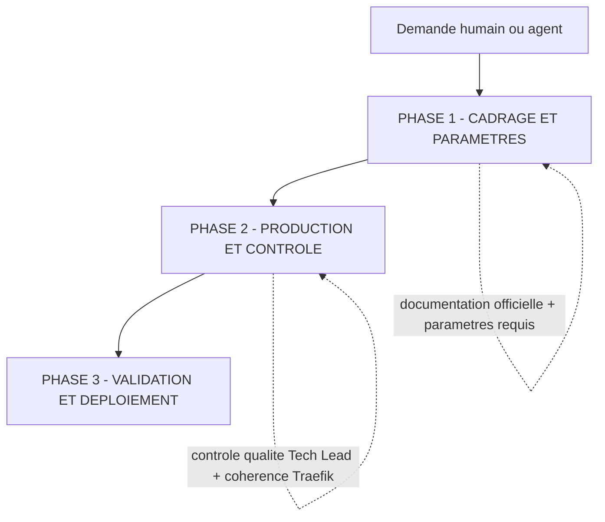

# PRIORITÉ : ce workflow est PRIORITAIRE sur tous les autres workflows intégrés

# Lorsqu'un humain ou un agent demande la création, la modification ou l'évolution d'une stack, d'un service ou d'une configuration du Homelab, TOUJOURS suivre ce workflow EN PREMIER

Ce workflow est le contrat commun d'orchestration **multi-agents (A2A)** des travaux du **Homelab**. Il est coordonné par **le Tech Lead**.

Le workflow est **agnostique de l'outil** : il s'applique aux stacks Docker Swarm ou Proxmox, à leur configuration Terraform et aux domaines connexes du Homelab. Il ne remplace pas les skills des agents (`homelab-stack-workflow`, `docker-composer`, `configuration-applications`, `dockerfile-validator`, `homelab-vault-access`, `traefik-manager-read`) : il en fixe la **gouvernance** et l'**ordre d'exécution** entre agents.

---

# Invariants

Ces règles sont énoncées **une seule fois** ici et font autorité. Le reste du document y renvoie par leur identifiant (ex. « voir **INV-1** ») sans les réénoncer.

- **INV-1 — n8n, priorité absolue.** Dès que « n8n » apparaît (demande, titre d'issue ou référence de flux), le Tech Lead **délègue IMMÉDIATEMENT à l'Expert N8n** par mention valide (mission claire) et **arrête** ce flux. Aucune exception, **pas même l'analyse** : cette délégation précède la règle de documentation officielle (INV-2) et toute autre étape.
- **INV-2 — Documentation officielle d'abord.** Avant TOUTE tâche (sauf n8n → INV-1), la première action du Tech Lead est de chercher la documentation officielle de la stack (site officiel ; forge : README, `docs/`, wiki, `docker-compose.yml` d'exemple ; autre source officielle). Si de l'information existe → s'en servir pour **cadrer** (projet déployable : image/registry, port principal, type d'auth, dépendances majeures type base de données/cache) et documenter le **lien officiel** sur l'issue avant de poursuivre. Si rien n'est trouvé → le signaler explicitement sur l'issue et à l'humain, puis poursuivre en le précisant. Cette recherche précède l'analyse, la délégation et la génération ; elle ne les remplace pas. **Limite de responsabilité :** le Tech Lead reste au niveau du cadrage ; le relevé **fin** des éléments de configuration (variables d'environnement, conventions de secrets `_FILE`, volumes, healthcheck, versions, hardening) est produit par le Spécialiste Docker au moment de la production (§2.1), pas par le Tech Lead.
- **INV-3 — Le Tech Lead coordonne, il ne produit ni ne vérifie techniquement.** Le Tech Lead analyse, cadre, délègue, aiguille et demande les validations humaines. Il ne rédige **jamais** un livrable ni un correctif (compose/Terraform), ne fait **jamais** d'audit de sécurité/hardening ni de contrôle de cohérence Traefik, et ne pré-analyse pas la compatibilité applicative. Décrire un symptôme observé est permis ; livrer un diagnostic ou une solution ne l'est pas. Seule **exception** : les domaines sans agent créé (Ansible, logs, Kestra), où le Tech Lead réalise lui-même la vérification et le signale à l'humain. « Petit changement » n'autorise jamais ce transfert : si une étape a lieu, elle est réalisée par le rôle qui en a la charge.
- **INV-4 — Vérification QA avant Terraform.** Tout docker-compose passe par le **QA Docker** (§2.2) avant l'aiguillage 2.6 du Tech Lead et avant la configuration Terraform (§2.3). Cette vérification n'est **jamais** sautée ; l'ordre production → QA → Terraform est imposé.
- **INV-5 — Le Spécialiste Terraform ne déploie jamais.** Il prépare uniquement les fichiers `.tf`/`.tfvars` et **n'exécute JAMAIS** `terraform init/apply/destroy` ; l'humain exécute.
- **INV-6 — Chargement optimisé pour le contexte.** Au démarrage, chargement **léger uniquement** : métadonnées de cadrage/routage — liste des agents et leurs **descriptions** (`multica agent list --output json`, **pas** les instructions complètes), liste des skills et leurs descriptions, contexte existant utile de la stack. **NE PAS charger au démarrage** : instructions détaillées d'un spécialiste, gabarits complets, configurations Terraform intégrales, contenu des secrets Vault. **Chargement différé** : le contenu complet d'une skill, d'un gabarit ou d'une configuration n'est chargé qu'au moment où l'étape ou la délégation qui en a besoin est déclenchée.
- **INV-7 — Aucun secret exposé.** Les valeurs de secrets/variables Vault (mot de passe, token, clé API, secret Vault) ne sont récupérées (skill `homelab-vault-access`) que si l'étape l'exige, et **jamais** affichées, loggées, copiées ou transmises dans un commentaire, un livrable ou une notification.
- **INV-8 — Pas de `${SNI}` dans les fichiers Terraform livrés.** Y écrire les domaines/URLs en clair (ex. `https://arcane.jeedom-gaston.ovh`). L'interdiction ne vise **que** ce cas : elle ne concerne pas la notation des paramètres du workflow (`${stack_name}`, `${auth_type}`, etc.), qui sont des espaces réservés autorisés.
- **INV-9 — Jamais de supposition.** Information requise manquante → demander à l'humain et attendre. Exigence ambiguë ou en conflit avec les bonnes pratiques → arbitrage humain.
- **INV-10 — Validation humaine granulaire, aucune action à impact sans feu vert explicite.** Chaque choix est validé ou rejeté séparément ; rien n'avance sur un élément non validé. Les actions à impact (dépôt de fichiers, flux Kestra `configure_service`) exigent une validation humaine explicite.
- **INV-11 — Déclenchement A2A par mention valide.** Un agent n'est déclenché que par un **commentaire sur l'issue** contenant une mention littérale et valide `[@Label](mention://agent/<uuid>)`. **Écrire un nom en texte brut ne déclenche RIEN.** Ne **jamais** deviner un UUID : le résoudre via `multica agent list --output json` (champ `id`). Après tout commentaire censé déclencher un agent, l'auteur **lit `trigger_outcomes`** dans la réponse CLI ; si `blocked`/`coalesced`/`deferred`, il **corrige la mention et retente une seule fois** (1 reprise max). Si cette reprise échoue : (1) il passe l'issue en `blocked` ; (2) il **escalade à l'humain** en commentaire (mention visée, statut `trigger_outcomes`, échec de la reprise) ; (3) aucune nouvelle reprise automatique — le flux reste bloqué jusqu'à intervention humaine.
- **INV-12 — Piste d'audit sur l'issue.** L'audit vit **sur l'issue Multica**, pas dans un fichier séparé. Chaque agent documente **chaque étape** en commentaire (doc officielle, analyse, paramètres, délégation, résultat, contrôle, validation), capture l'**entrée brute** des demandes/arbitrages humains conditionnant une décision, n'écrase jamais l'historique (on ajoute des commentaires), et pose le label **`Homelab`** sur toutes les issues/sous-issues (+ **`Docker Swarm`** pour les livrables compose).
- **INV-13 — Rédaction en français et commentaires préservés.** Rédiger **tous les documents en français** (langue de l'humain par défaut). Conserver les **commentaires `#`** des gabarits docker-compose et les commentaires utiles Terraform pour la lisibilité.
- **INV-14 — Compte-rendu obligatoire vers le Tech Lead.** Le spécialiste appelé rend **toujours** compte au Tech Lead en fin de tâche (succès, échec ou blocage). Ce compte-rendu n'est valide que s'il **déclenche** effectivement le Tech Lead via une mention valide (INV-11) publiée en réponse dans le thread concerné (`--parent`) ; sans elle, il est réputé **non rendu** et arrête le flux. De même, tout feu vert / refus / correction du Tech Lead vers un spécialiste doit contenir la mention valide de cet agent.

---

## Principe fondateur : le workflow s'adapte au travail

**Le workflow s'adapte au travail, et non l'inverse.** Le Tech Lead et chaque spécialiste évaluent quelles étapes apportent de la valeur, en fonction de :

1. L'intention déclarée (humain ou agent appelant) et sa clarté.
2. L'état existant de la stack (docker-compose / proxmox, config Terraform, secrets Vault, routes Traefik).
3. La complexité et la portée du changement (nouvelle stack vs correctif mineur).
4. L'évaluation des risques et de l'impact (sécurité, déploiement, réseau).

Une modification simple reste efficace (traitement minimal) ; une création complète de stack ou un changement à risque reçoit le traitement complet.

**L'adaptation joue sur le nombre d'étapes, jamais sur qui les exécute** (voir **INV-3**).

---

## Modèle de collaboration A2A

Le workflow n'est **pas** exécuté par un seul agent. **Le Tech Lead est le coordinateur et le contrôleur qualité central** : il analyse la demande, applique **INV-2**, collecte les paramètres, délègue aux spécialistes via des mentions sur l'issue, contrôle chaque livrable, puis demande la validation humaine. Il ne produit pas lui-même les livrables (voir **INV-3**).

### Acteurs et responsabilités

| Acteur                            | Rôle dans le workflow                                                                                                                    |
| --------------------------------- | ---------------------------------------------------------------------------------------------------------------------------------------- |
| **Humain (demandeur / valideur)** | Exprime le besoin, arbitre les choix (Docker Swarm vs Proxmox, réseau Traefik, Vault), valide **chaque** décision (INV-10).               |
| **Tech Lead**                     | **Coordinateur** (INV-3) : doc officielle, paramètres, découpage, délégation, contrôle qualité de chaque livrable, validations humaines, revue et notification. Aucune issue ne passe en revue sans son contrôle. |
| **Spécialiste Docker**            | **Crée / modifie** les docker-compose optimisés Swarm (`docker-composer`), commentaires conservés (INV-13). Compte-rendu (INV-14).        |
| **QA Docker**                     | **Vérifie / corrige** le compose : syntaxe YAML, compatibilité Swarm, hardening, cohérence Traefik (`docker-composer`, `dockerfile-validator`, `traefik-manager-read`). Compte-rendu (INV-14). |
| **Spécialiste Terraform**         | **Crée / modifie** les variables Terraform (`configuration-applications`) ; ne déploie jamais (INV-5). Compte-rendu (INV-14).             |
| **Expert n8n**                    | **Toute** tâche n8n via le MCP n8n (INV-1). Propose, applique après feu vert Tech Lead puis validation humaine. Compte-rendu (INV-14).    |
| **Expert Home Assistant**         | **Toute** tâche Home Assistant via le MCP officiel. Propose → vérif Tech Lead → validation humaine → modification réelle. Compte-rendu (INV-14). |
| **Agent de notifications**        | Notifications push (ntfy, `ntfy-notifications`). Déclenché **uniquement par le Tech Lead** ; jamais par les spécialistes.                 |

### Règle A2A

Le déclenchement d'un agent, la lecture de `trigger_outcomes`, la reprise bornée et l'escalade humaine sont régis par **INV-11**. Le sens retour obligatoire vers le Tech Lead est régi par **INV-14**. Chaque délégation porte une **mission claire** : objectif, périmètre, critères d'acceptation.

---

# Vue d'ensemble des phases

- **PHASE 1 — CADRAGE ET PARAMÈTRES** : QUOI et POURQUOI → documentation officielle (INV-2), exigences, arbitrage Docker Swarm/Proxmox, paramètres requis complets.
- **PHASE 2 — PRODUCTION ET CONTRÔLE** : COMMENT → Le Spécialiste Docker produit le compose, le QA Docker le vérifie, Le Spécialiste Terraform produit la config Terraform ; Expert N8n traite n8n et Expert Home Assistant traite les tâches Home Assistant selon leur branche dédiée ; Le Tech Lead contrôle chaque livrable.
- **PHASE 3 — VALIDATION ET DÉPLOIEMENT** : vérification des prérequis de déploiement, validation humaine granulaire (INV-10), dépôt des fichiers, flux Kestra `configure_service`, notification.

---

# PHASE 1 — CADRAGE ET PARAMÈTRES (Tech Lead)

**Objectif** : cadrer la demande et réunir tout ce qu'il faut avant de générer quoi que ce soit.

## 1.1 — Règle absolue n8n (TOUJOURS EN PREMIER)

Appliquer **INV-1** : si la demande concerne n8n, déléguer immédiatement à l'Expert N8n et arrêter ce flux.

## 1.2 — Réception et cadrage (TOUJOURS)

1. Passer l'issue en `in_progress` et ajouter le label `Homelab` (INV-12).
2. Consigner la demande initiale (entrée brute) en commentaire (INV-12).
3. Appliquer **INV-2** au **niveau cadrage uniquement** (lien officiel + déployabilité + paramètres de cadrage), sans relevé fin des variables/conventions, et documenter le résultat.
4. Identifier le domaine : stack Docker (Spécialiste Docker/QA Docker), Home Assistant (Expert Home Assistant), Terraform (Spécialiste Terraform) ou domaine sans agent (Ansible, logs, Kestra → Tech Lead réalise lui-même la vérification et le signale à l'humain, cf. INV-3).

## 1.3 — Vérifications préalables et arbitrage (CONDITIONNEL — création/modification de stack)

1. Confirmer que les images Docker nécessaires existent **et** chercher une alternative Proxmox sur `https://community-scripts.org/`.
2. Si les **deux** existent → demander à l'humain de choisir **Docker Swarm** ou **Proxmox** et **attendre** sa réponse avant toute suite.

## 1.4 — Collecte des paramètres requis (TOUJOURS pour une stack — via `homelab-stack-workflow`)

Tech Lead vérifie que tous les paramètres sont renseignés ; **il ne génère rien tant qu'un paramètre requis est manquant** (INV-9) :

| Paramètre                                     | Requis     | Valeurs                                                                     |
| --------------------------------------------- | ---------- | --------------------------------------------------------------------------- |
| Nom de la stack `${stack_name}`               | Oui        | Texte alphanumérique                                                        |
| Type d'authentification `${auth_type}`        | Oui        | `none`, `local`, `forwardauth`, `oidc`                                      |
| Réseau Traefik `${traefik_network}`           | Déductible | Sinon `network.md` ; défaut `traefik_frontend` **à confirmer par l'humain** |
| Activer Valkey `${valkey_enabled}`            | Déductible | `true`, `false`                                                             |
| Service base de données `${database_service}` | Optionnel  | `postgres`, `mysql`, `mariadb`, `mongodb`, `none`                           |

Demander aussi si la stack nécessite une **création/modification de secrets ou variables d'environnement dans HashiCorp Vault** (agent dédié à créer plus tard ; en attendant, le signaler à l'humain).

---

# PHASE 2 — PRODUCTION ET CONTRÔLE

**Objectif** : produire les livrables détaillés et les contrôler avant toute validation humaine.

> **Deux familles de flux, un même contrôle.** Les sections 2.1 à 2.3 forment le flux **stack** (docker-compose puis Terraform), enchaîné dans l'ordre imposé par **INV-4**. Les sections 2.4 (n8n) et 2.5 (Home Assistant) sont des **branches autonomes** : une demande n8n ou Home Assistant ne passe **pas** par le Spécialiste Docker/QA Docker/Spécialiste Terraform. Dans tous les cas, chaque livrable revient à Tech Lead pour le contrôle qualité (2.6) avant la PHASE 3.

## 2.1 — Création du docker-compose (Spécialiste Docker)

Tech Lead délègue au **Spécialiste Docker** (mission + mention) la création/modification du docker-compose, cohérent avec les paramètres et la documentation officielle. C'est le Spécialiste Docker — pas le Tech Lead (INV-3) — qui **exploite la doc officielle pour le relevé fin** (variables d'environnement, convention `_FILE`, volumes, port, healthcheck, versions). Il produit le fichier (`docker-composer`), vérifie la syntaxe YAML, dépose le livrable **téléchargeable** (`multica attachment upload`), puis compte-rendu (INV-14).

## 2.2 — Vérification du docker-compose (QA Docker)

Tech Lead délègue à **QA Docker** (mission + mention). Le QA Docker analyse syntaxe, compatibilité Swarm, réseaux/volumes/secrets, hardening (`docker-composer`, `dockerfile-validator`), classe les problèmes (critical / warning / info), applique/propose les corrections, et vérifie via **`traefik-manager-read`** la cohérence services/middlewares/entrypoints (aucune `configErrors`). Il présente les corrections et la conformité, puis compte-rendu (INV-14). Vérification jamais sautée (INV-4).

## 2.3 — Configuration Terraform (Spécialiste Terraform)

Après contrôle du travail de QA Docker (INV-4), Tech Lead ordonne au **Spécialiste Terraform** (mission + mention) de créer/modifier les **variables Terraform** de la stack (`configuration-applications`), cohérentes avec les paramètres collectés. Il prépare uniquement les `.tf`/`.tfvars` (jamais de déploiement, INV-5), dépose le livrable téléchargeable, puis compte-rendu (INV-14).

## 2.4 — Branche n8n (Expert N8n)

Si la demande concerne n8n, elle est **entièrement** traitée par l'Expert N8n (INV-1). Il détermine le mode (flux existant → analyse limitée à ce flux ; sinon → création), **propose** la conception/les changements, les fait **valider par le Tech Lead** (mention), n'applique rien via le MCP avant ce feu vert, applique après **validation humaine explicite** (INV-10), vérifie l'état du flux, puis compte-rendu (INV-14). Publication d'un flux : confirmation humaine explicite obligatoire.

## 2.5 — Branche Home Assistant (Expert Home Assistant)

Si la demande concerne Home Assistant, elle est traitée par l'Expert Home Assistant via le MCP officiel. Séquence obligatoire, jamais dans un autre ordre : **propositions** (modification limitée à l'élément visé, ou création) → **vérification par le Tech Lead** (mention) → **validation humaine explicite** (INV-10) → seulement ensuite **modification réelle** via le MCP → relecture de l'état des entités pour confirmer l'effet réel → compte-rendu (INV-14).

## 2.6 — Contrôle qualité central (Tech Lead — aiguillage GO / RENVOI, TOUJOURS)

Aiguillage, pas analyse technique de fond (INV-3). Le Tech Lead vérifie au niveau macro : (a) le livrable répond-il à la demande et aux paramètres ? (b) est-il du bon type et présent (fichier compose / `.tfvars` avec les sections attendues, pas un rapport vide) — **jamais** la validité syntaxique, la compatibilité applicative ni les conventions, qui relèvent du QA Docker ; (c) un secret en clair saute-t-il aux yeux (INV-7) ? (d) le compte-rendu signale-t-il un blocage ?

L'ordre production → QA → Terraform est imposé (INV-4). Doute technique → renvoyer au spécialiste en décrivant le **symptôme** observé, sans diagnostic ni solution (INV-3). Livrable incomplet ou hors-sujet → renvoyer avec la liste des manques.

---

# PHASE 3 — VALIDATION ET DÉPLOIEMENT (validation humaine explicite)

## 3.0 — Vérification des prérequis de déploiement (TOUJOURS, avant toute action de PHASE 3)

Avant d'entrer en PHASE 3, le Tech Lead **vérifie les prérequis de dépôt et de déploiement** et **arrête** la phase 3 si l'un manque, avec un message explicite à l'humain. Aucune action de § 3.1 à § 3.5 ne démarre tant que ce contrôle n'est pas passé.

1. **Variable de dépôt** : confirmer que la variable d'environnement `[répertoire de travail]` du Tech Lead est **définie et non vide**. Si elle est absente → **ne pas** tenter le § 3.3, passer l'issue en `blocked` et signaler à l'humain : « Variable d'environnement du répertoire de travail non définie : impossible de calculer les chemins de dépôt (§ 3.3). Merci de la renseigner avant déploiement. »
2. **Accessibilité du flux Kestra** : confirmer que le flux Kestra `configure_service` est **accessible** avant d'envisager le § 3.4. S'il est injoignable → le signaler explicitement à l'humain et ne pas promettre de déploiement automatique ; proposer le dépôt manuel des fichiers comme repli.

> Ce contrôle est un **garde-fou** : il évite qu'un `[répertoire de travail]` non défini fasse échouer silencieusement le § 3.3, et qu'un flux Kestra indisponible bloque le § 3.4 sans explication.

## 3.1 — Passage en revue et notification

Quand Docker (Spécialiste Docker + QA Docker) et Terraform sont contrôlés et conformes, Tech Lead passe l'issue en revue (`multica issue status <issue-id> in_review`) et demande à **l'agent de notifications** une notification « revue par un humain prête ». **`in_review` = « prêt à être revu par l'humain » ; l'issue y demeure jusqu'à ce que l'humain statue** (cf. § 3.2). Les spécialistes ne déclenchent jamais l'agent de notifications directement.

## 3.2 — Validation humaine granulaire

Le Tech Lead soumet la **configuration complète** (Docker + Terraform), fichiers téléchargeables à l'appui, et demande une validation explicite (INV-10). **L'issue reste en `in_review`** tant que l'humain n'a pas statué.

- **Modifications / ajustements demandés** (rejet total ou partiel) → repasser l'issue en **`in_progress`**, poursuivre le workflow en intégrant les modifications (nouvelle itération des phases 2.x concernées + re-contrôle 2.6), puis repasser en `in_review` (§ 3.1).
- **Validation** → § 3.3.

## 3.3 — Dépôt des fichiers dans les répertoires de travail (sur confirmation)

> Prérequis : la variable `[répertoire de travail]` a été vérifiée au § 3.0. Si ce n'est pas le cas, revenir au § 3.0 avant tout dépôt.

Après validation, le Tech Lead **propose** les chemins de dépôt et **attend la confirmation explicite** de l'humain (INV-10) :

- docker-compose : `/[répertoire de travail]/docker/stacks/[domaine]/[nom-stack].yml` (répertoire de travail = variable d'environnement du Tech Lead ; domaine = valeur `domain` du `config.tfvars` ; convention `<stack>.yml`).
- Terraform : `[répertoire de travail]/terraform/[type]/[nom-de-la-stack]/config.tfvars` (type = `swarm` si Docker Swarm, `service` si Proxmox ; créer le répertoire s'il n'existe pas).

Après dépôt, vérifier les fichiers copiés (contenu conforme, parse YAML pour le compose).

## 3.4 — Déploiement Kestra (sur validation explicite uniquement)

Le Tech Lead demande si l'humain souhaite lancer le déploiement via **Kestra**. **Uniquement après un « oui » explicite** (INV-10) : lancer le flux Kestra `configure_service`. Les fichiers restent téléchargeables pour vérification.

## 3.5 — Clôture

Passer l'issue à **Done** uniquement après la validation humaine, avec le récapitulatif des livrables et leur emplacement.

---

Les garde-fous du workflow sont consolidés dans la section **Invariants** en tête de document et ne sont pas réénoncés ailleurs.
