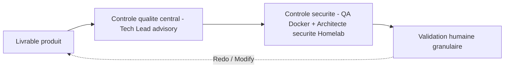

# Protocole — revue (reviewer) Homelab

Deux natures de revue coexistent dans le workflow Homelab, distinctes et non substituables. Miroir Homelab de [`core/common/protocols/reviewer.md`](../../../core/common/protocols/reviewer.md), adapté à l'équipe DevOps Homelab (pas d'Architecte cybersécurité dédié ; la sécurité technique est portée par le **QA Docker**, le jugement de posture par l'**Architecte de sécurité Homelab**).

## 1. Contrôle qualité central (Tech Lead — advisory)

Portée : aiguillage **GO / RENVOI** au niveau macro. Le Tech Lead vérifie uniquement : (a) le livrable répond-il à la demande et aux paramètres collectés ? (b) est-il du bon type et présent (fichier compose / `.tfvars` contenant les sections attendues, pas un rapport vide) ? (c) un secret en clair saute-t-il aux yeux ? (d) le compte-rendu du spécialiste signale-t-il un blocage ?

- **Jamais** la validité syntaxique, la compatibilité applicative, le hardening ou la cohérence Traefik : ces analyses appartiennent au Spécialiste Docker (production / correctif) et au QA Docker (vérification technique).
- **Ordre imposé** : tout compose passe par le QA Docker **avant** l'aiguillage du Tech Lead.
- Doute technique → renvoyer au spécialiste en décrivant le **symptôme** observé (« l'authentification risque d'échouer »), **sans** fournir de diagnostic ni de solution.
- **Classe** `review_class: advisory`. Le contrôle qualité central **ne remplace jamais** le contrôle sécurité ni la validation humaine.

## 2. Contrôle sécurité (QA Docker + Architecte de sécurité Homelab) — obligatoire, non substituable

Portée : sécurité de base d'un homelab (secrets, exposition réseau, permissions, durcissement Docker/Swarm, cohérence Traefik, absence de `${SNI}`). **Aucune notion de Loi 25 / PCI DSS / GDPR / LPRPDE.**

- **QA Docker** — contrôle sécurité **technique** (revue adversariale) : hardening, secrets `_FILE`, exposition, permissions, cohérence Traefik via `traefik-manager-read`. **Le QA contrôle et classifie** (critical / warning / info) : tout défaut est renvoyé au Spécialiste Docker (agent créateur) via le rapport JSON (`verdict = RENVOI`, points autosuffisants).
- **Architecte de sécurité Homelab** — **jugement** de posture (voix adoptée / sollicité pour les décisions structurantes de sécurité et la couche `global` des règles).
- **Déclenché systématiquement** dès qu'un stage produit ou modifie une surface de sécurité (compose, Terraform, hardening, exposition, Traefik, secrets).
- Procédure : le Tech Lead poste un commentaire mentionnant le QA Docker (UUID résolu via `multica agent list --output json`) avec le contexte et le résumé des modifications ; **attend l'analyse** ; intègre les recommandations **avant** la validation humaine.
- **Plancher SG-3** : aucun contrôle qualité central, aucun gate / sensor advisory ne peut porter, remplacer, conditionner ni court-circuiter ce contrôle. Un « vert » de gate ne dispense jamais du contrôle sécurité.

## Articulation des deux revues et du gate humain

- Le contrôle qualité central **prépare** le contrôle sécurité et le gate humain ; il ne les remplace pas.
- Le contrôle sécurité **précède toujours** la validation humaine sur toute surface de sécurité.
- La **validation humaine granulaire** reste l'unique gate décisionnel contraignant (invariant).

## Fin de revue

L'agent de revue notifie en retour le Tech Lead par **mention valide** sur l'issue, **en attachant le compte-rendu JSON** de revue (`review-<agent>-<stack>.json`) conforme au format unique [`report-format.md`](report-format.md) / [`report-format.schema.json`](report-format.schema.json). Le corps du commentaire est réduit au strict minimum (mention valide + `verdict` en un mot + « rapport JSON en pièce jointe ») : aucune prose ni liste de points dans le thread, le détail vit dans le JSON attaché. Une revue n'est jamais close sans cette notification à mention valide (sinon compte-rendu réputé non rendu, flux arrêté).
