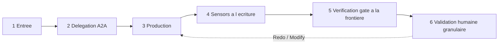

# Protocole — exécution générique d'un stage

Cycle standard qu'un stage suit, quelle que soit sa phase. Il ne se substitue jamais aux instructions propres de la fiche de stage ; il en fixe l'ossature commune, adaptée au moteur A2A Multica (mentions UUID, `trigger_outcomes`, statut d'issue, verrou metadata, piste d'audit sur l'issue).

Miroir Homelab de [`core/common/protocols/stage-protocol.md`](../../../core/common/protocols/stage-protocol.md).

## Cycle en 6 temps

### 1. Entrée — pré-requis et contexte
- Vérifier que les `requires_stage` sont satisfaits et que les artefacts `consumes` (marqués `required: true`) existent. Sinon : **halt-and-ask** (ne jamais deviner).
- Lire le verrou de concurrence `active_step` de la stack visée (un seul traitement par stack) ; si un traitement est actif, mettre en file et attendre la libération.
- Charger, **à la demande**, uniquement le contexte nécessaire au stage (chargement optimisé — voir [`../conductor.md`](../conductor.md)).

### 2. Délégation A2A (si `mode: subagent | pipeline | mob`)
- Le Tech Lead poste un commentaire sur l'issue avec une **mention valide** `[@Label](mention://agent/<uuid>)` et une **mission claire** : objectif, périmètre, critères d'acceptation.
- **Ne jamais deviner un UUID** : le résoudre via `multica agent list --output json` (champ `id`) ou la table de [`tech-lead-homelab-agent.md`](../../agents/tech-lead-homelab-agent.md). Après chaque mention, **lire `trigger_outcomes`** dans la réponse de la CLI ; un statut `blocked` / `coalesced` / `deferred` signifie que le run n'est PAS enfilé.
- La **topologie** dépend du `mode` : `subagent` = hub-and-spoke ; `pipeline` = supports chaînés (ex. Spécialiste Docker → QA Docker → Spécialiste Terraform) ; `mob` = supports en parallèle contre le brouillon du lead. `pipeline` / `mob` exigent `support_agents` non vide.
- Si `mode: inline`, le Tech Lead exécute directement (supports = voix adoptées).
- Le spécialiste appelé **rend toujours compte** au Tech Lead en fin de tâche, **par une mention valide** de retour (un compte-rendu sans mention valide est réputé non rendu et arrête le flux).
- **Reprise bornée puis escalade** : sur un `trigger_outcomes` non enfilé, corriger la mention et retenter **une seule fois** ; si l'unique reprise échoue, passer l'issue en `blocked`, escalader à l'humain, et n'effectuer aucune nouvelle reprise automatique.
- Si `for_each` est déclaré, le cycle 3→6 s'exécute **une fois par instance** de l'artefact nommé.

### 3. Production
- La fonction `lead_agent` produit les artefacts `produces`, dans la langue de l'humain, sans secret, avec les commentaires utiles des gabarits conservés.
- Chaque décision structurante est tracée dans le registre de décisions (`decisions/`).
- L'agent trace son avancement sur l'issue (piste d'audit au fil de l'eau) et dépose les livrables **téléchargeables** (`multica attachment upload`).

### 4. Sensors à l'écriture
- À l'écriture d'un artefact (compose, `.tfvars`), les `sensors` déclarés `fire_on: write` se déclenchent et leur verdict est consigné en commentaire (`✅` / `⚠️` / `⛔ indisponible`). **Advisory par défaut** — n'autorise aucun raccourci, ne vaut pas validation (SG-1..6). **Exception** : `plaintext-secret` / `terraform-no-sni` sont **bloquants sur `security-patch` / `new-stack`** (ALI-204).

### 5. Verification gate à la frontière de phase
- À la sortie de la phase, le Tech Lead exécute le gate de traçabilité ([`homelab/sensors/gates.md`](../../sensors/gates.md)) et poste le **« Rapport de vérification »** *avant* la validation humaine. Un écart est signalé, jamais bloquant (advisory) ; `⛔ indisponible ≠ conforme`.

### 6. Validation humaine granulaire
- Selon `human_gate` : `none` (aucune — Initialisation), `light` (approbation intention/périmètre — Idéation), `granular` (choix par choix — Cadrage / Production), `explicit` (validation explicite + prérequis §4.0 + rollback si destructif — Validation).
- Boucle **Keep / Modify / Redo** par élément (voir [`../conductor.md`](../conductor.md)). Sur `Modify` / `Redo`, retour au temps 3 pour l'élément concerné uniquement.

## Contrôle sécurité — non contournable
Dès qu'un stage **produit ou modifie une surface de sécurité** (compose, Terraform, hardening, exposition, Traefik, secrets), le contrôle sécurité (QA Docker pour la technique ; Architecte de sécurité Homelab pour la posture) intervient **avant** la validation humaine. L'autonomie (Production) ne court-circuite ni ne diffère jamais ce contrôle. Voir [`governance-security.md`](governance-security.md) et [`reviewer.md`](reviewer.md).

## Halt-and-ask
Le cycle s'arrête et interroge l'humain dès : échec / impossibilité d'un livrable ; écart ou contrôle de sécurité requis ; gate / sensor en écart, bloquant, ou `⛔ indisponible` ; décision structurante nouvelle non cadrée ; action à impact / destructive (dépôt de fichiers, flux Kestra, application n8n / Home Assistant) — **jamais autonome**, elle relève de la Validation sous validation explicite.
