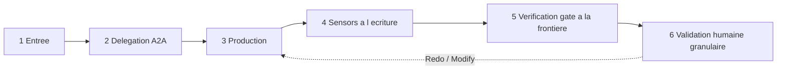

# Protocole — exécution générique d'un stage

Cycle standard qu'un stage suit, quelle que soit sa phase. Il ne se substitue jamais aux instructions propres de la fiche de stage ; il en fixe l'ossature commune, adaptée au moteur A2A Multica (mentions UUID, `trigger_outcomes`, statut d'issue, verrou metadata, piste d'audit sur l'issue).

Miroir Homelab de [`core/common/protocols/stage-protocol.md`](../../../core/common/protocols/stage-protocol.md).

## Cycle en 6 temps

```mermaid
flowchart LR
    E[1 Entree] --> D[2 Delegation A2A]
    D --> P[3 Production]
    P --> S[4 Sensors a l ecriture]
    S --> G[5 Verification gate a la frontiere]
    G --> V[6 Validation humaine granulaire]
    V -.->|Redo / Modify| P
```

### 1. Entrée — pré-requis et contexte

- Vérifier que les `requires_stage` sont satisfaits et que les artefacts `consumes` (marqués `required: true`) existent. Sinon : **halt-and-ask** (ne jamais deviner).
- Lire le verrou de concurrence `active_step` de la stack visée (un seul traitement par stack, lu **par artefact**) ; si un traitement est actif **sur le même artefact**, mettre en file et attendre la libération (deux artefacts disjoints — compose vs `.tfvars` — peuvent progresser en parallèle).
- Charger, **à la demande**, uniquement le contexte nécessaire au stage (chargement optimisé — voir [`conductor.md`](../conductor.md)).

### 2. Délégation A2A (si `mode: subagent | pipeline | mob`)

- Le Tech Lead poste un commentaire sur l'issue avec une **mention valide** `[@Label](mention://agent/<uuid>)` et une **mission claire** : objectif, périmètre, critères d'acceptation.
- **Ne jamais deviner un UUID** : le résoudre via `multica agent list --output json` (champ `id`) ou la table de [`tech-lead-homelab-agent.md`](../../agents/tech-lead-homelab-agent.md). Après chaque mention, **lire `trigger_outcomes`** dans la réponse de la CLI ; un statut `blocked` / `coalesced` / `deferred` signifie que le run n'est PAS enfilé.
- La **topologie** dépend du `mode` : `subagent` = hub-and-spoke ; `pipeline` = supports chaînés dans l'ordre déclaré, chacun voyant tout le travail amont (ex. le stage `autonomy-mode` : Spécialiste Terraform → Spécialiste Docker → Analyste QA sur le walking skeleton) ; `mob` = supports en parallèle contre le brouillon du lead. `pipeline` / `mob` exigent `support_agents` non vide. ⚠️ Ne pas confondre avec les **stages de Production** où Docker et Terraform s'exécutent **en parallèle** (deux sous-issues `--stage 1`, voir [« Cycle de statut des sous-issues & barrière de stage »](#cycle-de-statut-des-sous-issues--barrière-de-stage)) : ce n'est pas un `pipeline` séquentiel Docker → Terraform.
- **Statut de la sous-issue déléguée — `in_progress` au démarrage.** Quand la délégation ouvre une **sous-issue** confiée à une fonction spécialiste (ex. les deux sous-issues `--stage 1` de Production : compose et `.tfvars`), cette sous-issue passe en **`in_progress`** dès que son travail démarre (`multica issue status <sous-issue-id> in_progress`). Cf. [« Cycle de statut des sous-issues & barrière de stage »](#cycle-de-statut-des-sous-issues--barrière-de-stage).
- Si `mode: inline`, le Tech Lead exécute directement (supports = voix adoptées).
- Le spécialiste appelé **rend toujours compte** au Tech Lead en fin de tâche, **par une mention valide** de retour (un compte-rendu sans mention valide est réputé non rendu et arrête le flux). Ce **lien de retour actif est construit par l'agent délégataire lui-même** (UUID résolu via `multica agent list --output json`), jamais recopié depuis la mission. **L'assigneur ne pose jamais de lien de mention actif vers lui-même** (anti-wake parasite) : dans sa consigne de délégation il nomme l'agent de retour **en texte clair**. Voir [`governance-security.md`](governance-security.md) § « Règle A2A ».
- **Reprise bornée puis escalade** : sur un `trigger_outcomes` non enfilé, corriger la mention et retenter **une seule fois** ; si l'unique reprise échoue, passer l'issue en `blocked`, escalader à l'humain, et n'effectuer aucune nouvelle reprise automatique.
- Si `for_each` est déclaré, le cycle 3→6 s'exécute **une fois par instance** de l'artefact nommé.

### 3. Production

- La fonction `lead_agent` produit les artefacts `produces`, dans la langue de l'humain, sans secret, avec les commentaires utiles des gabarits conservés.
- Chaque décision structurante est tracée dans le registre de décisions (`decisions/`).
- L'agent trace son avancement sur l'issue (piste d'audit au fil de l'eau) et dépose les livrables **téléchargeables** (`multica attachment upload`).
- **Statut de la sous-issue déléguée — `in_review` à la livraison.** Dès que la fonction spécialiste a produit son livrable et rendu compte (mention valide de retour), **sa** sous-issue passe en **`in_review`** (`multica issue status <sous-issue-id> in_review`) : le livrable est produit et attend sa vérification. Cf. [« Cycle de statut des sous-issues & barrière de stage »](#cycle-de-statut-des-sous-issues--barrière-de-stage).

### 4. Sensors à l'écriture

- À l'écriture d'un artefact (compose, `.tfvars`), les `sensors` déclarés `fire_on: write` se déclenchent et leur verdict est consigné en commentaire (`✅` / `⚠️` / `⛔ indisponible`). **Advisory par défaut** — n'autorise aucun raccourci, ne vaut pas validation (SG-1..6). **Exception** : `plaintext-secret` / `terraform-no-sni` sont **bloquants sur `security-patch` / `new-stack`** (ALI-204).

### 5. Verification gate à la frontière de phase

- À la sortie de la phase, le Tech Lead exécute le gate de traçabilité ([`homelab/sensors/gates.md`](../../sensors/gates.md)) et poste le **« Rapport de vérification »** *avant* la validation humaine. Un écart est signalé, jamais bloquant (advisory) ; `⛔ indisponible ≠ conforme`.

### 6. Validation humaine granulaire

- Selon `human_gate` : `none` (aucune — Initialisation), `light` (approbation intention/périmètre — Idéation), `granular` (choix par choix — Cadrage / Production), `explicit` (validation explicite + prérequis §4.0 + rollback si destructif — Validation).
- Boucle **Keep / Modify / Redo** par élément (voir [`../conductor.md`](../conductor.md)). Sur `Modify` / `Redo`, retour au temps 3 pour l'élément concerné uniquement.

## Cycle de statut des sous-issues & barrière de stage

Quand un stage délègue son travail via des **sous-issues** (cas des stages de Production parallèles — Docker ∥ Terraform, deux sous-issues `--stage 1`), le statut de **chaque sous-issue spécialiste** suit un cycle en trois temps, et c'est l'atteinte de `done` sur **toutes** les sous-issues qui lève la **barrière de stage** vers l'aiguillage central.

1. **`in_progress` — début du travail.** À l'ouverture / démarrage de la sous-issue spécialiste (délégation A2A, temps 2), elle passe en `in_progress`.
2. **`in_review` — livrable produit.** Quand la fonction spécialiste a produit son livrable et rendu compte (temps 3), **sa** sous-issue passe en `in_review` : le livrable attend sa vérification QA.
3. **`done` — livrable validé par la QA.** Quand l'Analyste QA **valide** (`verdict = OK`) un livrable, la **sous-issue correspondante à ce livrable** passe à `done` — correspondance **un-pour-un** : livrable **Docker** validé → sous-issue **Docker** `done` ; livrable **Terraform** validé → sous-issue **Terraform** `done`. Un `verdict = RENVOI` **ne fait pas** passer la sous-issue à `done` : elle demeure en `in_review` tant que la boucle courte QA ↔ spécialiste n'a pas abouti à `OK`.

> `done` est ici le signal d'**acceptation technique du livrable par la QA** au sein du flux, et non la clôture humaine de l'issue parente — celle-ci reste la décision humaine portée par [`stages/validation/closure.md`](../stages/validation/closure.md).

**Barrière de stage.** L'aiguillage central ([`stages/production/central-quality-control.md`](../stages/production/central-quality-control.md)) ne démarre **que lorsque toutes les sous-issues spécialistes du stage sont à `done`** (barrière de stage : pas de démarrage tant que Docker **et** Terraform ne sont pas `done`). Tant qu'une sous-issue reste en `in_review` (ou en boucle de `RENVOI`), la barrière **n'est pas** franchie et le contrôle qualité central **ne démarre pas**. La condition de démarrage est donc « **toutes les sous-issues `done`** », jamais « au moins un livrable en `in_review` ».

## Contrôle sécurité — non contournable

Dès qu'un stage **produit ou modifie une surface de sécurité** (compose, Terraform, hardening, exposition, Traefik, secrets), le contrôle sécurité intervient **avant** la validation humaine ; l'autonomie (Production) ne le court-circuite ni ne le diffère jamais. Règle normative et répartition des rôles (Analyste QA technique / Architecte de sécurité Homelab posture) : [`governance-security.md` § Contrôle sécurité systématique](governance-security.md#contrôle-sécurité-systématique) et [`reviewer.md`](reviewer.md).

## Halt-and-ask

Le cycle s'arrête et interroge l'humain dès : échec / impossibilité d'un livrable ; écart ou contrôle de sécurité requis ; gate / sensor en écart, bloquant, ou `⛔ indisponible` ; décision structurante nouvelle non cadrée ; action à impact / destructive (dépôt de fichiers, flux Kestra, application n8n / Home Assistant) — **jamais autonome**, elle relève de la Validation sous validation explicite.
