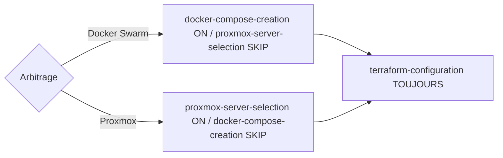

# Vérifications préalables et arbitrage Swarm / Proxmox

## Objectif

Trancher entre Docker Swarm et Proxmox lorsque les deux sont possibles, et **fixer la branche de déploiement exclusive** de la stack.

## Steps

### Step 1 — Vérifier les images et alternatives

Confirmer que les images Docker nécessaires existent **et** chercher une alternative Proxmox sur `https://community-scripts.org/`.

### Step 2 — Arbitrer avec l'humain

Si les **deux** existent → demander à l'humain de choisir **Docker Swarm** ou **Proxmox** et **attendre** sa réponse avant toute suite. Ne jamais présumer le choix.

### Step 3 — Fixer la branche exclusive (Docker XOR Proxmox)

Le choix de l'humain fixe **une et une seule** branche de déploiement, portée par la valeur de l'artefact `arbitrage_swarm_proxmox` (`docker` | `proxmox`). Cette valeur **conditionne** la Production (voir ADR [`0040`](../../../../decisions/0040-branche-proxmox-new-stack-xor-docker.md)) :

- **Docker Swarm** (`docker`) → [`docker-compose-creation`](../production/docker-compose-creation.md) s'exécute ; [`proxmox-server-selection`](../production/proxmox-server-selection.md) est **ignoré** (`SKIP`).
- **Proxmox** (`proxmox`) → [`proxmox-server-selection`](../production/proxmox-server-selection.md) s'exécute (délégation au **Spécialiste Proxmox**, agent `proxmox-specialist-agent`) ; [`docker-compose-creation`](../production/docker-compose-creation.md) est **ignoré** (`SKIP`).

Les deux branches sont **mutuellement exclusives** : on ne produit **jamais** un `docker-compose` **et** un script de déploiement Proxmox pour la même stack. L'exclusivité porte **uniquement** sur ce couple : [`terraform-configuration`](../production/terraform-configuration.md) reste **toujours** produit en parallèle (invariant `.tfvars` non abaissable sur `new-stack` / `infra-terraform`).

## Sensors

Outputs: choix Swarm / Proxmox consigné, porteur de la branche de déploiement (`docker` | `proxmox`). Frontière **Cadrage → Production** : artefact `arbitrage_swarm_proxmox` (conditionnel) contrôlé par le gate — voir [`homelab/sensors/gates.md`](../../../sensors/gates.md). La valeur de branche conditionne l'exécution exclusive de `docker-compose-creation` ⊕ `proxmox-server-selection`.
Imports: none.

## Learn

Boucle d'apprentissage maison (voir [`homelab/rules/`](../../../rules/README.md)) : candidats-règles (préférences Swarm / Proxmox par type de stack) tracés, remontés au gate granulaire.
