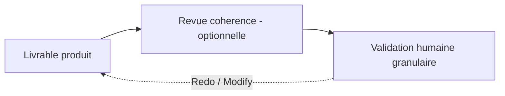

# Protocole — revue (reviewer)

Deux natures de revue coexistent dans le workflow, adaptées au domaine matching AO ↔ CV.

## 1. Revue de cohérence (Reviewer de cohérence)

Portée : cohérence **exigences AO ↔ profils extraits**, absence de conflits entre critères, complétude / structure / format des livrables JSON.

- **Portée par une fonction « review-only » distincte** : le **Reviewer de cohérence** (si existant dans le workspace), sollicité par mention A2A **par le coordinateur** à réception d'un livrable d'un agent spécialiste.
- Vérifie : correspondance exigences ↔ profils, absence de critère non tracé, absence de profil orphelin, respect des conventions (format JSON, communication agent↔agent en JSON, agent↔humain en Markdown).
- Verdict : demande de correction à l'agent responsable (via le coordinateur), ou passage à l'étape suivante (validation humaine).
- **Classe** `review_class: advisory`. La revue de cohérence **ne remplace jamais** la validation humaine.

## 2. Pas de revue de sécurité

Contrairement aux workflows `core/` et `homelab/`, le workflow Matching AO ↔ CV ne produit ni architecture ni infrastructure. **La revue de sécurité n'est pas applicable** par défaut.

Exception : si l'AO concerne un domaine sensible (santé, finance, données personnelles), le coordinateur peut solliciter une revue de sécurité sur décision de l'humain.

## Articulation des revues et du gate humain

- La revue de cohérence **prépare** le gate humain ; elle ne le remplace pas.
- La **validation humaine granulaire** reste l'unique gate décisionnel contraignant (invariant).

## Fin de revue

L'agent de revue notifie en retour l'assigneur / le demandeur par mention sur l'issue, avec un résumé clair des conclusions et recommandations. Une revue n'est jamais close sans cette notification.
