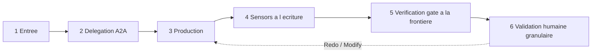

# Protocole — exécution générique d'un stage

Cycle standard qu'un stage suit, quel que soit sa phase. Il ne se substitue jamais aux instructions propres de la fiche de stage ; il en fixe l'ossature commune, adaptée au moteur A2A Multica (mentions UUID, statut d'issue, piste d'audit sur l'issue).

## Cycle en 6 temps

### 1. Entrée — pré-requis et contexte
- Vérifier que les `requires_stage` sont satisfaits et que les artefacts `consumes` (marqués `required: true`) existent. Sinon : **halt-and-ask** (ne jamais deviner).
- Charger, **à la demande**, uniquement le contexte nécessaire au stage.

### 2. Délégation A2A (si `mode: subagent`)
- Le coordinateur poste un commentaire sur l'issue avec une **mention valide** `[@Label](mention://agent/<uuid>)` et une **mission claire** : objectif, périmètre, critères d'acceptation.
- **Ne jamais deviner un UUID** : le résoudre via `multica agent list --output json` (champ `id`). Vérifier `trigger_outcomes` après chaque mention.
- Si `mode: inline`, le coordinateur exécute directement.
- Si `for_each` est déclaré, le cycle 3→6 s'exécute **une fois par instance** de l'artefact nommé.

### 3. Production
- La fonction `lead_agent` produit les artefacts `produces`, dans la langue de l'humain.
- **Agent ↔ Agent** : JSON uniquement. **Agent ↔ Humain** : Markdown uniquement.
- Chaque décision structurante est tracée sur l'issue.
- L'agent trace son avancement sur l'issue (piste d'audit au fil de l'eau).
- **Retour de délégation (obligatoire)** : en fin de production, l'agent lead **mentionne en retour le Coordinateur** `[@Coordinateur Matching](mention://agent/180b421f-e783-4eba-869e-6907b59e56a6)` dans le fil de l'issue, avec son livrable. Une réponse simple **n'enqueue aucun run** — seule une mention agent valide réveille le Coordinateur. Ne jamais deviner l'UUID : le résoudre via `multica agent list --output json`.
- **Vérification `trigger_outcomes`** : après le post, l'agent lead vérifie les `trigger_outcomes` de son commentaire (statuts `blocked` / `coalesced` / `deferred`). Si la mention n'a pas déclenché le run attendu, il le signale sur l'issue (halt-and-ask) plutôt que de considérer la tâche terminée.

### 4. Sensors à l'écriture
- À l'écriture d'un artefact, les `sensors` déclarés se déclenchent et leur verdict est consigné en commentaire. **Advisory** — n'autorise aucun raccourci.

### 5. Verification gate à la frontière de phase
- À la sortie de la phase, le coordinateur exécute le gate de traçabilité et poste le **« Rapport de vérification »** *avant* la validation humaine. Un écart est signalé, jamais bloquant.

### 6. Validation humaine granulaire
- Selon `human_gate` : `none` (aucune — Initialisation), `light` (approbation extraction — Analyse), `granular` (choix par choix — Validation), `explicit` (validation explicite — Clôture).
- Boucle **Keep / Modify / Redo** par élément (voir `conductor.md`). Sur `Modify` / `Redo`, retour au temps 3 pour l'élément concerné uniquement.

## Contrôle — non contournable
Le coordinateur valide chaque livrable avant validation humaine. La grille d'évaluation ne sera **jamais inventée** — elle sera demandée à l'humain si absente.

## Halt-and-ask
Le cycle s'arrête et interroge l'humain dès : échec / impossibilité d'un livrable ; écart ou contrôle requis ; gate / sensor en écart ; décision structurante nouvelle non cadrée ; action à impact / destructive (jamais autonome).
